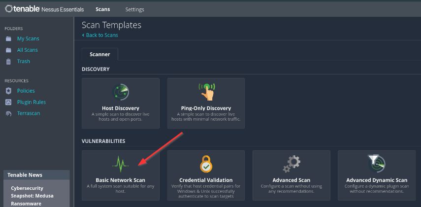
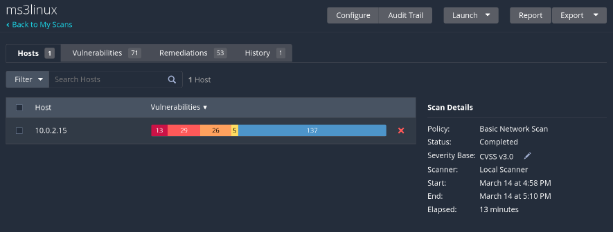

# Análisis de vulnerabilidades

# Por:

+ Félix Sánchez González

+ Francisco Javier Rodríguez Acosta

+ Santiago Domínguez Gómez

## 

## **Índice**  

[**1. Resumen ejecutivo**](#1-resumen-ejecutivo)  

[**2. Introducción**](#2-introducción)  
- [2.1. Antecedentes](#21-antecedentes)  
- [2.2. Objetivos](#22-objetivos)  

[**3. Metodología**](#3-metodología)  

[**4. Vulnerabilidades del Servidor Linux**](#4-vulnerabilidades-del-servidor-linux)  
- [4.1. Crítico](#41-crítico)  
- [4.2. Alto](#42-alto)  
- [4.3. Medio](#43-medio)  
- [4.4. Bajo](#44-bajo)  

[**5. Vulnerabilidades del Servidor Windows**](#5-vulnerabilidades-del-servidor-windows)  
- [5.1. Crítico](#51-crítico)  
- [5.2. Alto](#52-alto)  
- [5.3. Medio](#53-medio)  
- [5.4. Bajo](#54-bajo)  

[**6. Conclusiones**](#6-conclusiones)  

## **1\. Resumen ejecutivo** 

Este informe presenta los resultados de una evaluación de vulnerabilidades realizada en dos servidores de la empresa Secure Logistics. El objetivo principal fue identificar las vulnerabilidades presentes y evaluar su criticidad para determinar el riesgo general.

La evaluación reveló varias vulnerabilidades críticas y altas que podrían comprometer la seguridad de los servidores. Se identificaron vulnerabilidades en el sistema operativo, aplicaciones de terceros y configuraciones de seguridad. Las vulnerabilidades más críticas incluyen versiones obsoletas de Apache y PHP, la vulnerabilidad Blue Keep RDP y posibles fallas de ejecución remota de código.

Se recomienda encarecidamente aplicar las recomendaciones proporcionadas en este informe para mitigar los riesgos identificados y fortalecer la postura de seguridad de ambos servidores.

## **2\. Introducción **  

### **2.1. Antecedentes**
La empresa Secure Logistics nos ha solicitado una evaluación de vulnerabilidades de dos de sus servidores, uno Windows y otro Linux. La empresa tiene un presupuesto limitado para realizar pruebas de seguridad, por lo que se necesita una evaluación rápida para identificar cualquier vulnerabilidad significativa. Los resultados de esta evaluación servirán como base para realizar pruebas de seguridad más exhaustivas.

### **2.2. Objetivos**

Los objetivos del presente informe son:

* **Detectar y evaluar vulnerabilidades** existentes en ambos servidores.  
* **Clasificarlas** según su criticidad.  
* **Proporcionar recomendaciones** para su mitigación.

## **3\. Metodología**

Para realizar el análisis de las vulnerabilidades se ha utilizado la funcionalidad ***Basic Scan*** del escáner automático **Nessus Essentials**.

**Basic Network Scan**

**Scan Configuration**

**Scan Details**

Las vulnerabilidades detectadas en los servidores Linux y Windows se han consolidado en sendos listados, siendo clasificadas por su nivel de criticidad mediante el sistema **CVSS,** evaluando su impacto y proponiendo medidas de mitigación con el objetivo de reducir los riesgos identificados.

## **4\. Vulnerabilidades del Servidor Linux**

En esta sección se detallan las vulnerabilidades identificadas durante la evaluación del servidor Linux. Las vulnerabilidades se clasifican según su nivel de gravedad.

### **Crítico**

* [**Divulgación de Información de ProFTPD mod\_copy**](https://www.tenable.com/plugins/nessus/182615)

  * Puntuación CVSS v3.0: 9.8  
  * Descripción: ProFTPD mod\_copy permite la divulgación de información.  
  * Impacto: Se puede exponer información confidencial.  
  * Recomendación: Actualice ProFTPD a la última versión.

* [**RCE de Deserialización del Módulo Drupal Coder**](https://www.tenable.com/plugins/nessus/92626)  
    
  * Puntuación CVSS v3.0: 10.0  
  * Descripción: El módulo Drupal Coder es vulnerable a la deserialización, lo que lleva a la ejecución remota de código.  
  * Impacto: Ejecución remota de código.  
  * Recomendación: Actualice el módulo Drupal Coder a la última versión.  
    

### **Alto**

* [**Conjuntos de Cifrado de Fortaleza Media SSL Soportados (SWEET32)**](https://www.tenable.com/plugins/nessus/42873)  
    
  * Puntuación CVSS v3.0: 7.5  
  * Descripción: El servidor admite conjuntos de cifrado de fortaleza media (SWEET32).  
  * Impacto: Mayor riesgo de ataques de intermediario.  
  * Recomendación: Desactive la compatibilidad con conjuntos de cifrado de fortaleza media.

* [**API de Abstracción de Base de Datos de Drupal SQLi**](https://www.tenable.com/plugins/nessus/90317)  
    
  * Puntuación CVSS v3.0: 7.5  
  * Descripción: La API de Abstracción de Base de Datos de Drupal es vulnerable a la inyección SQL.  
  * Impacto: Potencial de compromiso de la base de datos.  
  * Recomendación: Aplique los parches necesarios a Drupal.

### **Medio**

* [**Reenvío de IP Habilitado**](https://www.tenable.com/plugins/nessus/51192)  
    
  * Puntuación CVSS v3.0: 6.5  
  * Descripción: El reenvío de IP está habilitado en el servidor.  
  * Impacto: Potencial para que el servidor se utilice como enrutador, lo que aumenta la superficie de ataque.  
  * Recomendación: Desactive el reenvío de IP si no es necesario.

* [**No se puede Confiar en el Certificado SSL**](https://www.tenable.com/plugins/nessus/51192)  
    
  * Puntuación CVSS v3.0: 6.5  
  * Descripción: No se puede confiar en el certificado SSL.  
  * Impacto: Mayor riesgo de ataques de intermediario.  
  * Recomendación: Obtenga un certificado SSL válido de una CA de confianza.

* [**Certificado SSL Autofirmado**](https://www.tenable.com/plugins/nessus/57582)  
    
  * Puntuación CVSS v3.0: 6.5  
  * Descripción: El certificado SSL está autofirmado.  
  * Impacto: Mayor riesgo de ataques de intermediario.  
  * Recomendación: Obtenga un certificado SSL válido de una CA de confianza.

* [**Detección del Protocolo TLS Versión 1.0**](https://www.tenable.com/plugins/nessus/104743)  
    
  * Puntuación CVSS v3.0: 6.5  
  * Descripción: TLS Versión 1.0 está habilitado.  
  * Impacto: Vulnerable a ataques conocidos.  
  * Recomendación: Desactive TLS Versión 1.0.

* [**Protocolo Obsoleto TLS Versión 1.1**](https://www.tenable.com/plugins/nessus/157288)  
    
  * Puntuación CVSS v3.0: 6.5  
  * Descripción: TLS Versión 1.1 está habilitado.  
  * Impacto: Vulnerable a ataques conocidos.  
  * Recomendación: Desactive TLS Versión 1.1.

* [**Debilidad de Truncamiento de Prefijo Terrapin SSH (CVE-2023-48795)**](https://www.tenable.com/plugins/nessus/153953)  
    
  * Puntuación CVSS v3.0: 5.9  
  * Descripción: SSH es vulnerable a la debilidad de truncamiento de prefijo Terrapin.  
  * Impacto: Potencial de ataques de intermediario.  
  * Recomendación: Actualice SSH a la última versión.

* [**Listado de Directorio Arbitrario de Multivistas de Apache**](https://www.tenable.com/plugins/nessus/71049)  
    
  * Puntuación CVSS v3.0: 5.3  
  * Descripción: Apache Multiviews permite el listado de directorios arbitrarios.  
  * Impacto: Se puede exponer información confidencial.  
  * Recomendación: Desactive Multiviews o restrinja el acceso.

* [**Firma SMB no requerida**](https://www.tenable.com/plugins/nessus/57608)  
    
  * Puntuación CVSS v3.0: 5.3  
  * Descripción: No se requiere la firma SMB.  
  * Impacto: Mayor riesgo de ataques de intermediario.  
  * Recomendación: Requiere la firma SMB.

* [**Algoritmos Débiles SSH Soportados**](https://www.tenable.com/plugins/nessus/90317)  
    
  * Puntuación CVSS v3.0: 4.3  
  * Descripción: SSH admite algoritmos débiles.  
  * Impacto: Mayor riesgo de ataques de fuerza bruta.  
  * Recomendación: Desactive los algoritmos débiles.  
    

### **Bajo**

* [**Cifrados de Modo CBC del Servidor SSH Habilitados**](https://www.tenable.com/plugins/nessus/71049)  
    
  * Puntuación CVSS v3.0: 3.7  
  * Descripción: Los cifrados de modo CBC del servidor SSH están habilitados.  
  * Impacto: Vulnerable a ataques conocidos.  
  * Recomendación: Desactive los cifrados de modo CBC.

* [**Algoritmos de Intercambio de Claves Débiles SSH Habilitados**](https://www.tenable.com/plugins/nessus/153953)  
    
  * Puntuación CVSS v3.0: 3.7  
  * Descripción: Los algoritmos de intercambio de claves débiles SSH están habilitados.  
  * Impacto: Vulnerable a ataques conocidos.  
  * Recomendación: Desactive los algoritmos de intercambio de claves débiles.

* [**Divulgación Remota de Fecha de Solicitud de Marca de Tiempo ICMP**](https://www.tenable.com/plugins/nessus/10114)  
    
  * Puntuación CVSS v3.0: 2.1  
  * Descripción: Divulgación Remota de Fecha de Solicitud de Marca de Tiempo ICMP  
  * Impacto: Divulgación de información  
  * Recomendación: Desactive las solicitudes de marca de tiempo ICMP.

* [**Algoritmos MAC Débiles SSH Habilitados**](https://www.tenable.com/plugins/nessus/71049)  
    
  * Puntuación CVSS v3.0: 2.6  
  * Descripción: Los algoritmos MAC débiles SSH están habilitados.  
  * Impacto: Vulnerable a ataques conocidos.  
  * Recomendación: Desactive los algoritmos MAC débiles.

## **5\. Vulnerabilidades del Servidor Windows**

En esta sección se detallan las vulnerabilidades identificadas durante la evaluación del servidor Windows. Las vulnerabilidades se clasifican según su nivel de gravedad.

### **Crítico**

* [**Apache 2.2.x \< 2.2.33-dev / 2.4.x \< 2.4.26 Múltiples Vulnerabilidades**](https://www.tenable.com/plugins/nessus/100995)  
    
  * Puntuación CVSS v3.0: 9.8  
  * Descripción: Existen múltiples vulnerabilidades en las versiones de Apache anteriores a 2.2.33-dev y 2.4.26.  
  * Impacto: Ejecución remota de código, denegación de servicio, divulgación de información.  
  * Recomendación: Actualice a la última versión de Apache.

* [**Apache 2.2.x \< 2.2.34 Múltiples Vulnerabilidades**](https://www.tenable.com/plugins/nessus/101787)  
    
  * Puntuación CVSS v3.0: 9.8  
  * Descripción: Existen múltiples vulnerabilidades en las versiones de Apache anteriores a 2.2.34.  
  * Impacto: Ejecución remota de código, denegación de servicio, divulgación de información.  
  * Recomendación: Actualice a la última versión de Apache.

* [**Apache 2.4.x \< 2.4.53 Múltiples Vulnerabilidades**](https://www.tenable.com/plugins/nessus/158900)  
    
  * Puntuación CVSS v3.0: 9.8  
  * Descripción: Existen múltiples vulnerabilidades en las versiones de Apache anteriores a 2.4.53.  
  * Impacto: Ejecución remota de código, denegación de servicio, divulgación de información.  
  * Recomendación: Actualice a la última versión de Apache.

* [**Apache 2.4.x \< 2.4.54 Omisión de Autenticación**](https://www.tenable.com/plugins/nessus/193421)  
    
  * Puntuación CVSS v3.0: 9.8  
  * Descripción: Existe una vulnerabilidad de omisión de autenticación en las versiones de Apache anteriores a 2.4.54.  
  * Impacto: Acceso no autorizado a recursos sensibles.  
  * Recomendación: Actualice a la última versión de Apache.

* [**Apache 2.4.x \< 2.4.56 Múltiples Vulnerabilidades**](https://www.tenable.com/plugins/nessus/172186)  
    
  * Puntuación CVSS v3.0: 9.8  
  * Descripción: Existen múltiples vulnerabilidades en las versiones de Apache anteriores a 2.4.56.  
  * Impacto: Ejecución remota de código, denegación de servicio, divulgación de información.  
  * Recomendación: Actualice a la última versión de Apache.

* [**Apache \< 2.4.49 Múltiples Vulnerabilidades**](https://www.tenable.com/plugins/nessus/153584)  
    
  * Puntuación CVSS v3.0: 9.8  
  * Descripción: Existen múltiples vulnerabilidades en las versiones de Apache anteriores a 2.4.49.  
  * Impacto: Ejecución remota de código, denegación de servicio, divulgación de información.  
  * Recomendación: Actualice a la última versión de Apache.

* [**Microsoft RDP RCE (CVE-2019-0708) (BlueKeep) (verificación no autenticada)**](https://www.tenable.com/plugins/nessus/125313)  
    
  * Puntuación CVSS v3.0: 9.8  
  * Descripción: Existe una vulnerabilidad de ejecución remota de código en Microsoft RDP (BlueKeep).  
  * Impacto: Ejecución remota de código.  
  * Recomendación: Aplique el parche de Microsoft para CVE-2019-0708.

* [**Apache 2.4.x \< 2.4.54 Múltiples Vulnerabilidades**](https://www.tenable.com/plugins/nessus/161948)  
    
  * Puntuación CVSS v3.0: 9.1  
  * Descripción: Existen múltiples vulnerabilidades en las versiones de Apache anteriores a 2.4.54.  
  * Impacto: Ejecución remota de código, denegación de servicio, divulgación de información.  
  * Recomendación: Actualice a la última versión de Apache.

* [**Apache 2.4.x \< 2.4.55 Múltiples Vulnerabilidades**](https://www.tenable.com/plugins/nessus/170113)  
    
  * Puntuación CVSS v3.0: 9.0  
  * Descripción: Existen múltiples vulnerabilidades en las versiones de Apache anteriores a 2.4.55.  
  * Impacto: Ejecución remota de código, denegación de servicio, divulgación de información.  
  * Recomendación: Actualice a la última versión de Apache.

* [**Apache \< 2.4.49 Múltiples Vulnerabilidades**](https://www.tenable.com/plugins/nessus/153583)  
    
  * Puntuación CVSS v3.0: 9.0  
  * Descripción: Existen múltiples vulnerabilidades en las versiones de Apache anteriores a 2.4.49.  
  * Impacto: Ejecución remota de código, denegación de servicio, divulgación de información.  
  * Recomendación: Actualice a la última versión de Apache.

* [**Apache HTTP Server SEoL (2.1.x \<= x \<= 2.2.x)**](https://www.tenable.com/plugins/nessus/171356)  
    
  * Puntuación CVSS v3.0: 10.0  
  * Descripción: Existe una vulnerabilidad de seguridad en las versiones de Apache HTTP Server 2.1.x a 2.2.x.  
  * Impacto: Divulgación de información.  
  * Recomendación: Actualice a una versión compatible de Apache.

* [**Detección de Versión de PHP No Compatible**](https://www.tenable.com/plugins/nessus/58987)  
    
  * Puntuación CVSS v3.0: 10.0  
  * Descripción: La versión detectada de PHP no es compatible.  
  * Impacto: Mayor riesgo de explotación debido a la falta de actualizaciones de seguridad.  
  * Recomendación: Actualice a una versión compatible de PHP.

* [**Sistema Operativo Windows No Compatible (remoto)**](https://www.tenable.com/plugins/nessus/108797)  
    
  * Puntuación CVSS v3.0: 10.0  
  * Descripción: El sistema operativo Windows detectado no es compatible.  
  * Impacto: Mayor riesgo de explotación debido a la falta de actualizaciones de seguridad.  
  * Recomendación: Actualice a una versión compatible de Windows OS.

* [**MS11-030: Vulnerabilidad en la Resolución DNS Podría Permitir la Ejecución Remota de Código (2509553) (verificación remota)**](https://www.tenable.com/plugins/nessus/53514)  
    
  * Puntuación CVSS v3.0: 10.0  
  * Descripción: Existe una vulnerabilidad de ejecución remota de código en la resolución DNS.  
  * Impacto: Ejecución remota de código.  
  * Recomendación: Aplique el parche de Microsoft para MS11-030.

* [**PHP 5.3.x \< 5.3.15 Múltiples Vulnerabilidades**](https://www.tenable.com/plugins/nessus/60085)  
    
  * Puntuación CVSS v3.0: 10.0  
  * Descripción: Existen múltiples vulnerabilidades en las versiones de PHP anteriores a 5.3.15.  
  * Impacto: Ejecución remota de código, denegación de servicio, divulgación de información.  
  * Recomendación: Actualice a una versión compatible de PHP.  
    

### **Alto**

* [**MS17-010: Actualización de Seguridad para Microsoft Windows SMB Server (4013389) (ETERNALBLUE) (ETERNALCHAMPION) (ETERNALROMANCE) (ETERNALSYNERGY) (WannaCry) (EternalRocks) (Petya) (verificación no autenticada)**](https://www.tenable.com/plugins/nessus/97833)  
    
  * Puntuación CVSS v3.0: 8.1  
  * Descripción: Existe una vulnerabilidad crítica en Microsoft Windows SMB Server (ETERNALBLUE).  
  * Impacto: Ejecución remota de código.  
  * Recomendación: Aplique el parche de Microsoft para MS17-010.

* [**Apache 2.4.x \< 2.4.54 Vulnerabilidad de Contrabando de Solicitudes HTTP**](https://www.tenable.com/plugins/nessus/193422)  
    
  * Puntuación CVSS v3.0: 7.5  
  * Descripción: Existe una vulnerabilidad de contrabando de solicitudes HTTP en las versiones de Apache anteriores a 2.4.54.  
  * Impacto: Acceso no autorizado, manipulación de datos.  
  * Recomendación: Actualice a la última versión de Apache.

* [**Apache 2.4.x \< 2.4.54 Múltiples Vulnerabilidades**](https://www.tenable.com/plugins/nessus/193423)  
    
  * Puntuación CVSS v3.0: 7.5  
  * Descripción: Existen múltiples vulnerabilidades en las versiones de Apache anteriores a 2.4.54.  
  * Impacto: Ejecución remota de código, denegación de servicio, divulgación de información.  
  * Recomendación: Actualice a la última versión de Apache.

* [**Apache 2.4.x \< 2.4.54 Múltiples Vulnerabilidades (mod\_lua)**](https://www.tenable.com/plugins/nessus/193424)  
    
  * Puntuación CVSS v3.0: 7.5  
  * Descripción: Existen múltiples vulnerabilidades en las versiones de Apache anteriores a 2.4.54 en mod\_lua.  
  * Impacto: Ejecución remota de código, denegación de servicio, divulgación de información.  
  * Recomendación: Actualice a la última versión de Apache.

* [**Apache 2.4.x \< 2.4.58 Múltiples Vulnerabilidades**](https://www.tenable.com/plugins/nessus/183391)  
    
  * Puntuación CVSS v3.0: 7.5  
  * Descripción: Existen múltiples vulnerabilidades en las versiones de Apache anteriores a 2.4.58.  
  * Impacto: Ejecución remota de código, denegación de servicio, divulgación de información.  
  * Recomendación: Actualice a la última versión de Apache.

* [**Apache 2.4.x \< 2.4.58 Lectura Fuera de Límites (CVE-2023-31122)**](https://www.tenable.com/plugins/nessus/193419)  
    
  * Puntuación CVSS v3.0: 7.5  
  * Descripción: Existe una vulnerabilidad de lectura fuera de límites en las versiones de Apache anteriores a 2.4.58.  
  * Impacto: Divulgación de información, denegación de servicio.  
  * Recomendación: Actualice a la última versión de Apache.

* [**Apache 2.4.x \< 2.4.59 Múltiples Vulnerabilidades**](https://www.tenable.com/plugins/nessus/192923)  
    
  * Puntuación CVSS v3.0: 7.5  
  * Descripción: Existen múltiples vulnerabilidades en las versiones de Apache anteriores a 2.4.59.  
  * Impacto: Ejecución remota de código, denegación de servicio, divulgación de información.  
  * Recomendación: Actualice a la última versión de Apache.

* [**PHP \< 7.3.24 Múltiples Vulnerabilidades**](https://www.tenable.com/plugins/nessus/142591)  
    
  * Puntuación CVSS v3.0: 7.5  
  * Descripción: Existen múltiples vulnerabilidades en las versiones de PHP anteriores a 7.3.24.  
  * Impacto: Ejecución remota de código, denegación de servicio, divulgación de información.  
  * Recomendación: Actualice a una versión compatible de PHP.

* [**Certificado SSL Firmado Usando un Algoritmo de Hash Débil**](https://www.tenable.com/plugins/nessus/35291)  
    
  * Puntuación CVSS v3.0: 7.5  
  * Descripción: El certificado SSL está firmado usando un algoritmo de hash débil.  
  * Impacto: Mayor riesgo de falsificación de certificados.  
  * Recomendación: Vuelva a emitir el certificado con un algoritmo de hash fuerte (por ejemplo, SHA-256).

* [**Conjuntos de Cifrado de Fortaleza Media SSL Soportados (SWEET32)**](https://www.tenable.com/plugins/nessus/42873)  
    
  * Puntuación CVSS v3.0: 7.5  
  * Descripción: El servidor admite conjuntos de cifrado de fortaleza media (SWEET32).  
  * Impacto: Mayor riesgo de ataques de intermediario.  
  * Recomendación: Desactive la compatibilidad con conjuntos de cifrado de fortaleza media.

* [**Conjuntos de Cifrado RC4 SSL Soportados (Bar Mitzvah)**](https://www.tenable.com/plugins/nessus/65821)  
    
  * Puntuación CVSS v3.0: 7.5  
  * Descripción: El servidor admite conjuntos de cifrado RC4 (Bar Mitzvah).  
  * Impacto: Mayor riesgo de ataques de intermediario.  
  * Recomendación: Desactive la compatibilidad con conjuntos de cifrado RC4.

* [**Apache 2.2.x \< 2.2.28 Múltiples Vulnerabilidades**](https://www.tenable.com/plugins/nessus/77531)  
    
  * Puntuación CVSS v3.0: 7.3  
  * Descripción: Existen múltiples vulnerabilidades en las versiones de Apache anteriores a 2.2.28.  
  * Impacto: Ejecución remota de código, denegación de servicio, divulgación de información.  
  * Recomendación: Actualice a la última versión de Apache.

* [**Divulgación de Servicios LanMan SNMP de Microsoft Windows LAN Manager**](https://www.tenable.com/plugins/nessus/10547)  
    
  * Puntuación CVSS v3.0: 7.3  
  * Descripción: Divulgación de Servicios LanMan SNMP de Microsoft Windows LAN Manager  
  * Impacto: Divulgación de información  
  * Recomendación: Desactive o restrinja el acceso a los servicios SNMP.

* [**PHP 5.3.x \< 5.3.23 Múltiples Vulnerabilidades**](https://www.tenable.com/plugins/nessus/66584)  
    
  * Puntuación CVSS v3.0: 7.3  
  * Descripción: Existen múltiples vulnerabilidades en las versiones de PHP anteriores a 5.3.23.  
  * Impacto: Ejecución remota de código, denegación de servicio, divulgación de información.  
  * Recomendación: Actualice a una versión compatible de PHP.

* [**PHP 5.3.x \< 5.3.28 Múltiples Vulnerabilidades de OpenSSL**](https://www.tenable.com/plugins/nessus/71426)  
    
  * Puntuación CVSS v3.0: 7.3  
  * Descripción: Existen múltiples vulnerabilidades de OpenSSL en las versiones de PHP anteriores a 5.3.28.  
  * Impacto: Ejecución remota de código, denegación de servicio, divulgación de información.  
  * Recomendación: Actualice a una versión compatible de PHP.

* [**PHP 5.3.x \< 5.3.29 Múltiples Vulnerabilidades**](https://www.tenable.com/plugins/nessus/77285)  
    
  * Puntuación CVSS v3.0: 7.3  
  * Descripción: Existen múltiples vulnerabilidades en las versiones de PHP anteriores a 5.3.29.  
  * Impacto: Ejecución remota de código, denegación de servicio, divulgación de información.  
  * Recomendación: Actualice a una versión compatible de PHP.

* [**Apache 2.2.x \< 2.2.23 Múltiples Vulnerabilidades**](https://www.tenable.com/plugins/nessus/62101)  
    
  * Puntuación CVSS v3.0: 7.0  
  * Descripción: Existen múltiples vulnerabilidades en las versiones de Apache anteriores a 2.2.23.  
  * Impacto: Ejecución remota de código, denegación de servicio, divulgación de información.  
  * Recomendación: Actualice a la última versión de Apache.

* [**MS12-020: Las Vulnerabilidades en el Escritorio Remoto Podrían Permitir la Ejecución Remota de Código (2671387) (verificación no autenticada)**](https://www.tenable.com/plugins/nessus/58435)  
    
  * Puntuación CVSS v3.0: 9.3  
  * Descripción: Existe una vulnerabilidad de ejecución remota de código en el Escritorio Remoto.  
  * Impacto: Ejecución remota de código.  
  * Recomendación: Aplique el parche de Microsoft para MS12-020.

* [**PHP 5.3.x \< 5.3.13 Ejecución de Código de Cadena de Consulta CGI**](https://www.tenable.com/plugins/nessus/59056)  
    
  * Puntuación CVSS v3.0: 7.5  
  * Descripción: Existe una vulnerabilidad de Ejecución de Código de Cadena de Consulta CGI en las versiones de PHP anteriores a 5.3.13.  
  * Impacto: Ejecución remota de código.  
  * Recomendación: Actualice a una versión compatible de PHP.

* [**PHP 5.3.x \< 5.3.14 Múltiples Vulnerabilidades**](https://www.tenable.com/plugins/nessus/59529)  
    
  * Puntuación CVSS v3.0: 7.5  
  * Descripción: Existen múltiples vulnerabilidades en las versiones de PHP anteriores a 5.3.14.  
  * Impacto: Ejecución remota de código, denegación de servicio, divulgación de información.  
  * Recomendación: Actualice a una versión compatible de PHP.

* [**PHP 5.3.x \< 5.3.22 Múltiples Vulnerabilidades**](https://www.tenable.com/plugins/nessus/64992)  
    
  * Puntuación CVSS v3.0: 7.5  
  * Descripción: Existen múltiples vulnerabilidades en las versiones de PHP anteriores a 5.3.22.  
  * Impacto: Ejecución remota de código, denegación de servicio, divulgación de información.  
  * Recomendación: Actualice a una versión compatible de PHP.

* [**PHP \< 5.3.12 / 5.4.2 Ejecución de Código de Cadena de Consulta CGI**](https://www.tenable.com/plugins/nessus/58988)  
    
  * Puntuación CVSS v3.0: 7.5  
  * Descripción: Existe una vulnerabilidad de Ejecución de Código de Cadena de Consulta CGI en las versiones de PHP anteriores a 5.3.12 y 5.4.2.  
  * Impacto: Ejecución remota de código.  
  * Recomendación: Actualice a una versión compatible de PHP.

* [**Nombre de Comunidad Predeterminado del Agente SNMP (público)**](https://www.tenable.com/plugins/nessus/41028)  
    
  * Puntuación CVSS v3.0: 7.5  
  * Descripción: El agente SNMP está utilizando el nombre de comunidad predeterminado "público".  
  * Impacto: Divulgación de información, acceso no autorizado.  
  * Recomendación: Cambie el nombre de comunidad SNMP predeterminado.

### **Medio**

* [**MS16-047: Actualización de seguridad para protocolos remotos SAM y LSAD (3148527) (Badlock) (verificación no autenticada)**](https://www.tenable.com/plugins/nessus/90510)  
    
  * Puntuación CVSS v3.0: 6.8  
  * Descripción: Vulnerabilidad en protocolos remotos SAM y LSAD (Badlock).  
  * Impacto: Ejecución remota de código.  
  * Recomendación: Aplicar el parche de Microsoft MS16-047.

* [**Debilidad de intermediario en el servidor de Protocolo de Escritorio Remoto**](https://www.tenable.com/plugins/nessus/18405)  
    
  * Puntuación CVSS v3.0: 6.5  
  * Descripción: Debilidad de intermediario en el servidor de Protocolo de Escritorio Remoto.  
  * Impacto: Ataques de intermediario.  
  * Recomendación:  Configurar correctamente el servidor RDP.

* [**No se puede confiar en el certificado SSL**](https://www.tenable.com/plugins/nessus/51192)  
  *  Puntuación CVSS v3.0: 6.5  
  *  Descripción: No se puede confiar en el certificado SSL.   
  *  Impacto: Mayor riesgo de ataques de intermediario.   
  *  Recomendación: Obtenga un certificado SSL válido de una CA de confianza.

* [**Certificado SSL autofirmado**](https://www.tenable.com/plugins/nessus/57582)  
    
  * Puntuación CVSS v3.0: 6.5  
  * Descripción: El certificado SSL está autofirmado.  
  * Impacto: Mayor riesgo de ataques de intermediario.  
  * Recomendación: Obtenga un certificado SSL válido de una CA de confianza.

* [**Detección del protocolo TLS versión 1.0**](https://www.tenable.com/plugins/nessus/104743)  
    
  * Puntuación CVSS v3.0: 6.5  
  * Descripción: TLS Versión 1.0 está habilitado.  
  * Impacto: Vulnerable a ataques conocidos.  
  * Recomendación: Desactive TLS Versión 1.0.

* [**Protocolo obsoleto TLS versión 1.1**](https://www.tenable.com/plugins/nessus/157288)  
    
  * Puntuación CVSS v3.0: 6.5  
  * Descripción: TLS Versión 1.1 está habilitado.  
  * Impacto: Vulnerable a ataques conocidos.  
  * Recomendación: Desactive TLS Versión 1.1.

* [**Apache 2.2.x \< 2.2.25 Múltiples Vulnerabilidades**](https://www.tenable.com/plugins/nessus/68915)  
    
  * Puntuación CVSS v3.0: 5.6  
  * Descripción: Existen múltiples vulnerabilidades en las versiones de Apache anteriores a 2.2.25.  
  * Impacto:  Divulgación de información, XSS.  
  * Recomendación: Actualice a la última versión de Apache.

* [**Apache 2.2.x \< 2.2.22 Múltiples Vulnerabilidades**](https://www.tenable.com/plugins/nessus/57791)  
    
  * Puntuación CVSS v3.0: 5.3  
  * Descripción: Existen múltiples vulnerabilidades en las versiones de Apache anteriores a 2.2.22.  
  * Impacto:  Divulgación de información, XSS.  
  * Recomendación: Actualice a la última versión de Apache.

* [**Apache 2.2.x \< 2.2.24 Múltiples Vulnerabilidades XSS**](https://www.tenable.com/plugins/nessus/64912)  
    
  * Puntuación CVSS v3.0: 5.3  
  * Descripción: Existen múltiples vulnerabilidades XSS en las versiones de Apache anteriores a 2.2.24.  
  * Impacto:  Cross-site scripting (XSS).  
  * Recomendación: Actualice a la última versión de Apache.

* [**Apache 2.2.x \< 2.2.27 Múltiples Vulnerabilidades**](https://www.tenable.com/plugins/nessus/73405)  
    
  * Puntuación CVSS v3.0: 5.3  
  * Descripción: Existen múltiples vulnerabilidades en las versiones de Apache anteriores a 2.2.27.  
  * Impacto:  Divulgación de información, XSS.  
  * Recomendación: Actualice a la última versión de Apache.

* [**Apache 2.4.x \< 2.4.54 Lectura fuera de límites (CVE-2022-28330)**](https://www.tenable.com/plugins/nessus/193420)   
  * Puntuación CVSS v3.0: 5.3   
  * Descripción: Existe una vulnerabilidad de lectura fuera de límites en Apache 2.4.x anterior a 2.4.54.   
  * Impacto:  Denegación de servicio, posible divulgación de información.   
  * Recomendación: Actualice a la última versión de Apache.

* [**Métodos HTTP TRACE / TRACK permitidos**](https://www.tenable.com/plugins/nessus/11213)  
    
  * Puntuación CVSS v3.0: 5.3  
  * Descripción: Los métodos HTTP TRACE / TRACK están permitidos.  
  * Impacto:  Posible divulgación de información.  
  * Recomendación: Desactive los métodos TRACE / TRACK.

* [**Divulgación de usuarios de LanMan SNMP de Microsoft Windows LAN Manager**](https://www.tenable.com/plugins/nessus/10546)  
    
  * Puntuación CVSS v3.0: 5.3  
  * Descripción: Divulgación de usuarios de LanMan SNMP de Microsoft Windows LAN Manager.  
  * Impacto: Divulgación de información.  
  * Recomendación: Desactive o restrinja el acceso a los servicios SNMP.

* [**PHP \< 7.3.28 Inyección de encabezado de correo electrónico**](https://www.tenable.com/plugins/nessus/152853)  
    
  * Puntuación CVSS v3.0: 5.3  
  * Descripción: Vulnerabilidad de inyección de encabezado de correo electrónico en PHP \< 7.3.28.  
  * Impacto:  Envío de correos electrónicos no deseados.  
  * Recomendación: Actualice a la última versión de PHP.

* [**Firma SMB no requerida**](https://www.tenable.com/plugins/nessus/57608)  
    
  * Puntuación CVSS v3.0: 5.3  
  * Descripción: No se requiere la firma SMB.  
  * Impacto: Mayor riesgo de ataques de intermediario.  
  * Recomendación: Requiere la firma SMB.

* [**Caducidad del certificado SSL**](https://www.tenable.com/plugins/nessus/15901)  
    
  * Puntuación CVSS v3.0: 5.3  
  * Descripción: El certificado SSL está a punto de caducar o ya ha caducado.  
  * Impacto:  Interrupción del servicio, desconfianza del navegador.  
  * Recomendación: Renueve el certificado SSL.

* [**Certificado SSL con nombre de host incorrecto**](https://www.tenable.com/plugins/nessus/45411)  
    
  * Puntuación CVSS v3.0: 5.3  
  * Descripción: El certificado SSL tiene un nombre de host incorrecto.  
  * Impacto:  Desconfianza del navegador, posibles ataques de intermediario.  
  * Recomendación: Obtenga un certificado SSL con el nombre de host correcto.

* [**Los servicios de Terminal no utilizan solo la autenticación de nivel de red (NLA)**](https://www.tenable.com/plugins/nessus/58453)  
    
  * Puntuación CVSS v3.0: 4.0  
  * Descripción: Los servicios de Terminal no utilizan solo la autenticación de nivel de red (NLA).  
  * Impacto:  Mayor riesgo de ataques de fuerza bruta.  
  * Recomendación: Habilite la autenticación de nivel de red (NLA).

* [**PHP 5.3.x \< 5.3.26 Múltiples Vulnerabilidades**](https://www.tenable.com/plugins/nessus/66842)  
    
  * Puntuación CVSS v3.0: 5.0  
  * Descripción: Existen múltiples vulnerabilidades en las versiones de PHP anteriores a 5.3.26.  
  * Impacto:  Divulgación de información, XSS.  
  * Recomendación: Actualice a una versión compatible de PHP.

* [**PHP 5.3.x \< 5.3.27 Múltiples Vulnerabilidades**](https://www.tenable.com/plugins/nessus/67259)  
    
  * Puntuación CVSS v3.0: 6.8  
  * Descripción: Existen múltiples vulnerabilidades en las versiones de PHP anteriores a 5.3.27.  
  * Impacto:  Divulgación de información, XSS.  
  * Recomendación: Actualice a una versión compatible de PHP.

* [**PHP \< 5.3.11 Múltiples Vulnerabilidades**](https://www.tenable.com/plugins/nessus/58966)  
    
  * Puntuación CVSS v3.0: 6.8  
  * Descripción: Existen múltiples vulnerabilidades en las versiones de PHP anteriores a 5.3.11.  
  * Impacto:  Divulgación de información, XSS.  
  * Recomendación: Actualice a una versión compatible de PHP.

* [**Omisión de seguridad de PHP PHP\_RSHUTDOWN\_FUNCTION**](https://www.tenable.com/plugins/nessus/73289)  
    
  * Puntuación CVSS v3.0: 5.0  
  * Descripción: Vulnerabilidad de omisión de seguridad de PHP PHP\_RSHUTDOWN\_FUNCTION.  
  * Impacto:  Omisión de restricciones de seguridad.  
  * Recomendación: Actualice a la última versión de PHP.

* [**El nivel de cifrado de los servicios de Terminal es medio o bajo**](https://www.tenable.com/plugins/nessus/57690)  
    
  * Puntuación CVSS v3.0: 4.3  
  * Descripción: El nivel de cifrado de los servicios de Terminal es medio o bajo.  
  * Impacto:  Mayor riesgo de ataques de fuerza bruta.  
  * Recomendación: Configure el nivel de cifrado de los servicios de Terminal en Alto.  
    

### **Bajo**

* [**Módulo Diffie-Hellman SSL/TLS \<= 1024 bits (Logjam)**](https://www.tenable.com/plugins/nessus/83875)  
    
  * Puntuación CVSS v3.0: 3.7  
  * Descripción: Se utiliza un módulo Diffie-Hellman SSL/TLS menor o igual a 1024 bits (Logjam).  
  * Impacto:  Vulnerable al ataque Logjam.  
  * Recomendación: Utilice un módulo Diffie-Hellman de al menos 2048 bits.

* [**Divulgación remota de fecha de solicitud de marca de tiempo ICMP**](https://www.tenable.com/plugins/nessus/10114)  
    
  * Puntuación CVSS v3.0: 2.1  
  * Descripción: Divulgación remota de fecha de solicitud de marca de tiempo ICMP.  
  * Impacto: Divulgación de información.  
  * Recomendación: Desactive las solicitudes de marca de tiempo ICMP.

* [**El nivel de cifrado de los servicios de Terminal no es compatible con FIPS-140**](https://www.tenable.com/plugins/nessus/30218)  
    
  * Puntuación CVSS v3.0: 2.6  
  * Descripción: El nivel de cifrado de los servicios de terminal no es compatible con FIPS-140  
  * Impacto: Incumplimiento de los requisitos de cumplimiento  
  * Recomendación: Configure los Servicios de Terminal para que sean compatibles con FIPS-140

#

## **6\. Conclusiones**

Tras la evaluación de vulnerabilidades realizada en los servidores Windows y Linux de la empresa Secure Logistics, se ha identificado un número significativo de fallos de seguridad con distintos niveles de criticidad. Las vulnerabilidades detectadas incluyen desde configuraciones deficientes y software desactualizado hasta fallos críticos que pueden permitir la ejecución remota de código y la divulgación de información sensible.

La clasificación de las vulnerabilidades según su criticidad ha permitido priorizar aquellas que suponen un mayor riesgo para la integridad, disponibilidad y confidencialidad de los sistemas. En particular, las vulnerabilidades críticas y de alta gravedad requieren atención inmediata para evitar posibles explotaciones que comprometan la seguridad de la infraestructura.

Con base en estos hallazgos, se han proporcionado recomendaciones específicas para la mitigación de cada vulnerabilidad. La aplicación de estos correctivos, incluyendo la actualización de software, la reconfiguración de protocolos inseguros y la implementación de mejores prácticas de seguridad, es fundamental para reducir la superficie de ataque y fortalecer la postura de seguridad de la organización.

Se recomienda a Secure Logistics adoptar un enfoque proactivo en la gestión de la seguridad, implementando un plan de monitoreo continuo y auditorías periódicas para detectar y mitigar nuevas vulnerabilidades que puedan surgir en el futuro.

##