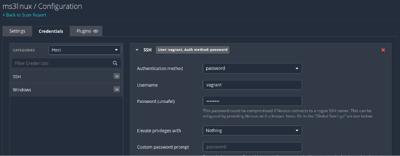
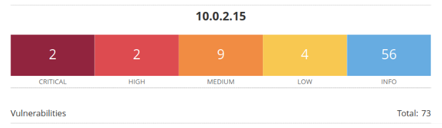
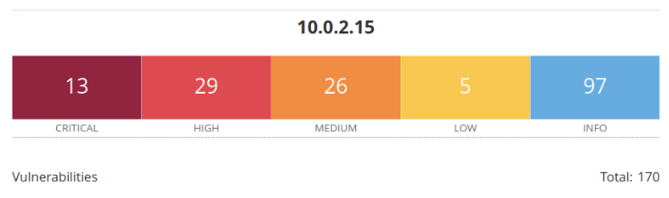

# **Caja Negra vs Caja Blanca**

### 

### Por:

+ Félix Sánchez González

+ Francisco Javier Rodríguez Acosta

+ Santiago Domínguez Gómez

## 

## **Índice**

[**1. Introducción**](#1-introducción)  

[**2. Metodología usada**](#2-metodología-usada)

[**3. Resumen de resultados**](#3-resumen-de-resultados)  
- [3.1. Vulnerabilidades encontradas en escaneo de caja negra](#31-vulnerabilidades-encontradas-en-escaneo-de-caja-negra)  
- [3.2. Vulnerabilidades encontradas en escaneo de caja blanca](#32-vulnerabilidades-encontradas-en-escaneo-de-caja-blanca)  

[**4. Listado de vulnerabilidades nuevas en la máquina Linux**](#4-listado-de-vulnerabilidades-nuevas-en-la-máquina-linux)  
- [4.1. Vulnerabilidades de gravedad crítica](#41-vulnerabilidades-de-gravedad-crítica)  
- [4.2. Vulnerabilidades de gravedad alta](#42-vulnerabilidades-de-gravedad-alta)  
- [4.3. Vulnerabilidades de gravedad media](#43-vulnerabilidades-de-gravedad-media)  
- [4.4. Vulnerabilidades de gravedad baja](#44-vulnerabilidades-de-gravedad-baja)  

[**5. Conclusiones**](#5-conclusiones)  

#
## **1\. Introducción** 

Este informe presenta los resultados del análisis de vulnerabilidades realizado en el servidor Linux usando Nessus, una herramienta popular para escanear sistemas. El objetivo fue comparar dos formas de hacerlo: caja negra y caja blanca. 

El escaneo de caja negra imita a un atacante externo que no sabe nada del sistema ni tiene acceso especial, así que solo encuentra fallos visibles desde fuera. 

En cambio, el escaneo de caja blanca se hizo con credenciales válidas, permitiendo revisar el sistema desde dentro y detectar más problemas de seguridad. 

Esta comparación muestra cómo el nivel de acceso afecta lo que podemos descubrir y nos da una idea más clara de los riesgos del servidor.

**Nota:**  Se muestran únicamente los resultados del servidor Linux para resumir el documento, ya que el objetivo es hacer una comparación de los resultados y no un escaneo en profundidad.

## **2\. Metodología usada** 

Se ha hecho un nuevo escaneo a la máquina, esta vez utilizando las credenciales de acceso para intentar identificar nuevas vulnerabilidades. 

**Opción de escaneo con contraseña en nessus**

Una vez se han obtenido los informes generados por nessus se ha extraído el nombre de cada vulnerabilidad en ambos reportes y se han comparado las listas con el comando **diff** en linux. 

## **3\. Resumen de resultados**

Los resultados de este análisis comparativo revelan una diferencia significativa en la cantidad y gravedad de las vulnerabilidades detectadas por cada metodología. 

El análisis de caja blanca, al tener acceso a información interna del sistema, identificó un conjunto mucho más amplio de vulnerabilidades que el análisis de caja negra. Esto demuestra que el uso de credenciales durante las evaluaciones de seguridad es fundamental para obtener una visión completa y precisa del estado de seguridad de un sistema.

Entre las vulnerabilidades más críticas detectadas exclusivamente por el análisis de caja blanca, se encuentran varias fallas de seguridad en el kernel de Linux, el componente central del sistema operativo. Estas vulnerabilidades podrían permitir a un atacante obtener control total sobre el servidor, ejecutar código malicioso de forma remota o incluso instalar rootkits persistentes. 

Además, se identificaron vulnerabilidades en software ampliamente utilizado como OpenSSL y glib2.0, que podrían ser explotadas para comprometer la confidencialidad, integridad o disponibilidad de los datos almacenados en el servidor.

### Vulnerabilidades encontradas en escaneo de Caja Negra 

### Vulnerabilidades encontradas en escaneo de Caja Blanca 

## **4\. Listado de vulnerabilidades nuevas encontradas en la máquina linux**  

### Gravedad Crítica 

* [Ubuntu 14.04 LTS / 16.04 LTS / 18.04 LTS / 20.04 LTS / 22.04 LTS / 23.10 : klibc vulnerabilities (USN-6736-1)](https://www.tenable.com/plugins/nessus/132926)  
    
  * Puntuación CVSS v3.0: 9.8  
  * Descripción: Existen múltiples vulnerabilidades en klibc.  
  * Impacto: Ejecución remota de código, denegación de servicio, divulgación de información.  
  * Recomendación: Actualice a la última versión de klibc.

* [Ubuntu 14.04 LTS / 16.04 LTS / 18.04 LTS / 20.04 LTS / 22.04 LTS / 24.04 LTS : libarchive vulnerabilities (USN-7070-1)](https://www.tenable.com/plugins/nessus/170701)  
    
  * Puntuación CVSS v3.0: 9.8  
  * Descripción: Existen múltiples vulnerabilidades en libarchive.  
  * Impacto: Ejecución remota de código, denegación de servicio, divulgación de información.  
  * Recomendación: Actualice a la última versión de libarchive.

* [Ubuntu 14.04 LTS / 16.04 LTS / 18.04 LTS / 20.04 LTS / 22.04 LTS / 24.04 LTS : rsync vulnerabilities (USN-7206-1)](https://www.tenable.com/plugins/nessus/172325)  
    
  * Puntuación CVSS v3.0: 9.8  
  * Descripción: Existen múltiples vulnerabilidades en rsync.  
  * Impacto: Ejecución remota de código, denegación de servicio, divulgación de información.  
  * Recomendación: Actualice a la última versión de rsync.

* [Ubuntu 14.04 LTS / 16.04 LTS / 18.04 LTS / 20.04 LTS / 24.04 LTS : Expat vulnerabilities (USN-7000-1)](https://www.tenable.com/plugins/nessus/169854)  
    
  * Puntuación CVSS v3.0: 9.8  
  * Descripción: Existen múltiples vulnerabilidades en Expat.  
  * Impacto: Ejecución remota de código, denegación de servicio, divulgación de información.  
  * Recomendación: Actualice a la última versión de Expat.

* [Ubuntu 14.04 LTS / 16.04 LTS / 18.04 LTS : GNU C Library vulnerabilities (USN-6762-1)](https://www.tenable.com/plugins/nessus/133717)  
    
  * Puntuación CVSS v3.0: 9.8  
  * Descripción: Existen múltiples vulnerabilidades en GNU C Library.  
  * Impacto: Ejecución remota de código, denegación de servicio, divulgación de información.  
  * Recomendación: Actualice a la última versión de GNU C Library.

* [Ubuntu 14.04 LTS : OpenSSL vulnerabilities (USN-7018-1)](https://www.tenable.com/plugins/nessus/170082)  
    
  * Puntuación CVSS v3.0: 9.8  
  * Descripción: Existen múltiples vulnerabilidades en OpenSSL.  
  * Impacto: Ejecución remota de código, denegación de servicio, divulgación de información.  
  * Recomendación: Actualice a la última versión de OpenSSL.

* [Ubuntu 14.04 LTS : glib2.0 vulnerability (USN-4014-2)](https://www.tenable.com/plugins/nessus/132925)  
    
  * Puntuación CVSS v3.0: 9.8  
  * Descripción: Existe una vulnerabilidad en glib2.0.  
  * Impacto: Ejecución remota de código, denegación de servicio, divulgación de información.  
  * Recomendación: Actualice a la última versión de glib2.0.

* [Ubuntu 14.04 LTS : zlib vulnerability (USN-7107-1)](https://www.tenable.com/plugins/nessus/171075)  
    
  * Puntuación CVSS v3.0: 9.8  
  * Descripción: Existe una vulnerabilidad en zlib.  
  * Impacto: Ejecución remota de código, denegación de servicio, divulgación de información.  
  * Recomendación: Actualice a la última versión de zlib.

* [Ubuntu 14.04 LTS / 16.04 LTS / 18.04 LTS / 20.04 LTS / 22.04 LTS / 24.04 LTS : Kerberos vulnerabilities (USN-6947-1)](https://www.tenable.com/plugins/nessus/169186)  
    
  * Puntuación CVSS v3.0: 9.8  
  * Descripción: Existen múltiples vulnerabilidades en Kerberos.  
  * Impacto: Ejecución remota de código, denegación de servicio, divulgación de información.  
  * Recomendación: Actualice a la última versión de Kerberos.

* [Ubuntu 14.04 LTS / 16.04 LTS / 18.04 LTS / 20.04 LTS / 22.04 LTS / 24.04 LTS / 24.10 : Kerberos vulnerability (USN-7257-1)](https://www.tenable.com/plugins/nessus/172841)  
    
  * Puntuación CVSS v3.0: 9.8  
  * Descripción: Existe una vulnerabilidad en Kerberos.  
  * Impacto: Ejecución remota de código, denegación de servicio, divulgación de información.  
  * Recomendación: Actualice a la última versión de Kerberos.

* [Canonical Ubuntu Linux SEoL (14.04.x)](https://www.tenable.com/plugins/nessus/201408)  
    
  * Puntuación CVSS v3.0: 10.0  
  * Descripción: Una mejora de seguridad está disponible.  
  * Impacto: Postura de seguridad mejorada.  
  * Recomendación: Aplique la mejora de seguridad.

### Gravedad Alta

* [Ubuntu 14.04 LTS / 16.04 LTS / 18.04 LTS / 20.04 LTS / 22.04 LTS / 24.04 LTS : Setuptools vulnerability (USN-7002-1)](https://www.tenable.com/plugins/nessus/169856)  
    
  * Puntuación CVSS v3.0: 8.8  
  * Descripción: Existe una vulnerabilidad en Setuptools.  
  * Impacto: Ejecución remota de código, denegación de servicio, divulgación de información.  
  * Recomendación: Actualice a la última versión de Setuptools.

* [Ubuntu 14.04 LTS : libvpx vulnerability (USN-7172-1)](https://www.tenable.com/plugins/nessus/171987)  
    
  * Puntuación CVSS v3.0: 8.8  
  * Descripción: Existe una vulnerabilidad en libvpx.  
  * Impacto: Ejecución remota de código, denegación de servicio, divulgación de información.  
  * Recomendación: Actualice a la última versión de libvpx.

* [Ubuntu 14.04 LTS / 16.04 LTS / 18.04 LTS / 20.04 LTS / 22.04 LTS / 23.10 / 24.04 LTS. : less vulnerability (USN-6756-1)](https://www.tenable.com/plugins/nessus/133597)  
    
  * Puntuación CVSS v3.0: 8.6  
  * Descripción: Existe una vulnerabilidad en less.  
  * Impacto: Ejecución remota de código, denegación de servicio, divulgación de información.  
  * Recomendación: Actualice a la última versión de less.

* [Linux Sudo Privilege Escalation (Out-of-bounds Write)](https://www.tenable.com/plugins/nessus/174928)  
    
  * Puntuación CVSS v3.0: 7.8  
  * Descripción: Existe una vulnerabilidad de escalada de privilegios en Sudo.  
  * Impacto: Escalada de privilegios.  
  * Recomendación: Actualice a la última versión de Sudo.

* [Ubuntu 14.04 LTS / 16.04 LTS / 18.04 LTS / 20.04 LTS / 22.04 LTS / 23.10 : Vim vulnerability (USN-6698-1)](https://www.tenable.com/plugins/nessus/132499)  
    
  * Puntuación CVSS v3.0: 7.8  
  * Descripción: Existe una vulnerabilidad en Vim.  
  * Impacto: Ejecución remota de código, denegación de servicio, divulgación de información.  
  * Recomendación: Actualice a la última versión de Vim.

* [Ubuntu 14.04 LTS : Linux kernel vulnerabilities (USN-6699-1)](https://www.tenable.com/plugins/nessus/132500)  
    
  * Puntuación CVSS v3.0: 7.8  
  * Descripción: Existen múltiples vulnerabilidades en el kernel de Linux.  
  * Impacto: Ejecución remota de código, denegación de servicio, divulgación de información.  
  * Recomendación: Actualice a la última versión del kernel de Linux.

* [Ubuntu 14.04 LTS : Linux kernel vulnerabilities (USN-7333-1)](https://www.tenable.com/plugins/nessus/174404)  
    
  * Puntuación CVSS v3.0: 7.8  
  * Descripción: Existen múltiples vulnerabilidades en el kernel de Linux.  
  * Impacto: Ejecución remota de código, denegación de servicio, divulgación de información.  
  * Recomendación: Actualice a la última versión del kernel de Linux.

* [Ubuntu 14.04 LTS : Linux kernel vulnerability (USN-6925-1)](https://www.tenable.com/plugins/nessus/168845)  
    
  * Puntuación CVSS v3.0: 7.8  
  * Descripción: Existe una vulnerabilidad en el kernel de Linux.  
  * Impacto: Ejecución remota de código, denegación de servicio, divulgación de información.  
  * Recomendación: Actualice a la última versión del kernel de Linux.

* [Ubuntu 14.04 LTS : Linux kernel vulnerability (USN-7122-1)](https://www.tenable.com/plugins/nessus/171284)  
    
  * Puntuación CVSS v3.0: 7.8  
  * Descripción: Existe una vulnerabilidad en el kernel de Linux.  
  * Impacto: Ejecución remota de código, denegación de servicio, divulgación de información.  
  * Recomendación: Actualice a la última versión del kernel de Linux.

* [Ubuntu 14.04 LTS : Linux kernel vulnerability (USN-7163-1)](https://www.tenable.com/plugins/nessus/171849)  
    
  * Puntuación CVSS v3.0: 7.8  
  * Descripción: Existe una vulnerabilidad en el kernel de Linux.  
  * Impacto: Ejecución remota de código, denegación de servicio, divulgación de información.  
  * Recomendación: Actualice a la última versión del kernel de Linux.

* [Ubuntu 14.04 LTS : Linux kernel vulnerability (USN-7232-1)](https://www.tenable.com/plugins/nessus/172595)  
    
  * Puntuación CVSS v3.0: 7.8  
  * Descripción: Existe una vulnerabilidad en el kernel de Linux.  
  * Impacto: Ejecución remota de código, denegación de servicio, divulgación de información.  
  * Recomendación: Actualice a la última versión del kernel de Linux.

* [Ubuntu 14.04 LTS : Linux kernel vulnerability (USN-7300-1)](https://www.tenable.com/plugins/nessus/173744)  
    
  * Puntuación CVSS v3.0: 7.8  
  * Descripción: Existe una vulnerabilidad en el kernel de Linux.  
  * Impacto: Ejecución remota de código, denegación de servicio, divulgación de información.  
  * Recomendación: Actualice a la última versión del kernel de Linux.

* [Ubuntu 14.04 LTS : Vim vulnerabilities (USN-6965-1)](https://www.tenable.com/plugins/nessus/169453)  
    
  * Puntuación CVSS v3.0: 7.8  
  * Descripción: Existen múltiples vulnerabilidades en Vim.  
  * Impacto: Ejecución remota de código, denegación de servicio, divulgación de información.  
  * Recomendación: Actualice a la última versión de Vim.

* [SSL Medium Strength Cipher Suites Supported (SWEET32)](https://www.tenable.com/plugins/nessus/117574)  
    
  * Puntuación CVSS v3.0: 7.5  
  * Descripción: El servidor admite conjuntos de cifrado de fortaleza media (SWEET32).  
  * Impacto: Mayor riesgo de ataques de intermediario.  
  * Recomendación: Desactive la compatibilidad con conjuntos de cifrado de fortaleza media.

* [Ubuntu 14.04 LTS / 16.04 LTS / 18.04 LTS / 20.04 LTS / 22.04 LTS / 24.04 LTS / 24.10 : libxml2 vulnerabilities (USN-7302-1)](https://www.tenable.com/plugins/nessus/173778)  
    
  * Puntuación CVSS v3.0: 7.5  
  * Descripción: Existen múltiples vulnerabilidades en libxml2.  
  * Impacto: Ejecución remota de código, denegación de servicio, divulgación de información.  
  * Recomendación: Actualice a la última versión de libxml2.

* [Ubuntu 14.04 LTS / 16.04 LTS / 18.04 LTS / 20.04 LTS / 22.04 LTS : Python vulnerabilities (USN-7015-5)](https://www.tenable.com/plugins/nessus/170079)  
    
  * Puntuación CVSS v3.0: 7.5  
  * Descripción: Existen múltiples vulnerabilidades en Python.  
  * Impacto: Ejecución remota de código, denegación de servicio, divulgación de información.  
  * Recomendación: Actualice a la última versión de Python.

* [Ubuntu 14.04 LTS / 16.04 LTS / 18.04 LTS / 20.04 LTS / 23.10 : LibTIFF vulnerabilities (USN-6644-1)](https://www.tenable.com/plugins/nessus/131859)  
    
  * Puntuación CVSS v3.0: 7.5  
  * Descripción: Existen múltiples vulnerabilidades en LibTIFF.  
  * Impacto: Ejecución remota de código, denegación de servicio, divulgación de información.  
  * Recomendación: Actualice a la última versión de LibTIFF.

* [Ubuntu 14.04 LTS / 16.04 LTS / 18.04 LTS : Bind vulnerabilities (USN-6723-1)](https://www.tenable.com/plugins/nessus/133054)  
    
  * Puntuación CVSS v3.0: 7.5  
  * Descripción: Existen múltiples vulnerabilidades en Bind.  
  * Impacto: Ejecución remota de código, denegación de servicio, divulgación de información.  
  * Recomendación: Actualice a la última versión de Bind.

* [Ubuntu 14.04 LTS / 16.04 LTS / 18.04 LTS : libxml2 vulnerability (USN-6658-2)](https://www.tenable.com/plugins/nessus/132057)  
    
  * Puntuación CVSS v3.0: 7.5  
  * Descripción: Existe una vulnerabilidad en libxml2.  
  * Impacto: Ejecución remota de código, denegación de servicio, divulgación de información.  
  * Recomendación: Actualice a la última versión de libxml2.

* [Ubuntu 14.04 LTS / 18.04 LTS : PostgreSQL vulnerability (USN-6968-3)](https://www.tenable.com/plugins/nessus/169548)  
    
  * Puntuación CVSS v3.0: 7.5  
  * Descripción: Existe una vulnerabilidad en PostgreSQL.  
  * Impacto: Ejecución remota de código, denegación de servicio, divulgación de información.  
  * Recomendación: Actualice a la última versión de PostgreSQL.

* [Ubuntu 14.04 LTS : GNU C Library vulnerability (USN-7259-3)](https://www.tenable.com/plugins/nessus/172987)  
    
  * Puntuación CVSS v3.0: 7.5  
  * Descripción: Existe una vulnerabilidad en GNU C Library.  
  * Impacto: Ejecución remota de código, denegación de servicio, divulgación de información.  
  * Recomendación: Actualice a la última versión de GNU C Library.

* [Ubuntu 14.04 LTS : LibTIFF vulnerability (USN-6997-2)](https://www.tenable.com/plugins/nessus/169828)  
    
  * Puntuación CVSS v3.0: 7.5  
  * Descripción: Existe una vulnerabilidad en LibTIFF.  
  * Impacto: Ejecución remota de código, denegación de servicio, divulgación de información.  
  * Recomendación: Actualice a la última versión de LibTIFF.

* [Ubuntu 14.04 LTS : SQLite vulnerability (USN-5615-3)](https://www.tenable.com/plugins/nessus/170081)  
    
  * Puntuación CVSS v3.0: 7.5  
  * Descripción: Existe una vulnerabilidad en SQLite.  
  * Impacto: Ejecución remota de código, denegación de servicio, divulgación de información.  
  * Recomendación: Actualice a la última versión de SQLite.

* [Ubuntu 14.04 LTS : samba vulnerability (USN-3976-2)](https://www.tenable.com/plugins/nessus/132924)  
    
  * Puntuación CVSS v3.0: 7.5  
  * Descripción: Existe una vulnerabilidad en samba.  
  * Impacto: Ejecución remota de código, denegación de servicio, divulgación de información.  
  * Recomendación: Actualice a la última versión de samba.

* [Ubuntu 14.04 LTS / 16.04 LTS / 18.04 LTS : libvpx vulnerability (USN-7249-1)](https://www.tenable.com/plugins/nessus/172785)  
    
  * Puntuación CVSS v3.0: 7.1  
  * Descripción: Existe una vulnerabilidad en libvpx.  
  * Impacto: Ejecución remota de código, denegación de servicio, divulgación de información.  
  * Recomendación: Actualice a la última versión de libvpx.

* [Ubuntu 14.04 LTS / 18.04 LTS / 20.04 LTS / 22.04 LTS : libsndfile vulnerabilities (USN-7273-1)](https://www.tenable.com/plugins/nessus/173229)  
    
  * Puntuación CVSS v3.0: 7.1  
  * Descripción: Existen múltiples vulnerabilidades en libsndfile.  
  * Impacto: Ejecución remota de código, denegación de servicio, divulgación de información.  
  * Recomendación: Actualice a la última versión de libsndfile.

* [Ubuntu 14.04 LTS / 18.04 LTS / 20.04 LTS : Libcroco vulnerabilities (USN-6958-1)](https://www.tenable.com/plugins/nessus/169342)  
    
  * Puntuación CVSS v3.0: 7.1  
  * Descripción: Existen múltiples vulnerabilidades en Libcroco.  
  * Impacto: Ejecución remota de código, denegación de servicio, divulgación de información.  
  * Recomendación: Actualice a la última versión de Libcroco.

* [Ubuntu 14.04 LTS : samba vulnerability (USN-3976-4)](https://www.tenable.com/plugins/nessus/125475)  
    
  * Puntuación CVSS v3.0: N/A  
  * Descripción: Existe una vulnerabilidad en samba.  
  * Impacto: Ejecución remota de código, denegación de servicio, divulgación de información.  
  * Recomendación: Actualice a la última versión de samba.

### Gravedad Media

* [Ubuntu 14.04 LTS : nano vulnerability (USN-7064-2)](https://www.tenable.com/plugins/nessus/170548)  
    
  * Puntuación CVSS v3.0: 6.7  
  * Descripción: Existe una vulnerabilidad en nano.  
  * Impacto: Divulgación de información.  
  * Recomendación: Actualice a la última versión de nano.

* [Node.js Module node-tar \< 6.2.1 DoS](https://www.tenable.com/plugins/nessus/181465)  
    
  * Puntuación CVSS v3.0: 6.5  
  * Descripción: Existe una vulnerabilidad de denegación de servicio en node-tar.  
  * Impacto: Denegación de servicio.  
  * Recomendación: Actualice a node-tar versión 6.2.1 o posterior.

* [Ubuntu 14.04 LTS / 16.04 LTS / 18.04 LTS : curl vulnerability (USN-6944-2)](https://www.tenable.com/plugins/nessus/169183)  
    
  * Puntuación CVSS v3.0: 6.5  
  * Descripción: Existe una vulnerabilidad en curl.  
  * Impacto: Divulgación de información.  
  * Recomendación: Actualice a la última versión de curl.

* [Ubuntu 14.04 LTS / 16.04 LTS / 18.04 LTS : ncurses vulnerability (USN-6684-1)](https://www.tenable.com/plugins/nessus/132349)  
    
  * Puntuación CVSS v3.0: 6.5  
  * Descripción: Existe una vulnerabilidad en ncurses.  
  * Impacto: Divulgación de información.  
  * Recomendación: Actualice a la última versión de ncurses.

* [Ubuntu 14.04 LTS : Linux kernel vulnerabilities (USN-6971-1)](https://www.tenable.com/plugins/nessus/169550)  
    
  * Puntuación CVSS v3.0: 6.4  
  * Descripción: Existen múltiples vulnerabilidades en el kernel de Linux.  
  * Impacto: Divulgación de información.  
  * Recomendación: Actualice a la última versión del kernel de Linux.

* [Ubuntu 14.04 LTS / 16.04 LTS / 18.04 LTS / 20.04 LTS / 22.04 LTS / 24.04 LTS / 24.10 : Expat vulnerability (USN-7145-1)](https://www.tenable.com/plugins/nessus/171478)  
    
  * Puntuación CVSS v3.0: 5.9  
  * Descripción: Existe una vulnerabilidad en Expat.  
  * Impacto: Denegación de servicio.  
  * Recomendación: Actualice a la última versión de Expat.

* [Ubuntu 14.04 LTS : linux vulnerabilities (USN-3983-1) (MDSUM/RIDL) (MFBDS/RIDL/ZombieLoad) (MLPDS/RIDL) (MSBDS/Fallout)](https://www.tenable.com/plugins/nessus/125474)  
    
  * Puntuación CVSS v3.0: 5.6  
  * Descripción: Existen múltiples vulnerabilidades en el kernel de Linux.  
  * Impacto: Divulgación de información.  
  * Recomendación: Actualice a la última versión del kernel de Linux.

* [Ubuntu 14.04 LTS / 16.04 LTS / 18.04 LTS / 20.04 LTS / 22.04 LTS / 23.10 / 24.04 LTS : LibTIFF vulnerability (USN-6827-1)](https://www.tenable.com/plugins/nessus/134835)  
    
  * Puntuación CVSS v3.0: 5.5  
  * Descripción: Existe una vulnerabilidad en LibTIFF.  
  * Impacto: Divulgación de información.  
  * Recomendación: Actualice a la última versión de LibTIFF.

* [Ubuntu 14.04 LTS / 16.04 LTS / 18.04 LTS / 20.04 LTS / 22.04 LTS / 23.10 : shadow vulnerability (USN-6640-1)](https://www.tenable.com/plugins/nessus/131549)  
    
  * Puntuación CVSS v3.0: 5.5  
  * Descripción: Existe una vulnerabilidad en shadow.  
  * Impacto: Divulgación de información.  
  * Recomendación: Actualice a la última versión de shadow.

* [Ubuntu 14.04 LTS / 16.04 LTS / 18.04 LTS : PAM vulnerability (USN-6588-2)](https://www.tenable.com/plugins/nessus/130879)  
    
  * Puntuación CVSS v3.0: 5.5  
  * Descripción: Existe una vulnerabilidad en PAM.  
  * Impacto: Divulgación de información.  
  * Recomendación: Actualice a la última versión de PAM.

* [Ubuntu 14.04 LTS : APR vulnerability (USN-7038-2)](https://www.tenable.com/plugins/nessus/170342)  
    
  * Puntuación CVSS v3.0: 5.3  
  * Descripción: Existe una vulnerabilidad en APR.  
  * Impacto: Divulgación de información.  
  * Recomendación: Actualice a la última versión de APR.

* [Ubuntu 14.04 LTS / 16.04 LTS / 18.04 LTS / 20.04 LTS / 22.04 LTS / 24.04 LTS : Vim vulnerabilities (USN-6993-1)](https://www.tenable.com/plugins/nessus/169730)  
    
  * Puntuación CVSS v3.0: 5.3  
  * Descripción: Existen múltiples vulnerabilidades en Vim.  
  * Impacto: Divulgación de información.  
  * Recomendación: Actualice a la última versión de Vim.

* [Ubuntu 14.04 LTS : Python vulnerability (USN-7015-4)](https://www.tenable.com/plugins/nessus/170078)  
    
  * Puntuación CVSS v3.0: 5.3  
  * Descripción: Existe una vulnerabilidad en Python.  
  * Impacto: Divulgación de información.  
  * Recomendación: Actualice a la última versión de Python.

* [MySQL Denial of Service (Jul 2020 CPU)](https://www.tenable.com/plugins/nessus/138561)  
    
  * Puntuación CVSS v3.0: 4.9  
  * Descripción: Existe una vulnerabilidad de denegación de servicio en MySQL.  
  * Impacto: Denegación de servicio.  
  * Recomendación: Actualice a la última versión de MySQL.

* [Ubuntu 14.04 LTS : Vim vulnerability (USN-7048-2)](https://www.tenable.com/plugins/nessus/170471)  
    
  * Puntuación CVSS v3.0: 4.5  
  * Descripción: Existe una vulnerabilidad en Vim.  
  * Impacto: Divulgación de información.  
  * Recomendación: Actualice a la última versión de Vim.

* [Ubuntu 14.04 LTS : Linux kernel vulnerability (USN-6645-1)](https://www.tenable.com/plugins/nessus/131550)  
    
  * Puntuación CVSS v3.0: 4.4  
  * Descripción: Existe una vulnerabilidad en el kernel de Linux.  
  * Impacto: Divulgación de información.  
  * Recomendación: Actualice a la última versión del kernel de Linux.

### Gravedad Baja

* [Ubuntu 14.04 LTS / 16.04 LTS / 18.04 LTS / 20.04 LTS / 22.04 LTS / 24.04 LTS / 24.10 : Vim vulnerability (USN-7131-1)](https://www.tenable.com/plugins/nessus/171343)  
    
  * Puntuación CVSS v3.0: 3.9  
  * Descripción: Existe una vulnerabilidad en Vim.  
  * Impacto: Divulgación de información.  
  * Recomendación: Actualice a la última versión de Vim.

* [ICMP Timestamp Request Remote Date Disclosure](https://www.tenable.com/plugins/nessus/10287)  
    
  * Puntuación CVSS v3.0: 2.1  
  * Descripción: El host remoto responde a las solicitudes de marca de tiempo ICMP. Esto permite que un atacante remoto determine la hora actual del sistema.  
  * Impacto: Divulgación de información.  
  * Recomendación: Filtre las solicitudes de marca de tiempo ICMP entrantes.

# 

## **5\. Conclusiones** 

Los hallazgos confirman que el análisis de caja blanca permite descubrir una mayor cantidad de vulnerabilidades, incluidas aquellas de gravedad crítica y alta, que podrían comprometer la seguridad del sistema si no se corrigen. 

En particular, se identificaron fallos en componentes fundamentales como el kernel de Linux, OpenSSL y otros paquetes esenciales, que podrían ser explotados por atacantes para ejecutar código malicioso o elevar privilegios dentro del sistema.

Además, el hecho de que no se hayan encontrado vulnerabilidades detectadas únicamente por el análisis de caja negra refuerza la conclusión de que este método, a pesar de ser relevante en pruebas de seguridad externas, no ofrece una visión completa del estado de seguridad del sistema.

Por ello, se recomienda combinar ambas metodologías en futuras evaluaciones para obtener un análisis integral y minimizar los riesgos de explotación.