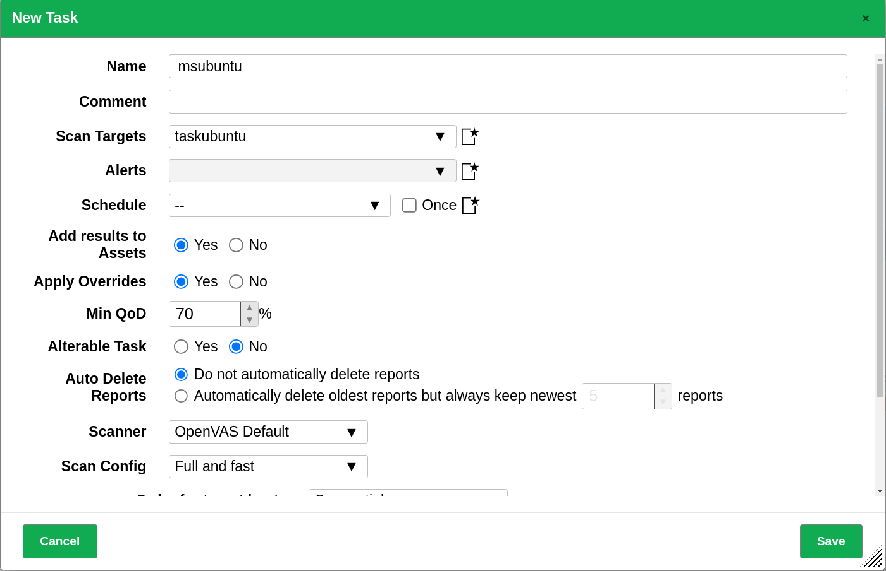
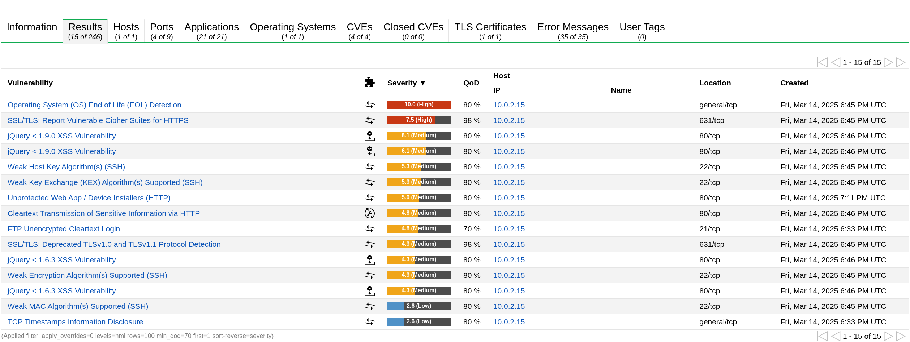
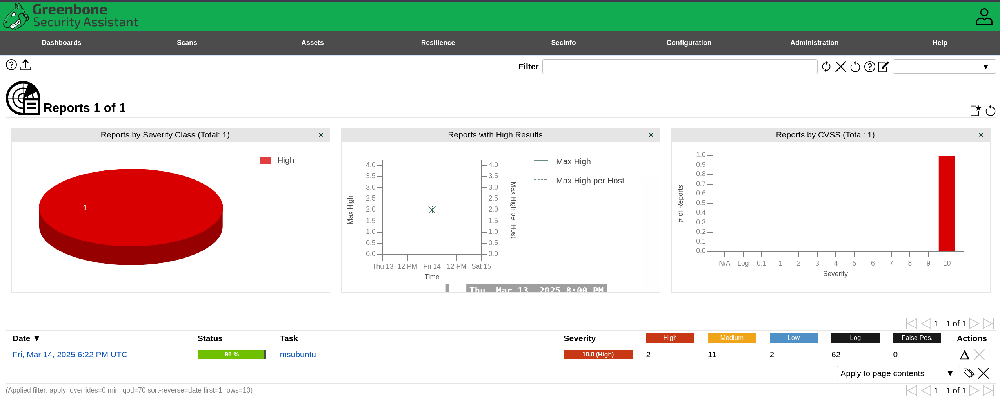
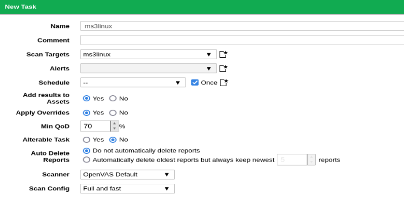
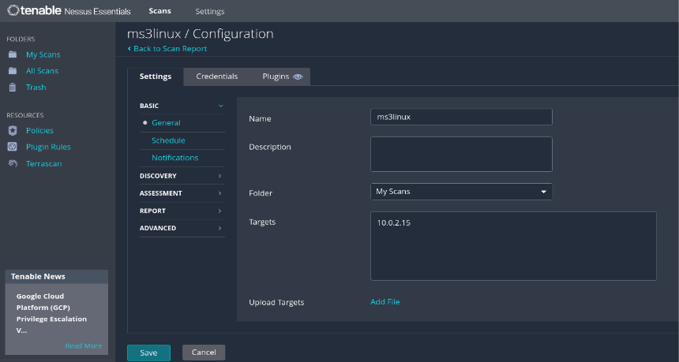

# **Comparativa de Herramientas OpenVAS y Nessus**

## Por:

+ Félix Sánchez González

## **Índice**  

[**1. Escaneos en OpenVAS**](#1-escaneos-en-openvas)  

[**2. Comparativa de Herramientas**](#2-comparativa-de-herramientas)  
- [2.1 Cobertura y Alcance](#21-cobertura-y-alcance)  
  - [OpenVAS](#openvas)  
  - [Nessus](#nessus)  
- [2.2 Detalle y Profundidad de la Información](#22-detalle-y-profundidad-de-la-informacion)  
  - [OpenVAS](#openvas-1)  
  - [Nessus](#nessus-1)  
- [2.3 Enfoque y Aplicabilidad](#23-enfoque-y-aplicabilidad)  
  - [OpenVAS](#openvas-2)  
  - [Nessus](#nessus-2)  
- [2.4 Diferencias de Interfaz](#24-diferencias-de-interfaz)  
  - [OpenVAS](#openvas-3)  
  - [Nessus](#nessus-3)  
- [2.5 Comparativa de Interfaces](#25-comparativa-de-interfaces)  
- [2.6 Precios y Licencias](#26-precios-y-licencias)  
  - [OpenVAS](#openvas-4)  
  - [Nessus](#nessus-4)  

[**3. Conclusiones**](#3-conclusiones)  

# **1\. Escaneos en OpenVAS**

En las siguientes imágenes se muestra el proceso seguido y los resultados obtenidos en los escaneos de OpenVas:

# **2\. Comparativa de Herramientas** 

Una vez realizados los escaneos con ambas herramientas pasamos a comparar sus características principales:

## **2.1 Cobertura y Alcance** 

### **OpenVAS** 

**Fortalezas:** Se destaca por filtrar los resultados para mostrar únicamente las vulnerabilidades con una alta calidad de detección (QoD ≥ 70%), lo que ayuda a reducir los falsos positivos. Además, proporciona información detallada sobre vulnerabilidades críticas, como sistemas operativos en fin de vida (como Ubuntu 14.04) y cifrados vulnerables (por ejemplo, SWEET32). 

**Debilidades:** Su enfoque en la filtración de resultados puede llevar a omitir vulnerabilidades de menor impacto que podrían ser relevantes en un análisis más completo. Además, su cobertura es más limitada en comparación con herramientas comerciales y su velocidad de escaneo es lenta, lo que puede retrasar la obtención de resultados, especialmente en entornos grandes y complejos.

### **Nessus**

**Fortalezas:** Nessus ofrece una cobertura mucho más amplia, siendo capaz de identificar hasta 73 vulnerabilidades, desde las más críticas hasta las informativas. Sus hallazgos están clasificados por severidad, lo que facilita su priorización y gestión. Una de sus grandes ventajas es la rapidez con la que realiza los escaneos, lo que permite obtener resultados en menos tiempo.

**Debilidades:** La gran cantidad de hallazgos que genera puede ser abrumadora, y es necesario un proceso adicional para filtrar los falsos positivos, lo cual requiere un esfuerzo adicional en la interpretación de los resultados.

## **2.2 Detalle y Profundidad de la Información**

### **OpenVAS** 

Proporciona descripciones claras y recomendaciones específicas para cada vulnerabilidad, facilitando la toma de decisiones rápidas y directas sobre los problemas más críticos. Su enfoque se centra principalmente en los problemas que tienen un impacto más inmediato en la seguridad del sistema. Sin embargo, su información es más superficial cuando se trata de vulnerabilidades de menor impacto, lo que podría no proporcionar una visión tan completa en análisis más profundos.

### **Nessus**

Ofrece un análisis más granular y detallado, proporcionando puntajes CVSS, VPR y EPSS para cada vulnerabilidad, lo que ofrece un contexto más amplio sobre el riesgo asociado. Además, incluye información técnica y de configuración que permite un seguimiento detallado de cada vulnerabilidad. Esto facilita la identificación de vulnerabilidades que podrían no ser obvias a simple vista, permitiendo un análisis más exhaustivo y un enfoque más proactivo para mejorar la seguridad del sistema.

## **2.3 Enfoque y Aplicabilidad**

### **OpenVAS**

Es ideal para auditorías rápidas y para aquellos entornos que requieren informes concisos sin sobrecargar de información. Su filtrado enfocado en vulnerabilidades críticas permite una respuesta rápida, pero la lentitud de los escaneos puede ser un inconveniente en escenarios que requieren análisis más ágiles o donde el tiempo es crucial.

### **Nessus**

Está diseñado para realizar auditorías exhaustivas y análisis en profundidad. Gracias a su capacidad para identificar una amplia gama de vulnerabilidades, es útil no solo para detectar problemas graves, sino también para encontrar configuraciones inseguras o vulnerabilidades menores que podrían ser la puerta de entrada para ataques más complejos. La rapidez de sus escaneos lo hace ideal para entornos dinámicos y exigentes que requieren respuestas rápidas, aunque la cantidad de información generada puede requerir una interpretación más detallada.

## 

## **2.4 Diferencias de Interfaz**

### **OpenVAS**

Presenta una experiencia más técnica y menos refinada, lo que puede resultar en una curva de aprendizaje más pronunciada, especialmente para usuarios nuevos.

### **Nessus**

Tiene una interfaz más intuitiva y amigable, con un diseño más pulido y fácil de navegar, lo que facilita su uso, incluso para usuarios menos experimentados.

## 

## **2.5 Comparativa de Interfaces**

| Característica | OpenVAS | Nessus |
| :---- | :---- | :---- |
| **Diseño** | Interfaz más técnica, con una apariencia menos refinada y más orientada a usuarios avanzados. | Diseño intuitivo y moderno, con una experiencia más fluida y visualmente atractiva. |
| **Facilidad de uso** | Puede ser más compleja de navegar, especialmente para usuarios sin experiencia previa en seguridad. | Ofrece una navegación más amigable y estructurada, facilitando la comprensión de los resultados. |
| **Configuración** | Requiere configuraciones manuales más avanzadas para optimizar los escaneos. | Interfaz más automatizada, con asistentes que guían el proceso de configuración. |
| **Presentación de resultados** | Presenta los hallazgos de manera detallada, pero con una disposición más técnica y menos visual. | Clasificación clara con escalas de severidad y gráficos para visualizar las vulnerabilidades encontradas. |
| **Reportes** | Ofrece reportes detallados, pero pueden ser más difíciles de interpretar sin conocimientos técnicos avanzados. | Genera reportes bien estructurados con explicaciones claras y enlaces a recursos adicionales. |
| **Velocidad de respuesta** | Puede ser más lento al cargar y procesar información debido a su arquitectura. | Responde de manera ágil, permitiendo una experiencia más dinámica al interactuar con la plataforma. |
| **Soporte y documentación** | Dispone de documentación técnica extensa, foros activos y comunidad open source.  | Tenable ofrece documentación completa, y soporte técnico profesional para versiones de pago pero con una comunidad más limitada. |

## **2.6 Precios y Licencias**

### **OpenVAS**

Es una herramienta de código abierto, lo que significa que su uso es gratuito a través de la **Greenbone Community Edition**. Sin embargo, esta versión no cuenta con soporte oficial. 

Para usuarios que requieren soporte profesional y características avanzadas, como escaneos más rápidos, eficientes y con menor impacto en el rendimiento del sistema, o una base de datos de vulnerabilidades con actualizaciones diarias, **Greenbone Enterprise Appliances** ofrece versiones comerciales, cuyo precio varía según las necesidades y el tamaño de la organización.

### **Nessus**
Nessus ofrece varias opciones de licencia:

La **Nessus Professional** tiene un coste de **USD 3,990 por un año**, **USD 7,780.50 por dos años** y **USD 11,371.50 por tres años**. Además, se puede añadir soporte avanzado por **USD 400 anuales**. Algunas de las **funcionalidades** que ofrece esta versión son: escaneos de vulnerabilidades **sin límite de direcciones IP**, **resultados en tiempo real** sobre el estado de las vulnerabilidades y generación de **informes adaptados a las necesidades específicas de la organización**.

La versión **Nessus Expert**, que incluye funcionalidades adicionales, tiene un precio de **USD 5,990 por un año**, **USD 11,680.50 por dos años** y **USD 17,071.50 por tres años**, con el mismo costo adicional de soporte avanzado. Esta versión incluye **todas las funcionalidades de Nessus Professional** y además añade **escaneo de aplicaciones web** e **identificación de riesgos en entorno de nube**. 

Además de estas opciones de pago, Nessus también ofrece **Nessus Essentials**. Esta versión gratuita es ideal para **uso personal**, **pequeños negocios** o **entornos educativos**, aunque posee ciertas **limitaciones** en comparación con las versiones de pago: los escaneos están restringidos a **16 direcciones IP como máximo**, **no muestra resultados en vivo** de las vulnerabilidades y **no es posible personalizar los informes**. 

# **3\. Conclusiones**

OpenVAS es una opción excelente para aquellos que buscan una herramienta gratuita y fácil de interpretar, ideal para auditorías rápidas centradas en vulnerabilidades de alta calidad. Sin embargo, su velocidad de escaneo y la cobertura limitada pueden ser inconvenientes en escenarios que requieren respuestas rápidas o análisis más completos.

En cambio, Nessus es más adecuado para entornos que requieren un análisis exhaustivo y detallado. Ofrece una cobertura extensa, escaneos rápidos y una mayor profundidad en el análisis, aunque con un mayor esfuerzo en la interpretación de los resultados. Si bien su costo puede ser un factor a considerar, es una opción muy poderosa para realizar auditorías de seguridad en entornos complejos.
