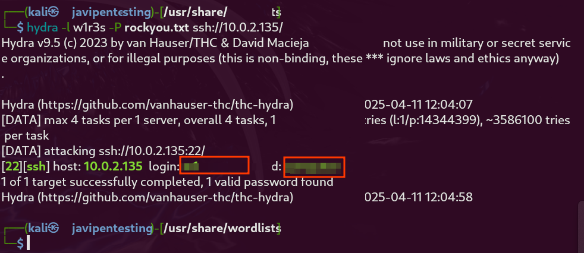
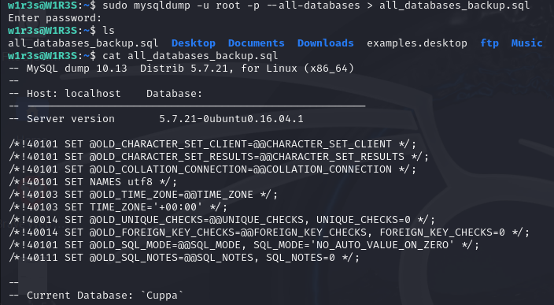

# Análisis de Vulnerabilidades en Máquina W1R3S

## Añadir en escaneos:  
- **FTP (puerto 21)**: `vsftpd 3.0.3`
- **SSH (puerto 22)**: `OpenSSH 7.2p2`
- **HTTP (puerto 80)**: `Apache 2.4.18` con CMS cuppa en /administrator.
- **MYSQL (puerto 3306)**: `versión 5.7.21` vulnerable a [CVE-2018-2647](https://nvd.nist.gov/vuln/detail/CVE-2018-2647)


## Vulnerabilidad 1: Cuppa CMS - Local File Inclusion (LFI)

### Identificación:
**Puerto(s) / Servicio(s):** 80/tcp - Apache httpd 2.4.18 <br>
**Herramienta(s) de Detección:** gobuster <br>
**Descripción Breve:** La instalación de Cuppa CMS permite acceso no autorizado a archivos del sistema mediante manipulación de rutas.

### Descripción:
**Tipo:** Inyección <br>
**CWE:** [CWE-22](https://cwe.mitre.org/data/definitions/22.html) - Improper Limitation of a Pathname to a Restricted Directory <br>
**Gravedad:** Alta <br>
**Vector de Ataque:** Remoto <br>
**Requiere Autenticación:** No <br>
**Impacto Potencial:** Lectura de archivos sensibles del sistema, posible revelación de credenciales y datos confidenciales, base para posteriores ataques.

### Detalles Técnicos:
La vulnerabilidad existe en el componente alertConfigField.php del Cuppa CMS. Este componente no valida adecuadamente el parámetro urlConfig, lo que permite la manipulación de rutas para acceder a archivos del sistema fuera del directorio web. https://www.exploit-db.com/exploits/25971

### Explotación:
Se accede a través de la URL vulnerable mediante técnica de path traversal:
```
http://ip/administrator/alerts/alertConfigField.php?urlConfig=../../../../../../../../../etc/passwd
```
Esta vulnerabilidad permitió obtener contenido de archivos críticos como /etc/passwd y /etc/shadow.


### Sistemas afectados:
Servidor W1R3S con ip 10.0.2.135

### Mitigación:
- Actualizar Cuppa CMS a una versión que no contenga esta vulnerabilidad
- Implementar validación de entrada en parámetros de URL
- Configurar restricciones apropiadas de acceso a archivos
- Aplicar principio de mínimo privilegio para el usuario web

## Vulnerabilidad 2: Credenciales débiles de usuario del sistema

### Identificación:
**Puerto(s) / Servicio(s):** 22/tcp - OpenSSH 7.2p2 <br>
**Herramienta(s) de Detección:** John the Ripper <br>
**Descripción Breve:** Contraseña del usuario w1r3s fácilmente crackeada.

### Descripción:
**Tipo:** Configuración insegura / credenciales débiles <br>
**CWE:** [CWE-521](https://cwe.mitre.org/data/definitions/521.html) -  Weak Password Requirements <br>
**Gravedad:** Alta <br>
**Vector de Ataque:** Remoto <br>
**Requiere Autenticación:** Sí (credenciales obtenidas) <br>
**Impacto Potencial:** Acceso no autorizado al sistema como usuario w1r3s, punto de entrada para escalada de privilegios.

### Detalles Técnicos:
El usuario w1r3s utilizaba la contraseña "computer" que fue fácilmente crackeada usando John the Ripper después de obtener el archivo /etc/shadow mediante la vulnerabilidad LFI.   


### Explotación:
Los archivos `/etc/passwd` y `/etc/shadow` fueron extraídos mediante la vulnerabilidad LFI. Posteriormente se usó la herramienta John the Ripper para crackear la contraseña. Con las credenciales obtenidas, se consiguió acceso SSH al sistema 


### Sistemas afectados:
Usuario w1r3s en el servidor W1R3S.

### Mitigación:
- Implementar políticas de contraseñas fuertes
- Aplicar rotación periódica de contraseñas
- Considerar implementación de autenticación de doble factor
- Limitar intentos fallidos de autenticación
## Vulnerabilidad 3: Configuración insegura de sudo

### Identificación:
**Puerto(s) / Servicio(s):** Sistema local
**Herramienta(s) de Detección:** Comando "sudo -l"
**Descripción Breve:** El usuario w1r3s tiene permisos para ejecutar cualquier comando como root.

### Descripción:
**Tipo:** Configuración insegura de privilegios <br>
**CWE:** [CWE-250](https://cwe.mitre.org/data/definitions/250.html) - Execution with Unnecessary Privileges <br>
**Gravedad:** Media <br>
**Vector de Ataque:** Local <br>
**Requiere Autenticación:** Sí (acceso como usuario w1r3s) <br>
**Impacto Potencial:** Escalada de privilegios a root, control total del sistema. <br>

### Detalles Técnicos:
El usuario w1r3s tiene la configuración "(ALL : ALL) ALL" en sudoers, lo que permite ejecutar cualquier comando como usuario root sin restricciones.

### Explotación:
Después de acceder como usuario w1r3s, se verificaron los permisos de sudo con "sudo -l". Al confirmar los privilegios completos, se ejecutó "sudo bash" para obtener shell con privilegios de root


### Sistemas afectados:
Configuración de sudo en el servidor W1R3S.

### Mitigación:
- Configurar sudo para permitir solo comandos específicos necesarios
- Aplicar principio de mínimo privilegio
- Implementar auditoría de comandos sudo ejecutados
- Revisar periódicamente la configuración de permisos


## Vulnerabilidad 4: FTP - Transmisión de Credenciales en Texto Claro

### Identificación: 
**Puerto(s) / Servicio(s):** 21/tcp - FTP  
**Herramienta(s) de Detección:**  Wireshark  

### Descripción Breve:
El protocolo FTP utilizado en el sistema transmite credenciales y datos sin cifrado, lo que permite su interceptación por atacantes mediante técnicas de sniffing.


### Descripción:
**Tipo:** Uso de protocolo inseguro  
**CWE:** [CWE-319](https://cwe.mitre.org/data/definitions/319.html) - Cleartext Transmission of Sensitive Information  
**Gravedad:** Alta  
**Vector de Ataque:** Remoto  
**Requiere Autenticación:** Sí (credenciales interceptadas)  
**Impacto Potencial:** Interceptación de credenciales, acceso no autorizado a datos sensibles y compromisos adicionales del sistema.  

### Detalles Técnicos:
El protocolo FTP no cuenta con mecanismos inherentes de cifrado, lo que permite que las credenciales (usuario y contraseña) sean transmitidas en texto claro durante el proceso de autenticación. Esto fue comprobado mediante la captura de tráfico con tcpdump, donde se evidenció la transmisión de las credenciales en formato legible.

### Explotación:
En la captura de la herramienta de paquetes de red wireshark se observó el contenido del texto en sin cifrar.

### Sistemas afectados:
FTP en el servidor W1R3S.

### Mitigación:
- Migrar a protocolos seguros como FTPS (FTP sobre SSL/TLS) o SFTP (parte del paquete SSH).
- Configurar el servidor FTP para deshabilitar accesos inseguros.
- Implementar autenticación multifactor para mayor seguridad.
- Utilizar herramientas de monitoreo para identificar intentos de acceso no autorizados.


## Vulnerabilidad: SSH - Autenticación vulnerable a ataques de fuerza bruta

### Identificación:
**Puerto(s) / Servicio(s):** 22/tcp - OpenSSH <br>
**Herramienta(s) de Detección:** Hydra <br>
**Descripción Breve:** El servicio SSH permite múltiples intentos de autenticación sin restricciones, posibilitando ataques de fuerza bruta exitosos.

### Descripción:
**Tipo:** Configuración insegura / ausencia de mecanismos de protección <br>
**CWE:** [CWE-307](https://cwe.mitre.org/data/definitions/307.html) - Improper Restriction of Excessive Authentication Attempts <br>
**Gravedad:** Alta <br>
**Vector de Ataque:** Remoto <br>
**Requiere Autenticación:** No <br>
**Impacto Potencial:**
- Acceso no autorizado al sistema mediante credenciales obtenidas
- Posible escalada de privilegios tras el acceso inicial
- Compromiso total del sistema y datos sensibles

### Detalles Técnicos:
El servidor SSH no implementa medidas de protección contra ataques de fuerza bruta como bloqueo temporal de IP tras múltiples intentos fallidos de autenticación. Esto permitió ejecutar un ataque automatizado con la herramienta Hydra que probó numerosas combinaciones de credenciales hasta encontrar unas válidas.

### Explotación:
Se utilizó Hydra para ejecutar un ataque de diccionario contra el servicio SSH en el puerto 22. La imagen muestra la ejecución exitosa del ataque, donde la herramienta logró identificar credenciales válidas después de probar múltiples combinaciones. Esta técnica es efectiva debido a la ausencia de mecanismos de restricción en los intentos de autenticación y al uso de contraseñas débiles en el sistema.



### Sistemas afectados:
Servidor SSH en el host 10.0.2.135

### Mitigación:
- Implementar Fail2ban para detectar y bloquear direcciones IP que realicen múltiples intentos de autenticación fallidos[2]
- Establecer políticas de contraseñas robustas con complejidad mínima requerida
- Considerar la implementación de autenticación por clave pública en lugar de contraseñas
- Configurar un límite máximo de intentos de autenticación en la configuración SSH
- Evaluar la posibilidad de implementar autenticación multifactor (MFA)
- Restringir el acceso SSH a rangos de IP específicos cuando sea posible
- Monitorizar los registros de autenticación SSH para detectar patrones sospechosos

### Referencias:
- https://cwe.mitre.org/data/definitions/307.html
- https://www.vps-mart.com/blog/prevent-ssh-brute-force-attacks-on-linux-using-fail2ban
- https://documentation.wazuh.com/current/proof-of-concept-guide/detect-brute-force-attack.html


## Vulnerabilidad: Permisos excesivos para usuario root - Acceso total a bases de datos

### Identificación:
**Host(s) Afectado(s):** 10.0.2.133
**Puerto(s) / Servicio(s):** Sistema y servicios de base de datos
**Herramienta(s) de Detección:** Inspección manual
**Descripción Breve:** El usuario root tiene acceso irrestricto a los archivos de base de datos, permitiendo la extracción completa de datos sin controles adicionales.

### Descripción:
**Tipo:** Configuración insegura / Gestión inadecuada de privilegios
**CWE:** [CWE-250](https://cwe.mitre.org/data/definitions/250.html) - Execution with Unnecessary Privileges
**Gravedad:** Medio
**Vector de Ataque:** Local
**Requiere Autenticación:** Sí (acceso como usuario root)
**Impacto Potencial:**
- Extracción no autorizada de datos sensibles
- Compromiso de confidencialidad de toda la información almacenada
- Posible modificación o eliminación de datos críticos

### Detalles Técnicos:
El usuario root del sistema tiene acceso directo a todos los archivos de las bases de datos almacenadas en el servidor, independientemente de las configuraciones de seguridad propias del motor de base de datos. Esta configuración permitió la descarga completa de los archivos de base de datos sin necesidad de autenticación adicional ni registros de auditoría. El acceso root elude los mecanismos de control de acceso implementados en el nivel de aplicación de base de datos.

### Explotación:
Se utilizó el acceso root para localizar y copiar directamente los archivos de base de datos del sistema. La descarga completa se realizó sin encontrar obstáculos ni generar alertas en los sistemas de monitoreo, demostrando la ausencia de controles de seguridad adicionales para proteger estos datos críticos.



### Sistemas afectados:
Servidor de base de datos en el host 10.0.2.135

### Mitigación:
- Implementar el principio de mínimo privilegio para todos los usuarios del sistema
- Crear cuentas dedicadas con privilegios limitados para cada base de datos específica
- Configurar controles de acceso basados en roles (RBAC) tanto a nivel de sistema como de base de datos
- Cifrar los archivos de base de datos para prevenir acceso directo al contenido
- Implementar sistemas de auditoría como auditd, SELinux o AppArmor para supervisar y restringir acciones sobre archivos sensibles
- Establecer alertas para actividades sospechosas relacionadas con archivos de base de datos
- Segmentar servicios para evitar que comprometer un componente permita acceso total al sistema


## Conclusión

El servidor W1R3S presenta múltiples vulnerabilidades que, cuando se encadenan, permiten una completa comprometimiento del sistema. La explotación comenzó con el aprovechamiento de una vulnerabilidad LFI en Cuppa CMS, que facilitó el acceso a archivos críticos del sistema. Esto permitió obtener credenciales de acceso por ssh. Finalmente, una configuración extremadamente permisiva de sudo permitió la escalada a privilegios de root. Desde este punto el atacante podría realizar cualquier acción con el sistema, como descargar información confidencial en el mismo o usarlo para atacar a otros sistemas en la red. 

Alternaltivamente es posible atacar el servidor por fuerza bruta al servicio SSH ya que no tiene limitación de intentos de contraseñas y utiliza credenciales débiles. 

El servidor planteaba unas medidas de seguridad muy débiles y facilmente explotables. Estas son facilmente solucionables aplicando una politicas de actualizaciones frecuentes e implementando una encriptación fuerte. 
