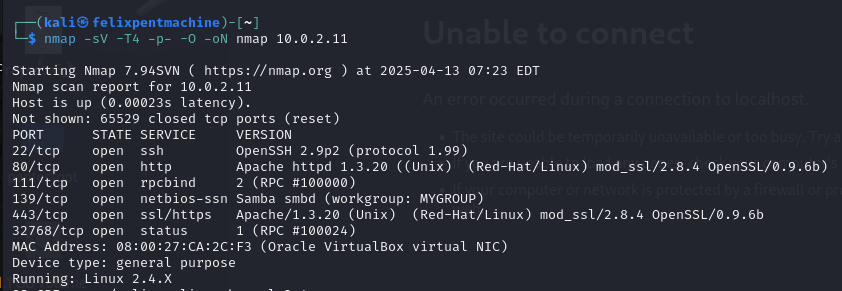
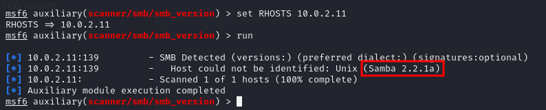

## Escaneo de Servicios

Reconocimiento:
Version de SMB

# Tabla de Vulnerabilidades de Kioptrix Nivel 1

## Resultados de la fase de reconocimiento

| Puerto/Servicio | Descripción | Vulnerabilidad | Impacto | Recomendación |
|-----------------|-------------|----------------|---------|---------------|
| 22/tcp - SSH | OpenSSH 2.9p2 con soporte para protocolo 1.99, versión obsoleta con múltiples fallos de seguridad. | CVE-2003-0693, CVE-2002-0640, CVE-2002-0639 - Vulnerabilidades de autenticación en protocolo SSH1 y problemas de desbordamiento de buffer. | Acceso no autorizado al sistema mediante credenciales comprometidas o ataques de descifrado de claves. | Actualizar OpenSSH a una versión reciente (7.x o superior), deshabilitar el protocolo SSH1 y configurar fail2ban para limitar intentos de acceso. |
| 80/tcp - HTTP | Apache 1.3.20 con mod_ssl/2.8.4 y OpenSSL/0.9.6b - Versión severamente desactualizada. | Múltiples vulnerabilidades documentadas: https://httpd.apache.org/security/vulnerabilities_13.html | Compromiso total del servidor web mediante ejecución remota de código y elevación de privilegios. | Actualizar Apache a la última versión, implementar configuraciones seguras de TLS y revisar periódicamente actualizaciones de seguridad. |
| 111/tcp - RPC | Servicio rpcbind versión 2 expuesto que proporciona información sobre servicios RPC disponibles. | CVE-2017-8779 - Vulnerabilidad de denegación de servicio en rpcbind que permite ataques DoS. | Interrupción de servicios críticos y posible acceso a información sensible del sistema. | Restringir acceso al servicio RPC únicamente a redes confiables mediante reglas de firewall y considerar la desactivación si no es necesario. |
| 139/tcp - Samba | Samba 2.2.1a con configuración por defecto que permite navegación de recursos compartidos. | CVE-2003-0201 - "trans2open", vulnerabilidad crítica que permite ejecución remota de código sin autenticación. Múltiples vulnerabilidades adicionales: https://www.opencve.io/cve?vendor=samba | Compromiso total del sistema mediante ejecución de código con privilegios elevados sin necesidad de autenticación. | Actualizar Samba a una versión moderna (4.x), implementar restricciones de acceso por IP y deshabilitar servicios no utilizados. |
| 443/tcp - HTTPS | Apache 1.3.20 con mod_ssl/2.8.4 y OpenSSL/0.9.6b - Implementación insegura de HTTPS. | CVE-2002-0082 - "OpenFuck", desbordamiento de buffer en mod_ssl permitiendo ejecución remota de código. Múltiples vulnerabilidades: https://httpd.apache.org/security/vulnerabilities_13.html | Compromiso total del servidor web mediante ejecución de comandos como usuario apache y potencial escalada de privilegios. | Actualizar Apache, mod_ssl y OpenSSL a versiones actuales, implementar configuraciones seguras de TLS y deshabilitar cifrados obsoletos. |
| 32768/tcp - RPC | Servicio RPC status expuesto que proporciona información sobre el estado del sistema. | CVE-2017-8779 - Vulnerabilidades de denegación de servicio en servicios RPC. | Exposición de información del sistema y posible interrupción de servicios críticos mediante ataques DoS. | Deshabilitar servicios RPC innecesarios, restringir acceso mediante reglas de firewall y mantener el sistema actualizado con los últimos parches de seguridad. |

## Vulnerabilidad 4: Samba Trans2Open - Ejecución de código remoto

### Identificación

| **Campo**                 | **Detalle**                          |
|---------------------------|---------------------------------------|
| **Puerto(s) / Servicio(s)** | 445 / Samba 2.2.1a                        |
| **Herramienta(s) de Detección** | Metasploit (módulo `linux/samba/trans2open`) |
| **Descripción Breve**      | Vulnerabilidad que permite la ejecución de código remoto en el servidor a través de Samba. |

### Descripción

| **Campo**                 | **Detalle**                                                                            |
|---------------------------|----------------------------------------------------------------------------------------|
| **Tipo**                  | Ejecución remota de código                                                            |
| **CVE**                   | [CVE-2003-0201](https://cve.mitre.org/cgi-bin/cvename.cgi?name=CVE-2003-0201)          |
| **Gravedad**              | Alta                                                                                   |
| **Vector de Ataque**      | Remoto                                                                                 |
| **Requiere Autenticación**| No                                                                                     |
| **Impacto Potencial**     | Control total de la máquina.                       |

### Detalles Técnicos

| **Campo**                 | **Detalle**                                                                            |
|---------------------------|----------------------------------------------------------------------------------------|
| **Configuración**         | Samba vulnerable que permite acceso a través del módulo `trans2open` en sistemas Linux. |
| **Payload utilizado**     | `linux/x86/shell/reverse_tcp`                                                          |

### Explotación

| **Campo**                 | **Detalle**                                                                            |
|---------------------------|----------------------------------------------------------------------------------------|
| **Procedimiento**         | Se ejecutó el exploit en Metasploit definiendo el payload de reverse shell y la IP objetivo. Se obtuvo una sesión como root. |
| **Evidencia**             |
  |

### Sistemas Afectados

| **Campo**                 | **Detalle**          |
|---------------------------|----------------------|
| **Servidor**              | Kioptrix Nivel 1    |

### Mitigación

- Actualizar Samba a una versión no vulnerable.  
- Restringir el acceso al puerto 445 desde fuentes no confiables.  
- Implementar políticas de acceso estrictas para servicios compartidos.  
- Monitorear actividad sospechosa en servidores Samba y aplicar prácticas de hardening.

## Vulnerabilidad: ptrace-kmod - Escalada de Privilegios Local

### Identificación

| **Campo**                 | **Detalle**                          |
|---------------------------|---------------------------------------|
| **Puerto(s) / Servicio(s)** | 443 / Apache 1.3.20 (mod_ssl) |
| **Herramienta(s) de Detección** | OpenFuck (exploit inicial para acceso), ptrace-kmod.c (escalada local) |
| **Descripción Breve**      | Vulnerabilidad de escalada de privilegios local que permite a usuarios sin privilegios obtener acceso root mediante una vulnerabilidad en el kernel Linux. |

### Descripción

| **Campo**                 | **Detalle**                                                                            |
|---------------------------|----------------------------------------------------------------------------------------|
| **Tipo**                  | Escalada de privilegios local                                                           |
| **CVE**                   | [CVE-2003-0127](https://cve.mitre.org/cgi-bin/cvename.cgi?name=CVE-2003-0127)          |
| **Gravedad**              | Alta                                                                                   |
| **Vector de Ataque**      | Local                                                                                 |
| **Requiere Autenticación**| Sí (acceso previo como usuario apache)                                                 |
| **Impacto Potencial**     | Control total del sistema como usuario root                      |

### Detalles Técnicos

| **Campo**                 | **Detalle**                                                                            |
|---------------------------|----------------------------------------------------------------------------------------|
| **Configuración**         | Kernel Linux vulnerable a ptrace que permite a usuarios sin privilegios manipular procesos en ejecución para obtener acceso root. |
| **Exploit utilizado**     | [ptrace-kmod.c](https://github.com/piyush-saurabh/exploits/blob/master/ptrace-kmod.c)                                                          |

### Explotación

| **Campo**                 | **Detalle**                                                                            |
|---------------------------|----------------------------------------------------------------------------------------|
| **Procedimiento**         | 1. Se obtuvo acceso inicial mediante la vulnerabilidad OpenFuck/mod_ssl (CVE-2002-0082)  2. Se compiló el exploit ptrace-kmod.c usando gcc   3. Se ejecutó el binario compilado  4. El exploit entregó automáticamente una shell con privilegios root |
| **Evidencia**             |  	|

### Sistemas Afectados

| **Campo**                 | **Detalle**          |
|---------------------------|----------------------|
| **Servidor**              | Kioptrix Nivel 1    |

### Mitigación

- Actualizar el kernel del sistema a una versión que corrija la vulnerabilidad de ptrace.
- Aplicar parches de seguridad disponibles para el sistema operativo.
- Implementar control de acceso basado en roles para limitar los usuarios que pueden ejecutar binarios.
- Configurar monitorización para detectar intentos de escalada de privilegios.
- Realizar auditorías regulares de seguridad para identificar vulnerabilidades pendientes.
- Considerar implementación de control de integridad para detectar cambios en binarios críticos del sistema.

## Vulnerabilidad: mod_ssl/Apache - Ejecución Remota de Código (OpenFuck)

### Identificación

| **Campo**                 | **Detalle**                          |
|---------------------------|---------------------------------------|
| **Puerto(s) / Servicio(s)** | 443 / Apache 1.3.20 (mod_ssl 2.8.x)                   |
| **Herramienta(s) de Detección** | OpenFuckV2, searchsploit |
| **Descripción Breve**      | Vulnerabilidad de desbordamiento de buffer en mod_ssl que permite ejecución remota de código mediante la explotación de la inicialización incorrecta de memoria. |

### Descripción

| **Campo**                 | **Detalle**                                                                            |
|---------------------------|----------------------------------------------------------------------------------------|
| **Tipo**                  | Ejecución remota de código                                                           |
| **CVE**                   | [CVE-2002-0082](https://cve.mitre.org/cgi-bin/cvename.cgi?name=CVE-2002-0082)          |
| **Gravedad**              | Alta                                                                                   |
| **Vector de Ataque**      | Remoto                                                                                |
| **Requiere Autenticación**| No                                                 |
| **Impacto Potencial**     | Acceso inicial al sistema como usuario apache                     |

### Detalles Técnicos

| **Campo**                 | **Detalle**                                                                            |
|---------------------------|----------------------------------------------------------------------------------------|
| **Configuración**         | El código de caché de sesión en mod_ssl antes de la versión 2.8.7-1.3.23 no inicializa correctamente la memoria con la función i2d_SSL_SESSION, permitiendo a atacantes remotos explotar un desbordamiento de buffer. |
| **Exploit utilizado**     | OpenFuckV2 (versión modificada para sistemas modernos)                                 |

### Explotación

| **Campo**                 | **Detalle**                                                                            |
|---------------------------|----------------------------------------------------------------------------------------|
| **Procedimiento**         | 1. Se ejecutó el exploit OpenFuckV2 contra el servidor   2. Se usó el parámetro 0x6b (correspondiente a RedHat Linux 7.2 apache-1.3.20-16)   3. Se especificó la IP objetivo y el puerto 4434. Se obtuvo shell como usuario apache |
| **Evidencia**             |   |

### Sistemas Afectados

| **Campo**                 | **Detalle**          |
|---------------------------|----------------------|
| **Servidor**              | Kioptrix Nivel 1 - 10.0.2.135   |

### Mitigación

- Actualizar Apache y mod_ssl a versiones posteriores a 2.8.7-1.3.23.
- Implementar un firewall de aplicaciones web para filtrar tráfico malicioso.
- Configurar correctamente TLS/SSL y deshabilitar versiones obsoletas del protocolo.
- Realizar auditorías regulares de seguridad para verificar las configuraciones.
- Implementar defensas en profundidad para proteger servidores web expuestos.
- Considerar el uso de soluciones de detección de intrusiones para identificar intentos de explotación.

